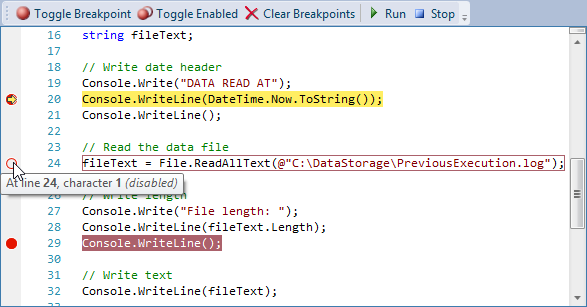

# Indicators

Indicators are special "tagged" regions of text that display a glyph in the indicator margin also generally highlight the text range with special styles.  Quick info can be displayed when hovering over the glyph, and custom mouse handling can be implemented to support functionality like toggling indicators when clicking in the indicator margin.

SyntaxEditor includes several built-in indicators: bookmarks, breakpoints, and current statement markers.  Any sort of custom indicator can easily be created as well.

## Basic Concepts

Indicators use the same [tagging mechanism](../../text-parsing/tagging/index.md) that is harnessed by many other SyntaxEditor features.  A certain text range is marked with a custom tag, in this case a tag that implements [IIndicatorTag](xref:ActiproSoftware.Text.Tagging.IIndicatorTag).  As text changes occur, the tagged range is automatically adjusted appropriately.



### Glyphs

The indicator margin is where glyphs from indicators are displayed.  Glyphs are drawn programmatically and render on the first view line that contains the related indicator.  The [IIndicatorTag](xref:ActiproSoftware.Text.Tagging.IIndicatorTag).[DrawGlyph](xref:ActiproSoftware.Text.Tagging.IIndicatorTag.DrawGlyph*) method is responsible for rendering the glyph.

> [!IMPORTANT]
> The indicator margin is hidden by default and should be made visible via the [SyntaxEditor](xref:@ActiproUIRoot.Controls.SyntaxEditor.SyntaxEditor).[IsIndicatorMarginVisible](xref:@ActiproUIRoot.Controls.SyntaxEditor.SyntaxEditor.IsIndicatorMarginVisible) property when indicators are used.  Otherwise, no glyphs will render in the editor.

It is recommended that glyphs be restricted to 16x16 size.  See the custom indicators example for a sample of creating a glyph.

### Classifications

While the [IIndicatorTag](xref:ActiproSoftware.Text.Tagging.IIndicatorTag) interface just handles rendering of the glyphs, more often than not, indicators also intend to style the contained text range differently.  You see this sort of thing with breakpoints, where they highlight the background of the text red.  This is accomplished by having the tag instance also implement [IClassificationTag](xref:ActiproSoftware.Text.Tagging.IClassificationTag).

See the [Tags and Classification Types](../../text-parsing/tagging/basic-concepts.md) topic for more information on how classification tags can be used to override default syntax highlighting.

### Taggers and Indicator Managers

Any [ITagger<T>](xref:ActiproSoftware.Text.Tagging.ITagger`1) can provide indicators, but indicators are most generally used with [ICollectionTagger<T>](xref:ActiproSoftware.Text.Tagging.ICollectionTagger`1) objects.  That sort of tagger works like a collection and allows you to add/remove, etc. indicator tags from it.

Say you wish to support bookmark indicators in your editor.  You would add a bookmark indicator tag for each bookmark instance to the [ICollectionTagger<T>](xref:ActiproSoftware.Text.Tagging.ICollectionTagger`1).  If the end user toggles off a bookmark, the related tag should be removed from the tagger.

SyntaxEditor provides a helpful indicator manager ([IIndicatorManager](xref:@ActiproUIRoot.Controls.SyntaxEditor.Indicators.IIndicatorManager) interface, accessible via the [IEditorDocument](xref:ActiproSoftware.Text.IEditorDocument).[IndicatorManager](xref:ActiproSoftware.Text.IEditorDocument.IndicatorManager) property) that wraps up much of the functionality of creating/accessing a tagger behind the scenes.  The manager has a number of generic methods that can be used to interact with indicators at a very high level.  When a method on the indicator manager is accessed, it will go see if a related tagger is found on the document.  For methods like [Add](xref:@ActiproUIRoot.Controls.SyntaxEditor.Indicators.IIndicatorManager.Add*) and [Toggle](xref:@ActiproUIRoot.Controls.SyntaxEditor.Indicators.IIndicatorManager.Toggle*), where it is your intention to add an indicator, the manager will install an appropriate [ICollectionTagger<T>](xref:ActiproSoftware.Text.Tagging.ICollectionTagger`1) on the document if one is not already present.  This is helpful because it means that a tagger provider language service doesn't need to be set up on your languages for each kind of indicator you wish to use.

[IIndicatorManager](xref:@ActiproUIRoot.Controls.SyntaxEditor.Indicators.IIndicatorManager) also provides access to some sub-managers (e.g., via the [Breakpoints](xref:@ActiproUIRoot.Controls.SyntaxEditor.Indicators.IIndicatorManager.Breakpoints) property) which are even friendlier ways to work directly with the related indicator type.

See below for examples of working with the indicator manager.

## Line-Based vs. Text Range-Based Indicators

There are two general kinds of indicators:  line-based and text range-based.

A line-based indicator is one that is applied to a single text snapshot line.  An example of this kind is a bookmark.  As text changes occur in and around the line, the indicator uses special logic and adjusts its tagged range to remain on and fully encompass a single line.

A text range-based indicator is one that is applied to a text snapshot range (start and end offset pair).  An example of this kind is a breakpoint.  As text changes occur in and around the range, the indicator adjusts its tagged range accordingly.  The tagged range can cover a small portion of a line or even span multiple lines.

## Bookmark Indicators

Bookmarks are line-based indicators that render a small bookmark glyph in the indicator margin to mark an area of interest for the end user.  An app generally supports navigation between the bookmarks so the end user can jump the caret between them.

Bookmarks can be easily managed via the [IBookmarkIndicatorManager](xref:@ActiproUIRoot.Controls.SyntaxEditor.Indicators.IBookmarkIndicatorManager) interface, which is accessible via the [IIndicatorManager](xref:@ActiproUIRoot.Controls.SyntaxEditor.Indicators.IIndicatorManager).[Bookmarks](xref:@ActiproUIRoot.Controls.SyntaxEditor.Indicators.IIndicatorManager.Bookmarks) property.

This code shows how to toggle a bookmark on the current line that contains the caret:

```csharp
editor.Document.IndicatorManager.Bookmarks.Toggle(editor.ActiveView.Selection.EndSnapshotOffset.Line);
```

Bookmark indicators also support an enabled state via their [BookmarkIndicatorTag](xref:ActiproSoftware.Text.Tagging.Implementation.BookmarkIndicatorTag).[IsEnabled](xref:ActiproSoftware.Text.Tagging.Implementation.BookmarkIndicatorTag.IsEnabled) property.  Bookmarks are enabled by default.  When disabled, their glyph and styled text range render differently.  This is generally a visual reminder to the end user that the bookmark will not be hit when finding the next bookmark.

This code shows how to toggle the enabled state for a bookmark on the current line:

```csharp
var tagRange = editor.Document.IndicatorManager.Bookmarks.GetInstances(editor.ActiveView.Selection.EndSnapshotOffset.Line).FirstOrDefault();
if (tagRange != null)
	editor.Document.IndicatorManager.Bookmarks.ToggleEnabledState(tagRange.Tag)
```

This code shows how to find and move the caret to the next instance of an enabled bookmark:

```csharp
// Create search options
var options = new TagSearchOptions<BookmarkIndicatorTag>();
options.CanWrap = true;
options.SearchUp = false;
options.Filter = (tr => tr.Tag.IsEnabled);
						
// Find the next indicator
var tagRange = editor.Document.IndicatorManager.Bookmarks.FindNext(editor.ActiveView.Selection.EndSnapshotOffset.Line, options);
if (tagRange != null) {
	// Move the caret
	editor.Caret.Offset = tagRange.VersionRange.Translate(editor.ActiveView.CurrentSnapshot).StartOffset;
}
```

## Breakpoint Indicators

Breakpoints are text range-based indicators that render a red circle glyph in the indicator margin and also highlight the contained text range with a red background.  Breakpoint indicators can be used to visually represent a code execution breakpoint when working with an external debugger.

Breakpoints can be easily managed via the [IBreakpointIndicatorManager](xref:@ActiproUIRoot.Controls.SyntaxEditor.Indicators.IBreakpointIndicatorManager) interface, which is accessible via the [IIndicatorManager](xref:@ActiproUIRoot.Controls.SyntaxEditor.Indicators.IIndicatorManager).[Breakpoints](xref:@ActiproUIRoot.Controls.SyntaxEditor.Indicators.IIndicatorManager.Breakpoints) property.

This code shows how to toggle a breakpoint over a [TextSnapshotRange](xref:ActiproSoftware.Text.TextSnapshotRange) (which generally is the text range of a statement):

```csharp
document.IndicatorManager.Breakpoints.Toggle(snapshotRange);
```

This code shows how to clear all breakpoints from a document:

```csharp
document.IndicatorManager.Breakpoints.Clear();
```

Breakpoint indicators also support an enabled state via their [BreakpointIndicatorTag](xref:ActiproSoftware.Text.Tagging.Implementation.BreakpointIndicatorTag).[IsEnabled](xref:ActiproSoftware.Text.Tagging.Implementation.BreakpointIndicatorTag.IsEnabled) property.  Breakpoints are enabled by default.  When disabled, their glyph and styled text range render differently.  This is generally a visual reminder to the end user that the breakpoint will not be hit when code execution occurs.

This code shows how to toggle the enabled state for a breakpoint on the current line:

```csharp
var tagRange = editor.Document.IndicatorManager.Breakpoints.GetInstances(new TextSnapshotRange(editor.ActiveView.Selection.EndSnapshotOffset)).FirstOrDefault();
if (tagRange != null)
	editor.Document.IndicatorManager.Breakpoints.ToggleEnabledState(tagRange.Tag)
```

## Current Statement Indicators

Current statement indicators are text range-based indicators that render a yellow arrow glyph in the indicator margin and also highlight the contained text range with a yellow background.  Current statement indicators can be used to visually represent the current code execution point in a debugging session.

Current statement indicators can be easily managed via the [ICurrentStatementIndicatorManager](xref:@ActiproUIRoot.Controls.SyntaxEditor.Indicators.ICurrentStatementIndicatorManager) interface, which is accessible via the [IIndicatorManager](xref:@ActiproUIRoot.Controls.SyntaxEditor.Indicators.IIndicatorManager).[CurrentStatement](xref:@ActiproUIRoot.Controls.SyntaxEditor.Indicators.IIndicatorManager.CurrentStatement) property.  Note that this particular indicator manager is geared towards managing at most a single indicator instance at a time for a document.  The reason is that there can only be a single current location in any debugging session.

This code shows how to set the current statement indicator over a [TextSnapshotRange](xref:ActiproSoftware.Text.TextSnapshotRange) (which generally is the text range of a statement):

```csharp
document.IndicatorManager.CurrentStatement.SetInstance(snapshotRange);
```

This code shows how to clear the current statement indicator from a document:

```csharp
document.IndicatorManager.CurrentStatement.Clear();
```

## Custom Indicators

Custom indicators can easily be created and used with SyntaxEditor.  To support a custom indicator, a custom indicator tag class and a custom indicator tagger class must be created.

> [!NOTE]
> One of the samples included with the product shows a complete implementation of a custom tag and tagger.  That is an excellent sample to examine when building a custom indicator.

### Indicator Tag

Two base classes are included that make it easier to support custom indicator creation.  The first is [IndicatorTagBase](xref:ActiproSoftware.Text.Tagging.Implementation.IndicatorTagBase) and is an abstract base class that implements [IIndicatorTag](xref:ActiproSoftware.Text.Tagging.IIndicatorTag).  Use this base class when the indicator will only show a glyph and not do any text range styling, such as in the case of bookmarks.

The second base class is [IndicatorClassificationTagBase](xref:ActiproSoftware.Text.Tagging.Implementation.IndicatorClassificationTagBase).  This abstract base class inherits the first and also implements [IClassificationTag](xref:ActiproSoftware.Text.Tagging.IClassificationTag), allowing it to style text ranges.  See the [Tags and Classification Types](../../text-parsing/tagging/basic-concepts.md) topic for more information on how classification tags can be used to override default syntax highlighting.

The [IIndicatorTag](xref:ActiproSoftware.Text.Tagging.IIndicatorTag).[DrawGlyph](xref:ActiproSoftware.Text.Tagging.IIndicatorTag.DrawGlyph*) method must be overridden to render the glyph for the indicator.  It will be called any time the indicator is scrolled into view, and the resulting glyph will appear in the indicator margin.

### Indicator Tagger

Similar to the two tag base classes above, two tagger base classes are provided: [IndicatorTaggerBase<T>](xref:ActiproSoftware.Text.Tagging.Implementation.IndicatorTaggerBase`1) (to be used with [IndicatorTagBase](xref:ActiproSoftware.Text.Tagging.Implementation.IndicatorTagBase) tags) and [IndicatorClassificationTaggerBase<T>](xref:ActiproSoftware.Text.Tagging.Implementation.IndicatorClassificationTaggerBase`1) (to be used with [IndicatorClassificationTagBase](xref:ActiproSoftware.Text.Tagging.Implementation.IndicatorClassificationTagBase) tags).  The type parameter is the type of tag being returned by the tagger.

In either case, both taggers implement [ICollectionTagger<T>](xref:ActiproSoftware.Text.Tagging.ICollectionTagger`1) and can be interacted with similar to a collection.  See the [Taggers and Tagger Providers](../../text-parsing/tagging/taggers.md) topic for details on collection taggers.

One important thing to note about the tagger is that your inheriting class must include a public constructor that takes a single [ICodeDocument](xref:ActiproSoftware.Text.ICodeDocument) parameter.  The constructor should call the base constructor and pass any orderings that are appropriate to it so that indicators from certain taggers can appear above indicator from other taggers.

This code shows an example of a custom tagger that orders itself above the token tagger, meaning if its tags support [IClassificationTag](xref:ActiproSoftware.Text.Tagging.IClassificationTag) then it can override syntax highlighting:

```csharp
public CustomIndicatorTagger(ICodeDocument document) : 
	base("CustomIndicator", new Ordering[] { 
		new Ordering(TaggerKeys.Token, OrderPlacement.Before)
	}, document, true) {}
```

### Indicator Manager

As mentioned above, the [IIndicatorManager](xref:@ActiproUIRoot.Controls.SyntaxEditor.Indicators.IIndicatorManager) interface has a number of helpful method for working with indicators, even custom ones.  For custom indicators, the generic methods directly on [IIndicatorManager](xref:@ActiproUIRoot.Controls.SyntaxEditor.Indicators.IIndicatorManager) should be used.  Each of these methods takes two generic type arguments:  the type of tagger and the type of tag.

This code shows how to create a custom tag, set its quick info content provider, and add it to a certain [TextSnapshotRange](xref:ActiproSoftware.Text.TextSnapshotRange):

```csharp
// Create an indicator tag
var tag = new CustomIndicatorTag();
tag.ContentProvider = new PlainTextContentProvider("Custom indicator created at " + DateTime.Now.ToLongTimeString());

// Add the indicator tag (use a generic method provided on the indicator manager for custom indicators)
editor.Document.IndicatorManager.Add<CustomIndicatorTagger, CustomIndicatorTag>(snapshotRange, tag);
```

## IntelliPrompt Quick Info for Glyphs

IntelliPrompt quick info can be added for the glyphs in the indicator margin.  This means that when the mouse hovers over the glyph, a tooltip will display.

The quick info comes from the [IContentProvider](xref:@ActiproUIRoot.Controls.SyntaxEditor.IntelliPrompt.IContentProvider) that is set in the [IIndicatorTag](xref:ActiproSoftware.Text.Tagging.IIndicatorTag).[ContentProvider](xref:ActiproSoftware.Text.Tagging.IIndicatorTag.ContentProvider) property.  The content provider can return simple text, complex markup, etc. as described in the [Content Providers](../intelliprompt/popup-content-providers.md) topic.

> [!NOTE]
> There is one requirement for this functionality to work.  A special [IndicatorQuickInfoProvider](xref:@ActiproUIRoot.Controls.SyntaxEditor.IntelliPrompt.Implementation.IndicatorQuickInfoProvider) language service must be registered on the language.  This quick info provider has built-in functionality to watch for the mouse being over indicator glyphs and use their related content provider for the quick info tip content.

This code shows how to register an [IndicatorQuickInfoProvider](xref:@ActiproUIRoot.Controls.SyntaxEditor.IntelliPrompt.Implementation.IndicatorQuickInfoProvider) language service on a language:

```csharp
language.RegisterService(new IndicatorQuickInfoProvider());
```

## Handling Pointer Events in the Indicator Margin

Mouse events in the indicator margin can be handled via an [IEditorViewPointerInputEventSink](xref:@ActiproUIRoot.Controls.SyntaxEditor.IEditorViewPointerInputEventSink) language service.

For instance, if your app supports a debugging experience, you may wish to allow clicks in the indicator margin to toggle whether a breakpoint is defined on the statement at that line.  A full example of implementing this kind of behavior is given in the debugging-related indicators sample.
