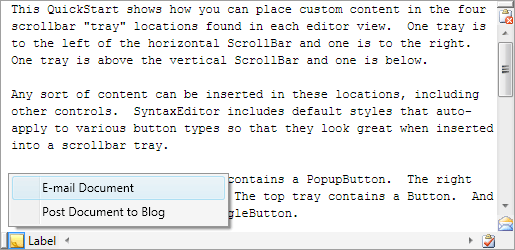

# Scrolling

Scrolling can be performed by end users via keyboard, mouse wheel, or touch.  Editor views can be scrolled programmatically as well.

Scrollbars can optionally be hidden in the views, or even automatically hidden when not needed.

Scrollbar acceleration allows scrolling speed to increase the longer a scrollbar button is held.

@if (winrt wpf) {

Each editor view in SyntaxEditor also has four scrollbar tray areas, where custom controls can be inserted via data templates.

}

## Scrolling Via Keyboard

SyntaxEditor has [default key bindings](../input-output/default-key-bindings.md) for all of the standard scroll-related text editing keys, like <kbd>PgUp</kbd>, <kbd>PgDn</kbd>, <kbd>Ctrl</kbd>+<kbd>End</kbd>, etc.

## Scrolling Via Mouse Wheel

### Vertical Scrolling

Vertical scrolling can be performed by spinning the mouse wheel.  Each wheel notch scrolled should scroll the view by an average view line height.  However, if an operating system option is chosen that requests page-based scrolling with the mouse wheel, the view will scroll by the view height amount instead.

### Horizontal Scrolling

Horizontal scrolling can be performed by holding the <kbd>Shift</kbd> key and spinning the mouse wheel.

### Preventing Scrolling Over Unfocused Editor Views

The [SyntaxEditor](xref:@ActiproUIRoot.Controls.SyntaxEditor.SyntaxEditor).[CanPointerWheelScrollUnfocusedViews](xref:@ActiproUIRoot.Controls.SyntaxEditor.SyntaxEditor.CanPointerWheelScrollUnfocusedViews) property can be set to `false` to prevent the mouse wheel from scrolling editor views that don't contain focus.  This property is `true` by default, which means scroll any editor view under the mouse pointer, whether it has focus or not.

## Scrolling Via Touch

SyntaxEditor supports smooth inertia-based touch scrolling.

## Programmatically Scrolling a View to a Position

The [IEditorView](xref:@ActiproUIRoot.Controls.SyntaxEditor.IEditorView).[Scroller](xref:@ActiproUIRoot.Controls.SyntaxEditor.IEditorView.Scroller) object has many methods for programmatically scrolling a view.

An editor view can be scrolled such that it displays the line containing a specified [TextPosition](xref:ActiproSoftware.Text.TextPosition).  This is done by initializing a [TextViewScrollState](xref:@ActiproUIRoot.Controls.SyntaxEditor.TextViewScrollState) object and passing it to the [IEditorViewScroller](xref:@ActiproUIRoot.Controls.SyntaxEditor.IEditorViewScroller).[ScrollTo](xref:@ActiproUIRoot.Controls.SyntaxEditor.IEditorViewScroller.ScrollTo*) method.

The following example shows how to scroll the view line containing the 24th document line (text positions are zero-based) to the center of the view.  The first parameter is the vertical anchor text position.  The second parameter is a [TextViewVerticalAnchorPlacement](xref:@ActiproUIRoot.Controls.SyntaxEditor.TextViewVerticalAnchorPlacement) that indicates where the vertical anchor text position should be placed in the view (e.g., top, center, bottom).  The third parameter is a pixel delta from the placement, meaning you could scroll a text position to the top of the view but also displace it down a certain pixel amount so that lines above it are visible too for context.  The fourth parameter is the horizontal scroll amount.

```csharp
var scrollState = new TextViewScrollState(new TextPosition(23, 0), TextViewVerticalAnchorPlacement.Center, 0, 0);
this.ActiveView.Scroller.ScrollTo(scrollState);
```

The [ITextView](xref:@ActiproUIRoot.Controls.SyntaxEditor.ITextView).[ScrollState](xref:@ActiproUIRoot.Controls.SyntaxEditor.ITextView.ScrollState) property returns the current resolved scroll state for the view.

## Scrolling Past Document End

The [SyntaxEditor](xref:@ActiproUIRoot.Controls.SyntaxEditor.SyntaxEditor).[CanScrollPastDocumentEnd](xref:@ActiproUIRoot.Controls.SyntaxEditor.SyntaxEditor.CanScrollPastDocumentEnd) property, which defaults to `true`, specifies whether scrolling can occur past the document end.  When this feature is enabled, the last line of the document can scroll to the top of an editor view under certain scrolling circumstances: scrollbar, mouse wheel, and touch-scrolling.

The property can be set to `false` to prevent the above circumstances from scrolling the last document line above the bottom of the editor view.  That being said, only set the property to `false` if your editor isn't using multiple font families/sizes and your editor doesn't make use of intra-line adornments.  Both of those scenarios allow view lines with varying heights and can prevent the proper calculation of a vertical scrollbar maximum.

## ScrollBar Visibility

The [SyntaxEditor](xref:@ActiproUIRoot.Controls.SyntaxEditor.SyntaxEditor).[HorizontalScrollBarVisibility](xref:@ActiproUIRoot.Controls.SyntaxEditor.SyntaxEditor.HorizontalScrollBarVisibility) and [VerticalScrollBarVisibility](xref:@ActiproUIRoot.Controls.SyntaxEditor.SyntaxEditor.VerticalScrollBarVisibility) properties determine the logic behind scrollbar visibility.

- `Visible` - Always show the scrollbar.  This is generally the default.  See the [Word Wrap](word-wrap.md) topic for an example of hiding the scrollbar when word wrap is enabled.

- `Auto` - Only show the scrollbar when it is necessary.

- `Hidden` or `Disabled` - Hide the scrollbar.

## ScrollBar Acceleration

SyntaxEditor supports scrollbar acceleration, meaning the longer the mouse is pressed over a scrollbar button, the faster scrolling will occur.

This feature has been designed to make it easier for end users to scan past large portions of a document.

### Maximum Accelerated Scroll Units

The [SyntaxEditor](xref:@ActiproUIRoot.Controls.SyntaxEditor.SyntaxEditor).[ScrollBarAccelerationMaximum](xref:@ActiproUIRoot.Controls.SyntaxEditor.SyntaxEditor.ScrollBarAccelerationMaximum) property can be set to control the maximum number of scroll units to scroll per scroll event.

By default, this value is `4`, meaning that scrolling down for example starts at `1` line per scroll event.  If the mouse is held on the vertical scrollbar's down arrow button for a certain interval, then `2` lines scroll per event.  If the mouse is still held down after another interval, then `3` lines scroll per event.  If the mouse is still held down after another interval, then `4` lines scroll per event.  This is the largest number of lines that will be scrolled.  The lines scrolled per event reset when the mouse button is released.

> [!TIP]
> Set the [ScrollBarAccelerationMaximum](xref:@ActiproUIRoot.Controls.SyntaxEditor.SyntaxEditor.ScrollBarAccelerationMaximum) property value to `1` to disable scrollbar acceleration.

### Acceleration Interval

The [SyntaxEditor](xref:@ActiproUIRoot.Controls.SyntaxEditor.SyntaxEditor).[ScrollBarAccelerationInterval](xref:@ActiproUIRoot.Controls.SyntaxEditor.SyntaxEditor.ScrollBarAccelerationInterval) property controls how long it takes to increment scroll units during a scroll operation.

The default value is `3 seconds`, meaning every three seconds of scrolling, the number of units scrolled per scroll event will increase until the [ScrollBarAccelerationMaximum](xref:@ActiproUIRoot.Controls.SyntaxEditor.SyntaxEditor.ScrollBarAccelerationMaximum) value is reached.

@if (winrt wpf) {

## ScrollBar Tray Locations

Each editor view has four distinct scrollbar tray areas.  The locations include:

- Left of the horizontal scrollbar
- Right of the horizontal scrollbar
- Above of the vertical scrollbar
- Below of the vertical scrollbar



*An editor view showing controls added in each of the four scrollbar trays*

}

@if (winrt wpf) {

## Data Templates

The tray areas are populated based on data templates that are set via these [SyntaxEditor](xref:@ActiproUIRoot.Controls.SyntaxEditor.SyntaxEditor) properties:

| Member | Description |
|-----|-----|
| [ScrollBarTrayBottomTemplate](xref:@ActiproUIRoot.Controls.SyntaxEditor.SyntaxEditor.ScrollBarTrayBottomTemplate) Property | Gets or sets the `DataTemplate` containing controls that are displayed under the vertical `ScrollBar` in an [IEditorView](xref:@ActiproUIRoot.Controls.SyntaxEditor.IEditorView). |
| [ScrollBarTrayLeftTemplate](xref:@ActiproUIRoot.Controls.SyntaxEditor.SyntaxEditor.ScrollBarTrayLeftTemplate) Property | Gets or sets the `DataTemplate` containing controls that are displayed left of the horizontal `ScrollBar` in an [IEditorView](xref:@ActiproUIRoot.Controls.SyntaxEditor.IEditorView). |
| [ScrollBarTrayRightTemplate](xref:@ActiproUIRoot.Controls.SyntaxEditor.SyntaxEditor.ScrollBarTrayRightTemplate) Property | Gets or sets the `DataTemplate` containing controls that are displayed right of the horizontal `ScrollBar` in an [IEditorView](xref:@ActiproUIRoot.Controls.SyntaxEditor.IEditorView). |
| [ScrollBarTrayTopTemplate](xref:@ActiproUIRoot.Controls.SyntaxEditor.SyntaxEditor.ScrollBarTrayTopTemplate) Property | Gets or sets the `DataTemplate` containing controls that are displayed above the vertical `ScrollBar` in an [IEditorView](xref:@ActiproUIRoot.Controls.SyntaxEditor.IEditorView). |

The easiest way to define a data template is in XAML.  This code shows how to define the mail `ToggleButton` seen in the screenshot above:

```xaml
<editor:SyntaxEditor>
	<editor:SyntaxEditor.ScrollBarTrayBottomTemplate>
		<DataTemplate>
			<ToggleButton ToolTip="ToggleButton in the bottom tray">
				<Image Width="16" Height="16" Stretch="None"
				       Source="/Resources/Images/Mail16.png" />
			</ToggleButton>
		</DataTemplate>
	</editor:SyntaxEditor.ScrollBarTrayBottomTemplate>
</editor:SyntaxEditor>
```

}

@if (wpf) {

## Button Styles

The most common button controls are auto-styled when used within a tray area.  The button types that are auto-styled are:

- Button (native WPF)
- ToggleButton (native WPF)
- RepeatButton (native WPF)
- [PopupButton](xref:@ActiproUIRoot.Controls.PopupButton) (Actipro Shared Library)

Use the [PopupButton](xref:@ActiproUIRoot.Controls.PopupButton) control if you wish to display a menu or other popup such as in the screenshot above.

While WPF buttons can support any content, we recommend small icons as the button content.

}
