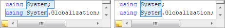

# Selection and Block Selection

SyntaxEditor has a powerful text selection model that supports both continuous stream (snaking) as well as block selection within editor views.

## Accessing the Selection

Each [IEditorView](xref:@ActiproUIRoot.Controls.SyntaxEditor.IEditorView) has its own selection model since the selection is unique to each view.  The selection and its functionality described below is available via the [IEditorViewSelection](xref:@ActiproUIRoot.Controls.SyntaxEditor.IEditorViewSelection) interface, which can be retrieved from the [IEditorView](xref:@ActiproUIRoot.Controls.SyntaxEditor.IEditorView).[Selection](xref:@ActiproUIRoot.Controls.SyntaxEditor.IEditorView.Selection) property.

The currently active view within a [SyntaxEditor](xref:@ActiproUIRoot.Controls.SyntaxEditor.SyntaxEditor) is available from the [SyntaxEditor](xref:@ActiproUIRoot.Controls.SyntaxEditor.SyntaxEditor).[ActiveView](xref:@ActiproUIRoot.Controls.SyntaxEditor.SyntaxEditor.ActiveView) property.

## Continuous Stream vs. Block Selection

Continuous stream is considered the "normal", snaking type of selection.  It has a start and end position and encompasses all text in between the positions.

Block selection, sometimes called column or rectangular selection, allows a singular rectangular portion of text to be selected instead of the whole line.  The selection includes all of the characters captured within the rectangle defined by the start (anchor) position and the end position in the selection.



*Continuous stream (left) vs. block (right) selection*

When a block selection is active, multiple lines can be edited at the same time.  Typing will enter the character on each line.  Pasting single-line text will paste the text on each line.  Likewise, keyboard operations like <kbd>Del</kbd> and <kbd>Bkspace</kbd> will work on each line.

## Getting Information About the Current Selection

There are a number of properties on the [IEditorViewSelection](xref:@ActiproUIRoot.Controls.SyntaxEditor.IEditorViewSelection) interface that allow you to see exactly what is selected in the selection's owner [IEditorView](xref:@ActiproUIRoot.Controls.SyntaxEditor.IEditorView).

| Member | Description |
|-----|-----|
| [EndOffset](xref:@ActiproUIRoot.Controls.SyntaxEditor.IEditorViewSelection.EndOffset) Property | Gets or sets the end offset of the primary selection range. |
| [EndPosition](xref:@ActiproUIRoot.Controls.SyntaxEditor.IEditorViewSelection.EndPosition) Property | Gets or sets the [TextPosition](xref:ActiproSoftware.Text.TextPosition) that represents the end of the primary selection range. |
| [FirstOffset](xref:@ActiproUIRoot.Controls.SyntaxEditor.IEditorViewSelection.FirstOffset) Property | Gets the first offset in the primary selection range. |
| [FirstPosition](xref:@ActiproUIRoot.Controls.SyntaxEditor.IEditorViewSelection.FirstPosition) Property | Gets the first [TextPosition](xref:ActiproSoftware.Text.TextPosition) in the primary selection range. |
| [GetTextRanges](xref:@ActiproUIRoot.Controls.SyntaxEditor.IEditorViewSelection.GetTextRanges*) Method | Returns an array of [TextRange](xref:ActiproSoftware.Text.TextRange) objects that specify the ranges of text that is selected. |
| [IsNormalized](xref:@ActiproUIRoot.Controls.SyntaxEditor.IEditorViewSelection.IsNormalized) Property | Gets whether the primary selection range is normalized ([StartPosition](xref:@ActiproUIRoot.Controls.SyntaxEditor.IEditorViewSelection.StartPosition) occurs at or before the [EndPosition](xref:@ActiproUIRoot.Controls.SyntaxEditor.IEditorViewSelection.EndPosition)). |
| [IsZeroLength](xref:@ActiproUIRoot.Controls.SyntaxEditor.IEditorViewSelection.IsZeroLength) Property | Gets whether the primary selection range has a zero length. |
| [LastOffset](xref:@ActiproUIRoot.Controls.SyntaxEditor.IEditorViewSelection.LastOffset) Property | Gets the last offset in the primary selection range. |
| [LastPosition](xref:@ActiproUIRoot.Controls.SyntaxEditor.IEditorViewSelection.LastPosition) Property | Gets the last [TextPosition](xref:ActiproSoftware.Text.TextPosition) in the primary selection range. |
| [Length](xref:@ActiproUIRoot.Controls.SyntaxEditor.IEditorViewSelection.Length) Property | Gets the absolute offset length of the primary selection range. |
| [Mode](xref:@ActiproUIRoot.Controls.SyntaxEditor.IEditorViewSelection.Mode) Property | Gets a [SelectionModes](xref:@ActiproUIRoot.Controls.SyntaxEditor.SelectionModes) that indicates the selection mode currently in use. |
| [PositionRange](xref:@ActiproUIRoot.Controls.SyntaxEditor.IEditorViewSelection.PositionRange) Property | Gets or sets the [TextPositionRange](xref:ActiproSoftware.Text.TextPositionRange) that describes the start and end [TextPosition](xref:ActiproSoftware.Text.TextPosition) of the primary selection. |
| [Ranges](xref:@ActiproUIRoot.Controls.SyntaxEditor.IEditorViewSelection.Ranges) Property | Gets the collection of selection ranges in the view.  This collection ordinarily contains a single range, but can have more than one range when there are multiple selections.  Each selection range has its own caret at the selection range's end position. |
| [StartOffset](xref:@ActiproUIRoot.Controls.SyntaxEditor.IEditorViewSelection.StartOffset) Property | Gets or sets the start offset of the primary selection range. |
| [StartPosition](xref:@ActiproUIRoot.Controls.SyntaxEditor.IEditorViewSelection.StartPosition) Property | Gets or sets the [TextPosition](xref:ActiproSoftware.Text.TextPosition) that represents the start of the primary selection range. |
| [TextRange](xref:@ActiproUIRoot.Controls.SyntaxEditor.IEditorViewSelection.TextRange) Property | Gets or sets the [TextRange](xref:ActiproSoftware.Text.TextRange) that specifies the offset range of the primary selection. |

## Creating Continuous Stream Selections at Run-time

Continuous stream selections can be made via the mouse or the keyboard.

To make a continuous stream selection with the mouse, left click in the text area and drag to create the selection.  Hold <kbd>Ctrl</kbd> when click+dragging to select by word instead of character, but only if the [SyntaxEditor](xref:@ActiproUIRoot.Controls.SyntaxEditor.SyntaxEditor).[AreMultipleSelectionRangesEnabled](xref:@ActiproUIRoot.Controls.SyntaxEditor.SyntaxEditor.AreMultipleSelectionRangesEnabled) property is `false`.

To make a continuous stream selection with the keyboard, hold the <kbd>Shift</kbd> key, and press any arrow key.  Other keys such as <kbd>Home</kbd>, <kbd>End</kbd>, <kbd>PgUp</kbd>, and <kbd>PgDn</kbd> also create selections while holding <kbd>Shift</kbd>.  Holding <kbd>Ctrl</kbd>+<kbd>Shift</kbd> when using the arrows keys will select by word instead of character.

## Creating Multiple Selections at Run-time

Multiple continuous stream selections can be made when the [SyntaxEditor](xref:@ActiproUIRoot.Controls.SyntaxEditor.SyntaxEditor).[AreMultipleSelectionRangesEnabled](xref:@ActiproUIRoot.Controls.SyntaxEditor.SyntaxEditor.AreMultipleSelectionRangesEnabled) property is `true`, the default.

A new selection can be added by holding the <kbd>Ctrl</kbd> key when clicking in the text area or clicking on the selection or line number margins.

Press the <kbd>Esc</kbd> key when there are multiple selection ranges to collapse back to a single primary selection range.

Most built-in edit actions and editing features are designed to support multiple selections.  For instance, pressing <kbd>Shift</kbd>+<kbd>Right Arrow</kbd> will extend all of the selections by one character.  Copying text from multiple selections unions the selected text, joining each range's text with a line terminator.  Pasting multi-line text into a view with the same number of selections as text lines being pasted will replace each selection with a related line from the pasted text.

### Adding the Next Occurrence

Pressing <kbd>Ctrl</kbd>+<kbd>D</kbd> adds the next occurrence of the currently-selected text to the selection, or selects the current word if there is no selection.

The [IEditorViewSelection](xref:@ActiproUIRoot.Controls.SyntaxEditor.IEditorViewSelection).[AddNextOccurrence](xref:@ActiproUIRoot.Controls.SyntaxEditor.IEditorViewSelection.AddNextOccurrence*) method provides access to this functionality.

## Creating Block Selections at Run-time

Block selections can be made via the mouse or the keyboard.

To make a block selection with the mouse, hold the <kbd>Alt</kbd> key, left click in the text area and drag to create the selection.  Hold <kbd>Ctrl</kbd>+<kbd>Alt</kbd>+<kbd>Shift</kbd> when click+dragging to select by word instead of character.

To make a block selection with the keyboard, hold the <kbd>Shift</kbd>+<kbd>Alt</kbd> keys, and press any arrow key.  Holding <kbd>Ctrl</kbd>+<kbd>Alt</kbd>+<kbd>Shift</kbd> when using the arrows keys will select by word instead of character.

## Creating a Single Selection Programmatically

The selection can be set programmatically using a number of the properties and methods on [IEditorViewSelection](xref:@ActiproUIRoot.Controls.SyntaxEditor.IEditorViewSelection), such as [StartOffset](xref:@ActiproUIRoot.Controls.SyntaxEditor.IEditorViewSelection.StartOffset).

The [SelectRange](xref:@ActiproUIRoot.Controls.SyntaxEditor.IEditorViewSelection.SelectRange*) method has several overloads that allow for easy selection creation with options.  For instance you can create a selection via an offset/length, a [TextRange](xref:ActiproSoftware.Text.TextRange), a [TextPosition](xref:ActiproSoftware.Text.TextPosition) pair, or a [TextPositionRange](xref:ActiproSoftware.Text.TextPositionRange).  Each overload also has corresponding overloads that accept a [SelectionModes](xref:@ActiproUIRoot.Controls.SyntaxEditor.SelectionModes) parameter.  When you use this parameter, you can indicate whether the selection should be a continuous stream or block selection.

When using setter properties or [SelectRange](xref:@ActiproUIRoot.Controls.SyntaxEditor.IEditorViewSelection.SelectRange*) method overloads that don't accept a [SelectionModes](xref:@ActiproUIRoot.Controls.SyntaxEditor.SelectionModes) property, the current selection mode (indicated by the [Mode](xref:@ActiproUIRoot.Controls.SyntaxEditor.IEditorViewSelection.Mode) property) will be used.

This code selects the text range `0-20` (20 characters) using the current [Mode](xref:@ActiproUIRoot.Controls.SyntaxEditor.IEditorViewSelection.Mode):

```csharp
editor.ActiveView.Selection.SelectRange(new TextRange(0, 20));
```

This code selects the text range `10-20` (10 characters) using continuous stream mode:

```csharp
editor.ActiveView.Selection.SelectRange(10, 10, SelectionModes.ContinuousStream));
```

This code selects the text position (line, char) range `(1,0)-(2,10)` using block mode:

```csharp
editor.ActiveView.Selection.SelectRange(new TextPositionRange(1, 0, 2, 10), SelectionModes.Block);
```

The [IEditorViewSelection](xref:@ActiproUIRoot.Controls.SyntaxEditor.IEditorViewSelection) interface provides a lot of additional methods for performing relative selection operations such as [MoveDown](xref:@ActiproUIRoot.Controls.SyntaxEditor.IEditorViewSelection.MoveDown*), [SelectPageDown](xref:@ActiproUIRoot.Controls.SyntaxEditor.IEditorViewSelection.SelectPageDown*), [SelectBlockRight](xref:@ActiproUIRoot.Controls.SyntaxEditor.IEditorViewSelection.SelectBlockRight*), etc.  Check the [IEditorViewSelection](xref:@ActiproUIRoot.Controls.SyntaxEditor.IEditorViewSelection) class library member list to see the numerous methods that are available.

## Creating Multiple Selections Programmatically

The [IEditorViewSelection](xref:@ActiproUIRoot.Controls.SyntaxEditor.IEditorViewSelection).[SelectRanges](xref:@ActiproUIRoot.Controls.SyntaxEditor.IEditorViewSelection.SelectRanges*) method allows for a collection of [TextPositionRange](xref:ActiproSoftware.Text.TextPositionRange) objects to be specified that will become multiple selections.  A caret will be placed at the end of each position range.  An optional second parameter allows the index of the primary selection range to be specified.  If <kbd>Esc</kbd> is pressed by the end user, all selection ranges but the primary selection range will be removed.

## Getting or Replacing the Selected Text

The [IEditorView](xref:@ActiproUIRoot.Controls.SyntaxEditor.IEditorView).[SelectedText](xref:@ActiproUIRoot.Controls.SyntaxEditor.IEditorView.SelectedText) property gets and sets the currently selected text and pays proper attention to block selections if applicable.  The setter calls the [ReplaceSelectedText](xref:@ActiproUIRoot.Controls.SyntaxEditor.IEditorView.ReplaceSelectedText*) method.

This code puts the currently selected text in a string:

```csharp
string text = editor.ActiveView.SelectedText;
```

For setting text, the [ReplaceSelectedText](xref:@ActiproUIRoot.Controls.SyntaxEditor.IEditorView.ReplaceSelectedText*) method can be called to replace the currently selected text with alternate text.  The [DeleteSelectedText](xref:@ActiproUIRoot.Controls.SyntaxEditor.IEditorView.DeleteSelectedText*) method can be called to delete the currently selected text.

This code deletes currently selected text:

```csharp
editor.ActiveView.DeleteSelectedText(TextChangeTypes.Delete);
```

This code replaces currently selected text:

```csharp
editor.ActiveView.ReplaceSelectedText(TextChangeTypes.Typing, "Inserted Text");
```

Both these methods have overloads that accept an [IEditorViewTextChangeOptions](xref:@ActiproUIRoot.Controls.SyntaxEditor.IEditorViewTextChangeOptions) object, which inherits [ITextChangeOptions](xref:ActiproSoftware.Text.ITextChangeOptions).  The base options in [ITextChangeOptions](xref:ActiproSoftware.Text.ITextChangeOptions) are described in the [Text Changes and Operations](../../text-parsing/core-text/text-changes.md) topic.  The [IEditorViewTextChangeOptions](xref:@ActiproUIRoot.Controls.SyntaxEditor.IEditorViewTextChangeOptions) interface defines several additional properties.

The [IsBlock](xref:@ActiproUIRoot.Controls.SyntaxEditor.IEditorViewTextChangeOptions.IsBlock) option indicates if the text change should be considered a block text change.  The [SelectInsertedText](xref:@ActiproUIRoot.Controls.SyntaxEditor.IEditorViewTextChangeOptions.SelectInsertedText) option determines if the inserted text should be selected.  The [VirtualCharacterFill](xref:@ActiproUIRoot.Controls.SyntaxEditor.IEditorViewTextChangeOptions.VirtualCharacterFill) option determines if when the caret is at a virtual character position, the text change will insert whitespace into the document to fill up to the insertion point's [TextPosition](xref:ActiproSoftware.Text.TextPosition).

## Determining If Any of the Selected Text is Read-Only

The [IEditorViewSelection](xref:@ActiproUIRoot.Controls.SyntaxEditor.IEditorViewSelection).[IsReadOnly](xref:@ActiproUIRoot.Controls.SyntaxEditor.IEditorViewSelection.IsReadOnly) property returns whether any of the text in the selection is currently flagged as read-only.

## Disabling Certain Selection Modes

The [SyntaxEditor](xref:@ActiproUIRoot.Controls.SyntaxEditor.SyntaxEditor).[SelectionModesAllowed](xref:@ActiproUIRoot.Controls.SyntaxEditor.SyntaxEditor.SelectionModesAllowed) property is a flags enumeration that indicates the types of selection modes that are permitted.

By altering the [SelectionModes](xref:@ActiproUIRoot.Controls.SyntaxEditor.SelectionModes) value set to this property, you can determine whether continuous stream and block selections are allowed.  The default is to allow both.

## Selection Change Event

The [SyntaxEditor](xref:@ActiproUIRoot.Controls.SyntaxEditor.SyntaxEditor).[ViewSelectionChanged](xref:@ActiproUIRoot.Controls.SyntaxEditor.SyntaxEditor.ViewSelectionChanged) event fires whenever the selection's anchor or length have changed.  This makes the event an ideal place to update the current caret column and position in a status bar.

The event passes an [EditorViewSelectionEventArgs](xref:@ActiproUIRoot.Controls.SyntaxEditor.EditorViewSelectionEventArgs) that has a number of useful properties on it.  It tells you the [IEditorView](xref:@ActiproUIRoot.Controls.SyntaxEditor.IEditorView) that contains the selection (be sure to only update UI when the view's [IsActive](xref:@ActiproUIRoot.Controls.SyntaxEditor.IEditorView.IsActive) property is true).  The [CaretPosition](xref:@ActiproUIRoot.Controls.SyntaxEditor.EditorViewSelectionEventArgs.CaretPosition) property contains the primary caret's [TextPosition](xref:ActiproSoftware.Text.TextPosition).  Use its [DisplayLine](xref:ActiproSoftware.Text.TextPosition.DisplayLine) and [DisplayCharacter](xref:ActiproSoftware.Text.TextPosition.DisplayCharacter) properties when displaying the caret location in a status bar or other user interface.

### Batch Selection Changes

Sometimes multiple selection changes might be made, such as in the case of performing a text change that alters the selection, but wanting to specifically set another selection right afterward.  In this scenario, a batch can be created to wrap the text change and any selection changes.  The selection changed event will only be raised when the outermost batch is completed.

This example shows how to create a disposable batch object.  When the batch is disposed, the batch is completed.

```csharp
using (var batch = editor.ActiveView.Selection.CreateBatch(EditorViewSelectionBatchOptions.None)) {
	// Perform text changes and selection changes here
}
```

## Capturing and Restoring the Selection State

Sometimes it's handy to be able to capture and later restore a selection.  This feature is used in actions like indent lines where the text in the selection is modified and when complete, the selection still appears to contain the same relative range of text, even though new characters were inserted within the selected text range.

The [IEditorViewSelection](xref:@ActiproUIRoot.Controls.SyntaxEditor.IEditorViewSelection).[CaptureState](xref:@ActiproUIRoot.Controls.SyntaxEditor.IEditorViewSelection.CaptureState*) method can be called to return an [IEditorViewSelectionState](xref:@ActiproUIRoot.Controls.SyntaxEditor.IEditorViewSelectionState) object.  This object persists information about the current selection state.  If you make changes and then call the [IEditorViewSelectionState](xref:@ActiproUIRoot.Controls.SyntaxEditor.IEditorViewSelectionState).[Restore](xref:@ActiproUIRoot.Controls.SyntaxEditor.IEditorViewSelectionState.Restore*) method, the selection will attempt to restore itself as best it can to the text that was originally selected.

This functionality makes use of the [snapshot translation](../../text-parsing/core-text/snapshot-translation.md) feature, found in the text framework.

## Selection Collapsing

The <kbd>Esc</kbd> key can be pressed to collapse the selection.

If there are multiple selection ranges, the <kbd>Esc</kbd> key will first remove all selections other than the primary selection.

When there is a single selection range, the selection will collapse to the caret, meaning make the selection go to zero-length.  This behavior can be changed so that the selection collapses to the selection anchor instead.  The [SyntaxEditor](xref:@ActiproUIRoot.Controls.SyntaxEditor.SyntaxEditor).[SelectionCollapsesToAnchor](xref:@ActiproUIRoot.Controls.SyntaxEditor.SyntaxEditor.SelectionCollapsesToAnchor) property can be set to `true` to activate this behavior.

Some end users like the ability to auto-collapse the selection when a copy operation occurs.  Set the [SyntaxEditor](xref:@ActiproUIRoot.Controls.SyntaxEditor.SyntaxEditor).[SelectionCollapsesOnCopy](xref:@ActiproUIRoot.Controls.SyntaxEditor.SyntaxEditor.SelectionCollapsesOnCopy) property to `true` to enable this behavior.

## Selection Grippers for Touch

When the end user touches a view, a small selection gripper will appear below the start and end of the selection.  The gripper can be dragged to resize the selection, or tapped to show a context menu.

The [SyntaxEditor](xref:@ActiproUIRoot.Controls.SyntaxEditor.SyntaxEditor).[AreSelectionGrippersEnabled](xref:@ActiproUIRoot.Controls.SyntaxEditor.SyntaxEditor.AreSelectionGrippersEnabled) property can be set to `false` to disable display of the selection grippers.

## Virtual Space

The [SyntaxEditor](xref:@ActiproUIRoot.Controls.SyntaxEditor.SyntaxEditor).[IsVirtualSpaceAtLineEndEnabled](xref:@ActiproUIRoot.Controls.SyntaxEditor.SyntaxEditor.IsVirtualSpaceAtLineEndEnabled) property can be set to `true` to allow virtual space at the end of view lines.

This feature permits the caret is able to move beyond a view line's line terminator.  Typing a character while the caret is in virtual space past the end of a line will automatically insert enough whitespace characters to fill up to the typed character before it is inserted.

Block selections can be made in virtual space at the end of lines, even without line end virtual space being enabled.  This prevents the caret from snapping to an offset when making a block selection, which can sometimes be problematic.
