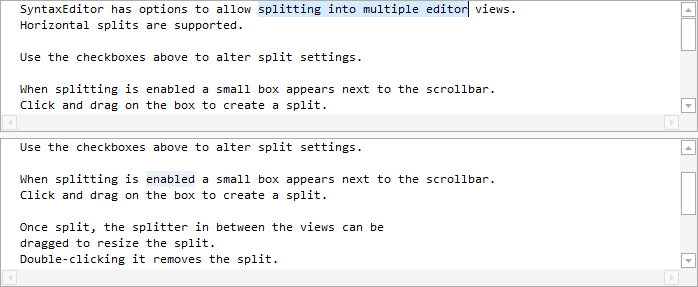

# Splitting

SyntaxEditor supports split views so that you can edit multiple areas of a document at the same time.

## Splitting UI

There are two forms of UI that are visible when splitting features are enabled.



*A horizontal split of a SyntaxEditor*

When splitting is enabled, a small gripper button appears on top of the right vertical scrollbar.  This gripper allows you to create a horizontal split by either double-clicking it or dragging it downward.

When split, the area between views can be dragged to resize the splits.  The splitter there can be double-clicked to remove the split.

## Split Capabilities

These members control splitting features:

| Member | Description |
|-----|-----|
| [CanSplitHorizontally](xref:ActiproSoftware.Windows.Controls.SyntaxEditor.SyntaxEditor.CanSplitHorizontally) Property | Gets or sets whether the editor can be split horizontally to show more than one view.  The default value is `true`. |

## Split State and Locations

The following properties are used to determine if there is currently a split in the editor, and can also be used to create a split.

| Member | Description |
|-----|-----|
| [HasHorizontalSplit](xref:ActiproSoftware.Windows.Controls.SyntaxEditor.SyntaxEditor.HasHorizontalSplit) Property | Gets or sets whether the editor is currently split horizontally to show more than one view. |
| [HorizontalSplitPercentage](xref:ActiproSoftware.Windows.Controls.SyntaxEditor.SyntaxEditor.HorizontalSplitPercentage) Property | Gets or sets the percentage across the width of the editor at which the horizontal split is located.  The value must be between `0` and `1`, where `0` indicates no split. |

This code creates a horizontal split:

```csharp
editor.HasHorizontalSplit = true;
```

## Resetting Splits

The [SyntaxEditor](xref:ActiproSoftware.Windows.Controls.SyntaxEditor.SyntaxEditor).[ResetViews](xref:ActiproSoftware.Windows.Controls.SyntaxEditor.SyntaxEditor.ResetViews*) method can be used to reset the editor to showing a single view.

## View Placement

The [IEditorView](xref:ActiproSoftware.Windows.Controls.SyntaxEditor.IEditorView).[Placement](xref:ActiproSoftware.Windows.Controls.SyntaxEditor.IEditorView.Placement) property returns an [EditorViewPlacement](xref:ActiproSoftware.Windows.Controls.SyntaxEditor.EditorViewPlacement) enumeration value indicating where a view is currently located within the editor.
