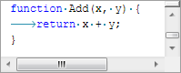
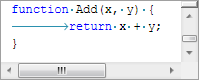

# Whitespace

SyntaxEditor can optionally display whitespace characters, change tab size, do tab to space conversion, and more.

## Visible Whitespace

SyntaxEditor can optionally display whitespace characters when the [SyntaxEditor](xref:@ActiproUIRoot.Controls.SyntaxEditor.SyntaxEditor).[IsWhitespaceVisible](xref:@ActiproUIRoot.Controls.SyntaxEditor.SyntaxEditor.IsWhitespaceVisible) property is set to `true`.

*Tabs and spaces visible in the editor*

@if (winrt wpf) {

### Visible Whitespace Color

The [SyntaxEditor](xref:@ActiproUIRoot.Controls.SyntaxEditor.SyntaxEditor).[VisibleWhitespaceForeground](xref:@ActiproUIRoot.Controls.SyntaxEditor.SyntaxEditor.VisibleWhitespaceForeground) property gets/sets the color used to render visible whitespace.

}

## Tab Size

The term tab size refers to the number of spaces that a tab character appears to represent.  SyntaxEditor allows you to configure the tab size.  The default tab size is `4`, meaning tabs render in the space of four space characters.

*A tab size of eight spaces, instead of four, which is the default*

The tab size can be altered by setting the [ITextDocument](xref:ActiproSoftware.Text.ITextDocument).[TabSize](xref:ActiproSoftware.Text.ITextDocument.TabSize) property.  When this property is changed, the related [TabSizeChanged](xref:ActiproSoftware.Text.ITextDocument.TabSizeChanged) event is raised.

## Tabs to Spaces Conversion While Typing

Tabs that are typed can be automatically converted to space characters if the [ITextDocument](xref:ActiproSoftware.Text.ITextDocument).[AutoConvertTabsToSpaces](xref:ActiproSoftware.Text.ITextDocument.AutoConvertTabsToSpaces) property is set to `true`.

## Backspacing to the Previous Tab Stop

When [ITextDocument](xref:ActiproSoftware.Text.ITextDocument).[AutoConvertTabsToSpaces](xref:ActiproSoftware.Text.ITextDocument.AutoConvertTabsToSpaces) is true, pressing the <kbd>Bkspace</kbd> key before the first non-whitespace character of a line will backspace to the previous tab stop by default.  Set the [SyntaxEditor](xref:@ActiproUIRoot.Controls.SyntaxEditor.SyntaxEditor).[CanBackspaceOverSpacesToTabStop](xref:@ActiproUIRoot.Controls.SyntaxEditor.SyntaxEditor.CanBackspaceOverSpacesToTabStop) property is set to `false` to alter this behavior to only allow backspacing a single space at a time.

## Tabification and Tab to Space Conversion

The [IEditorViewTextChangeActions](xref:@ActiproUIRoot.Controls.SyntaxEditor.IEditorViewTextChangeActions) interface, available via the [IEditorView](xref:@ActiproUIRoot.Controls.SyntaxEditor.IEditorView).[TextChangeActions](xref:@ActiproUIRoot.Controls.SyntaxEditor.IEditorView.TextChangeActions) property, provides several methods for doing tab/space conversions within the currently selected text.

The [TabifySelectedLines](xref:@ActiproUIRoot.Controls.SyntaxEditor.IEditorViewTextChangeActions.TabifySelectedLines*) and [UntabifySelectedLines](xref:@ActiproUIRoot.Controls.SyntaxEditor.IEditorViewTextChangeActions.UntabifySelectedLines*) methods convert leading line whitespace from spaces to tabs and back in the current view selection.

The [ConvertSpacesToTabs](xref:@ActiproUIRoot.Controls.SyntaxEditor.IEditorViewTextChangeActions.ConvertSpacesToTabs*) and [ConvertTabsToSpaces](xref:@ActiproUIRoot.Controls.SyntaxEditor.IEditorViewTextChangeActions.ConvertTabsToSpaces*) methods convert all whitespace from spaces to tabs and back in the current view selection.

## Whitespace Trim Modes

SyntaxEditor supports automatic trimming of whitespace under certain scenarios.  The [WhitespaceTrimModes](xref:ActiproSoftware.Text.WhitespaceTrimModes) enumeration is a flags enumeration that specifies the types of whitespace trim modes that are available, such as trimming trailing whitespace on paste and trailing whitespace on text replacements.

Set the [IEditorDocument](xref:ActiproSoftware.Text.IEditorDocument).[WhitespaceTrimModes](xref:ActiproSoftware.Text.IEditorDocument.WhitespaceTrimModes) property to control the automatic whitespace trim behavior.
