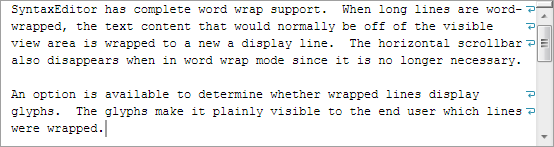

# Word Wrap

Word wrapping is a powerful feature that allows users to view all text for a line by wrapping text that normally would have been outside the view horizontally to one or more view lines in the editor.

## Word Wrap Modes

The [SyntaxEditor](xref:@ActiproUIRoot.Controls.SyntaxEditor.SyntaxEditor).[WordWrapMode](xref:@ActiproUIRoot.Controls.SyntaxEditor.SyntaxEditor.WordWrapMode) property can be set to `WordWrapMode.Word` to activate word wrap functionality.  By default it is set to `WordWrapMode.None`, meaning no word wrap.



*Word wrap active in the editor, with the glyphs on the right indicating wrapped lines*

This code activates word wrap:

```csharp
editor.WordWrapMode = WordWrapMode.Word;
```

The boolean [SyntaxEditor](xref:@ActiproUIRoot.Controls.SyntaxEditor.SyntaxEditor).[IsWordWrapEnabled](xref:@ActiproUIRoot.Controls.SyntaxEditor.SyntaxEditor.IsWordWrapEnabled) property also toggles between the `WordWrapMode.None` and `WordWrapMode.Word` wrap modes.

When the [SyntaxEditor](xref:@ActiproUIRoot.Controls.SyntaxEditor.SyntaxEditor).[WordWrapMode](xref:@ActiproUIRoot.Controls.SyntaxEditor.SyntaxEditor.WordWrapMode) property is changed, the [SyntaxEditor](xref:@ActiproUIRoot.Controls.SyntaxEditor.SyntaxEditor).[WordWrapModeChanged](xref:@ActiproUIRoot.Controls.SyntaxEditor.SyntaxEditor.WordWrapModeChanged) event is raised.

## Horizontal ScrollBar Visibility

The horizontal `ScrollBar` remains visible when word wrap is enabled and the [SyntaxEditor](xref:@ActiproUIRoot.Controls.SyntaxEditor.SyntaxEditor).[HorizontalScrollBarVisibility](xref:@ActiproUIRoot.Controls.SyntaxEditor.SyntaxEditor.HorizontalScrollBarVisibility) property has its default value of `HorizontalScrollBarVisibility.Visible`.  The reason is that some platforms allow tray content next to the horizontal `ScrollBar` that may include buttons or caret position information, such as in Visual Studio's editor.

Some usage scenarios may wish to hide the horizontal `ScrollBar` when word wrap is enabled.  This behavior can be achieved by handling the [SyntaxEditor](xref:@ActiproUIRoot.Controls.SyntaxEditor.SyntaxEditor).[WordWrapModeChanged](xref:@ActiproUIRoot.Controls.SyntaxEditor.SyntaxEditor.WordWrapModeChanged) event and altering the [SyntaxEditor](xref:@ActiproUIRoot.Controls.SyntaxEditor.SyntaxEditor).[HorizontalScrollBarVisibility](xref:@ActiproUIRoot.Controls.SyntaxEditor.SyntaxEditor.HorizontalScrollBarVisibility) property in response like this:

```csharp
private void OnSyntaxEditorWordWrapModeChanged(object sender, EventArgs e) {
	editor.HorizontalScrollBarVisibility = (editor.WordWrapMode == WordWrapMode.None ? ScrollBarVisibility.Visible : ScrollBarVisibility.Auto);
}
```

## Word Wrap Glyph Margin

Word wrap glyphs can be displayed on the right side of view lines in a special margin that indicate soft line breaks (wrapped lines).

The [SyntaxEditor](xref:@ActiproUIRoot.Controls.SyntaxEditor.SyntaxEditor).[AreWordWrapGlyphsVisible](xref:@ActiproUIRoot.Controls.SyntaxEditor.SyntaxEditor.AreWordWrapGlyphsVisible) property can be set to `true` to activate this functionality.
