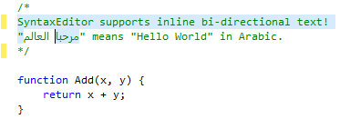

# Bi-Directional Input Support

SyntaxEditor is fully natively compatible with extended Unicode characters and even supports bi-directional editing.

Bi-directional display of text is a tricky thing because as soon as you enter a sequence of right-to-left characters such as Arabic or Hebrew, the entire sequence is flipped over and directional left/right arrow keys move the caret in the opposite direction.

*SyntaxEditor showing the partial selection of some Arabic text*

In the screenshot above, say you have the caret at the left quote on line 3.  If you press your right arrow, the caret moves to column 2, which is considered "before" the Arabic sequence of characters.  If you press right arrow again, the caret jumps to "before" the second Arabic character, which visually is to the left of the character left of the rightmost quote.  If you press right arrow again, it continues moving one character to the left within the Arabic section.  This continues until you reach the leftmost side of the Arabic sequence, where the caret next moves past the right quote.  From that point on, right arrow moves to the right since it is back in left-to-right mode.

In the screenshot, the selection was anchored at the start of the "SyntaxEditor" word and then the caret was moved down to the next line into the Arabic sequence of characters.  You can see how the selection properly splits to show the contiguous sequence of characters that are selected.
