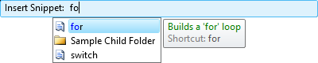

# Code Snippets

IntelliPrompt code snippets provide a way to insert pre-defined fragments of text into the editor.  Each code snippet can declare multiple fields of text, and when a code snippet template session is activated in SyntaxEditor, the text is inserted and the end user can tab between the fields to edit their values.

Multiple fields can be declared with the same ID.  In this scenario, only one of the fields with that ID in a template session will be editable.  When that field's value is changed by the end user, the dependent fields (the other non-editable fields with the same ID) will have their value updated as well.  This improves end user typing efficiency.

The XML code snippet file format used is the same as Visual Studio's.  This allows for any Visual Studio compatible code snippet to be used in SyntaxEditor.

## Opening Selection Sessions

Functionality is included that displays a helpful popup where the end user can type the title of an accessible code snippet to activate it.  A completion list that shows the code snippets and child folders at the current folder level is also displayed below the popup and fully supports partial matches and <kbd>Tab</kbd>-based selection.  The code snippets used to populate the selection session come from the [ICodeSnippetProvider](xref:@ActiproUIRoot.Controls.SyntaxEditor.IntelliPrompt.ICodeSnippetProvider) language service.



When a folder is selected in the completion list, the scope of the selection popup changes to that folder and the user can access the code snippets and child folders within it.  Pressing <kbd>Bkspace</kbd> or clicking the parent folder's link, backs up to the parent folder level.

### Programmatic Session Creation

A code snippet selection session can be opened via two different method calls.  Both require that a [ICodeSnippetProvider](xref:@ActiproUIRoot.Controls.SyntaxEditor.IntelliPrompt.ICodeSnippetProvider) language service is registered on the language.  One displays the code snippets that are designated as 'expansion' types and the other displays those designated as 'surrounds with' types:

```csharp
editor.ActiveView.IntelliPrompt.RequestInsertSnippetSession();  // Show 'expansion' code snippets
// editor.ActiveView.IntelliPrompt.RequestSurroundWithSession();  // Show 'surrounds with' code snippets
```

Both of these helper methods wrap a call to the [ICodeSnippetProvider](xref:@ActiproUIRoot.Controls.SyntaxEditor.IntelliPrompt.ICodeSnippetProvider).[RequestSelectionSession](xref:@ActiproUIRoot.Controls.SyntaxEditor.IntelliPrompt.ICodeSnippetProvider.RequestSelectionSession*) method.

## Opening Template Sessions

Code snippets are generally inserted into SyntaxEditor and activated into a template session by one of these methods:

- Selection made via a selection session.
- End user types a code snippet's registered shortcut (defined in the source XML file) into SyntaxEditor and presses the <kbd>Tab</kbd> key.
- Programmatic template session creation.

### Pressing Tab After a Code Snippet Shortcut

Each code snippet has a shortcut that can be typed into the editor.  When the <kbd>Tab</kbd> key is pressed after the shortcut, an [ICodeSnippetProvider](xref:@ActiproUIRoot.Controls.SyntaxEditor.IntelliPrompt.ICodeSnippetProvider) language service will look at the word before the caret to see if it matches any registered code snippets.  If a match is found, the shortcut text is removed from the document, and a code snippet template session is opened.

This mechanism depends on a [ICodeSnippetProvider](xref:@ActiproUIRoot.Controls.SyntaxEditor.IntelliPrompt.ICodeSnippetProvider) service being registered on the current language.  Please see the sections below for more information on code snippet providers.

### Programmatic Session Creation

Assuming that an [ICodeSnippet](xref:@ActiproUIRoot.Controls.SyntaxEditor.IntelliPrompt.ICodeSnippet) has been loaded into the `snippet` variable via some means, a session can be programmatically opened like this:

```csharp
CodeSnippetTemplateSession session = new CodeSnippetTemplateSession();
session.CodeSnippet = snippet;
session.Open(editor.ActiveView);
```

## Template Sessions at Run-Time

When a template session is opened, the code snippet's text is inserted into the document.  Some code snippets indicate a location within their text where the current view's selected text should be inserted.  In this scenario, the selected text prior to the session being opened is appropriately indented and injected within the code snippet text.

If one or more fields were declared in the code snippet, then fields will display in the editor.  Fields are highlighted replacement regions that represent the regions of text that need to be edited to complete the code snippet.  While the caret is in a field, the <kbd>Tab</kbd> key can be used to navigate to the next field.  Likewise, <kbd>Shift</kbd>+<kbd>Tab</kbd> navigates to the previous field.

Editable fields are drawn with a background behind them.  Sometimes a field refers to a declaration that is used in multiple places within the code snippet.  In that case, only the first field is designated as editable.  When its value changes, the other fields that are dependent upon it automatically update.  The dependent fields are drawn with a dotted line around them.

Once all the fields have been updated, pressing <kbd>Enter</kbd> while in a field completes the code snippet and closes the session.  At this point, if the code snippet designated a target offset for the caret to end up at, the caret will move to that offset.

## Template Session Event Sink

Any object that implements the [ICodeSnippetTemplateSessionEventSink](xref:@ActiproUIRoot.Controls.SyntaxEditor.IntelliPrompt.ICodeSnippetTemplateSessionEventSink) interface can be registered on a language to handle events related to code snippet template sessions.

These methods on the event sink receive the event notifications:

| Member | Description |
|-----|-----|
| [NotifyDeclarationActivated](xref:@ActiproUIRoot.Controls.SyntaxEditor.IntelliPrompt.ICodeSnippetTemplateSessionEventSink.NotifyDeclarationActivated*) Method | Notifies when a new declaration in the session's code snippet is activated. |
| [NotifyDeclarationDeactivated](xref:@ActiproUIRoot.Controls.SyntaxEditor.IntelliPrompt.ICodeSnippetTemplateSessionEventSink.NotifyDeclarationDeactivated*) Method | Notifies when a declaration in the session's code snippet is deactivated. |
| [NotifyDeclarationTextChanged](xref:@ActiproUIRoot.Controls.SyntaxEditor.IntelliPrompt.ICodeSnippetTemplateSessionEventSink.NotifyDeclarationTextChanged*) Method | Notifies when the text value of the active declaration in the session's code snippet is changed. |
| [NotifySessionClosed](xref:@ActiproUIRoot.Controls.SyntaxEditor.IntelliPrompt.ICodeSnippetTemplateSessionEventSink.NotifySessionClosed*) Method | Notifies after a session is closed. |
| [NotifySessionOpened](xref:@ActiproUIRoot.Controls.SyntaxEditor.IntelliPrompt.ICodeSnippetTemplateSessionEventSink.NotifySessionOpened*) Method | Notifies after a session is opened. |
| [NotifySessionOpening](xref:@ActiproUIRoot.Controls.SyntaxEditor.IntelliPrompt.ICodeSnippetTemplateSessionEventSink.NotifySessionOpening*) Method | Notifies before a session is opened. |

See the [Event Sinks](../../language-creation/event-sinks.md) topic for more information on event sinks in general.

## Code Snippets

Code snippets are represented by the [ICodeSnippet](xref:@ActiproUIRoot.Controls.SyntaxEditor.IntelliPrompt.ICodeSnippet) interface.

Here are the important members of the [CodeSnippet](xref:@ActiproUIRoot.Controls.SyntaxEditor.IntelliPrompt.Implementation.CodeSnippet) class, which implements [ICodeSnippet](xref:@ActiproUIRoot.Controls.SyntaxEditor.IntelliPrompt.ICodeSnippet):

| Member | Description |
|-----|-----|
| [Author](xref:@ActiproUIRoot.Controls.SyntaxEditor.IntelliPrompt.Implementation.CodeSnippet.Author) Property | Gets or sets the name of the code snippet author. |
| [CodeDelimiter](xref:@ActiproUIRoot.Controls.SyntaxEditor.IntelliPrompt.Implementation.CodeSnippet.CodeDelimiter) Property | Gets or sets the character used to describe literals and objects in the code. |
| [CodeKind](xref:@ActiproUIRoot.Controls.SyntaxEditor.IntelliPrompt.Implementation.CodeSnippet.CodeKind) Property | Gets or sets a `CodeSnippetKind` indicating the kind of code contained by the snippet. |
| [CodeLanguage](xref:@ActiproUIRoot.Controls.SyntaxEditor.IntelliPrompt.Implementation.CodeSnippet.CodeLanguage) Property | Gets or sets the language in which the snippet's code is written. |
| [CodeText](xref:@ActiproUIRoot.Controls.SyntaxEditor.IntelliPrompt.Implementation.CodeSnippet.CodeText) Property | Gets or sets the code that is inserted when the code snippet is activated. |
| [Declarations](xref:@ActiproUIRoot.Controls.SyntaxEditor.IntelliPrompt.Implementation.CodeSnippet.Declarations) Property | Gets the collection of declarations. |
| [Description](xref:@ActiproUIRoot.Controls.SyntaxEditor.IntelliPrompt.Implementation.CodeSnippet.Description) Property | Gets or sets descriptive information about the code snippet contents. |
| [HelpUrl](xref:@ActiproUIRoot.Controls.SyntaxEditor.IntelliPrompt.Implementation.CodeSnippet.HelpUrl) Property | Gets or sets a URL that provides more information about the code snippet. |
| [ImportedNamespaces](xref:@ActiproUIRoot.Controls.SyntaxEditor.IntelliPrompt.Implementation.CodeSnippet.ImportedNamespaces) Property | Gets the collection of imported namespaces. |
| [Keywords](xref:@ActiproUIRoot.Controls.SyntaxEditor.IntelliPrompt.Implementation.CodeSnippet.Keywords) Property | Gets the collection of keywords that describe the code snippet. |
| [References](xref:@ActiproUIRoot.Controls.SyntaxEditor.IntelliPrompt.Implementation.CodeSnippet.References) Property | Gets the collection of assembly references. |
| [Shortcut](xref:@ActiproUIRoot.Controls.SyntaxEditor.IntelliPrompt.Implementation.CodeSnippet.Shortcut) Property | Gets or sets the shortcut text used to insert the code snippet. |
| [SnippetTypes](xref:@ActiproUIRoot.Controls.SyntaxEditor.IntelliPrompt.Implementation.CodeSnippet.SnippetTypes) Property | Gets the types of actions that can be performed by the code snippet. |
| [Tag](xref:@ActiproUIRoot.Controls.SyntaxEditor.IntelliPrompt.Implementation.CodeSnippet.Tag) Property | Gets or sets the object that contains user-defined data about the object. |
| [Title](xref:@ActiproUIRoot.Controls.SyntaxEditor.IntelliPrompt.Implementation.CodeSnippet.Title) Property | Gets or sets the code snippet title. |

## Code Snippet Serialization

[ICodeSnippet](xref:@ActiproUIRoot.Controls.SyntaxEditor.IntelliPrompt.ICodeSnippet) objects can be saved to and loaded from an XML format via the use of a [CodeSnippetSerializer](xref:@ActiproUIRoot.Controls.SyntaxEditor.IntelliPrompt.Implementation.CodeSnippetSerializer).  In fact, it's the same XML format that Visual Studio uses to store code snippet data.  That means that any code snippets created for Visual Studio can be used directly within SyntaxEditor as well.

Please see the Visual Studio documentation for more information on the XML schema for code snippet files.

### Loading a Code Snippet

Code snippets can be loaded from a `Stream` via the [CodeSnippetSerializer](xref:@ActiproUIRoot.Controls.SyntaxEditor.IntelliPrompt.Implementation.CodeSnippetSerializer).[LoadFromStream](xref:@ActiproUIRoot.Controls.SyntaxEditor.IntelliPrompt.Implementation.CodeSnippetSerializer.LoadFromStream*) method. @if (wpf winforms) {They can be loaded from a file via the [CodeSnippetSerializer](xref:@ActiproUIRoot.Controls.SyntaxEditor.IntelliPrompt.Implementation.CodeSnippetSerializer).[LoadFromFile](xref:@ActiproUIRoot.Controls.SyntaxEditor.IntelliPrompt.Implementation.CodeSnippetSerializer.LoadFromFile*) method. }

The return value is an enumerable of [ICodeSnippet](xref:@ActiproUIRoot.Controls.SyntaxEditor.IntelliPrompt.ICodeSnippet) objects, since each code snippet file can contain more than one code snippet per Microsoft's specifications.

### Saving a Code Snippet

Code snippets can be saved to a `Stream` via the [CodeSnippetSerializer](xref:@ActiproUIRoot.Controls.SyntaxEditor.IntelliPrompt.Implementation.CodeSnippetSerializer).[SaveToStream](xref:@ActiproUIRoot.Controls.SyntaxEditor.IntelliPrompt.Implementation.CodeSnippetSerializer.SaveToStream*) method. @if (wpf winforms) {They can be saved to a file via the [CodeSnippetSerializer](xref:@ActiproUIRoot.Controls.SyntaxEditor.IntelliPrompt.Implementation.CodeSnippetSerializer).[SaveToFile](xref:@ActiproUIRoot.Controls.SyntaxEditor.IntelliPrompt.Implementation.CodeSnippetSerializer.SaveToFile*) method. }

A parameter array of [ICodeSnippet](xref:@ActiproUIRoot.Controls.SyntaxEditor.IntelliPrompt.ICodeSnippet) objects is used as a parameter, since each code snippet file can contain more than one code snippet per Microsoft's specifications.

## Code Snippet Folders and Metadata

The [ICodeSnippetFolder](xref:@ActiproUIRoot.Controls.SyntaxEditor.IntelliPrompt.ICodeSnippetFolder) interface, implemented by the [CodeSnippetFolder](xref:@ActiproUIRoot.Controls.SyntaxEditor.IntelliPrompt.Implementation.CodeSnippetFolder) class, represents a folder that can reference code snippets.  Each folder has a [Name](xref:@ActiproUIRoot.Controls.SyntaxEditor.IntelliPrompt.ICodeSnippetFolder.Name) property that is usually the value of the real file system folder it represents.

A folder has a [Items](xref:@ActiproUIRoot.Controls.SyntaxEditor.IntelliPrompt.ICodeSnippetFolder.Items) collection, where each item is an object of type [ICodeSnippetMetadata](xref:@ActiproUIRoot.Controls.SyntaxEditor.IntelliPrompt.ICodeSnippetMetadata).  The [ICodeSnippetMetadata](xref:@ActiproUIRoot.Controls.SyntaxEditor.IntelliPrompt.ICodeSnippetMetadata) interface specifies a subset of the properties found on the [ICodeSnippet](xref:@ActiproUIRoot.Controls.SyntaxEditor.IntelliPrompt.ICodeSnippet) interface, and is used to store minimal descriptive information about a particular code snippet, such as its title, shortcut, and description.  The metadata also has a [GetCodeSnippet](xref:@ActiproUIRoot.Controls.SyntaxEditor.IntelliPrompt.ICodeSnippetMetadata.GetCodeSnippet*) method that can be called to dynamically load the referenced full code snippet.

Nested folders can be created as well.  Each folder has a [Folders](xref:@ActiproUIRoot.Controls.SyntaxEditor.IntelliPrompt.ICodeSnippetFolder.Folders) collection that lists the child folders of the current folder.

A helper [FindItemByShortcut](xref:@ActiproUIRoot.Controls.SyntaxEditor.IntelliPrompt.ICodeSnippetFolder.FindItemByShortcut*) method is included that recursively searches an [ICodeSnippetFolder](xref:@ActiproUIRoot.Controls.SyntaxEditor.IntelliPrompt.ICodeSnippetFolder) hierarchy for a contained code snippet that has a particular shortcut.

@if (wpf winforms) {

## Loading a Code Snippet Folder

An [ICodeSnippetFolder](xref:@ActiproUIRoot.Controls.SyntaxEditor.IntelliPrompt.ICodeSnippetFolder) can be created and initialized programmatically, or fully-loaded from a file system path.

To create and initialize an [ICodeSnippetFolder](xref:@ActiproUIRoot.Controls.SyntaxEditor.IntelliPrompt.ICodeSnippetFolder) from a file system path, call the static [CodeSnippetFolder](xref:@ActiproUIRoot.Controls.SyntaxEditor.IntelliPrompt.Implementation.CodeSnippetFolder).[LoadFrom](xref:@ActiproUIRoot.Controls.SyntaxEditor.IntelliPrompt.Implementation.CodeSnippetFolder.LoadFrom*) method.

```csharp
ICodeSnippetFolder folder = CodeSnippetFolder.LoadFrom(path, "CSharp");
```

This method will recursively examine folders and load any code snippets located that are for the designated language.

}

## Code Snippet Providers

The [ICodeSnippetProvider](xref:@ActiproUIRoot.Controls.SyntaxEditor.IntelliPrompt.ICodeSnippetProvider) interface, and related [CodeSnippetProvider](xref:@ActiproUIRoot.Controls.SyntaxEditor.IntelliPrompt.Implementation.CodeSnippetProvider) implementation class, is very important since it is the service that should be registered on a language to make code snippet functionality available.  It is used to store available code snippet metadata, watch keypresses, and manage the adornments for fields in any template sessions.

Its [RootFolder](xref:@ActiproUIRoot.Controls.SyntaxEditor.IntelliPrompt.ICodeSnippetProvider.RootFolder) property needs to be set to an [ICodeSnippetFolder](xref:@ActiproUIRoot.Controls.SyntaxEditor.IntelliPrompt.ICodeSnippetFolder) instance that has loaded code snippet metadata into itself or one of its nested folders.  Its [IsCaseSensitive](xref:@ActiproUIRoot.Controls.SyntaxEditor.IntelliPrompt.ICodeSnippetProvider.IsCaseSensitive) property can also be set to `false` for case-insensitive languages.

This code registers a provider on a language using the folder from the previous section's sample:

```csharp
language.RegisterService(new CodeSnippetProvider() { RootFolder = folder });
```

This code is also required to be called once per application instance since it registers the classification types and related styles for any fields that will be visible during a template session.  If it is not called, then field backgrounds and borders might not display.

```csharp
new DisplayItemClassificationTypeProvider().RegisterAll();
```

Once the provider has been registered on a language, it will watch for <kbd>Tab</kbd> key presses.  If a shortcut for a known code snippet appears before the caret, then that code snippet will be activated into a new template session.

## Customizing Code Snippet Providers

Some languages may wish to only allow shortcuts to trigger code snippet template sessions when in certain portions of code.  For instance, a language generally doesn't want a code snippet shortcut to trigger when the shortcut is in a comment or a string literal.

This can be achieved by creating a class that inherits [CodeSnippetProvider](xref:@ActiproUIRoot.Controls.SyntaxEditor.IntelliPrompt.Implementation.CodeSnippetProvider).  Then override the [GetPossibleShortcutSnapshotRange](xref:@ActiproUIRoot.Controls.SyntaxEditor.IntelliPrompt.Implementation.CodeSnippetProvider.GetPossibleShortcutSnapshotRange*) method and in that code, first call the base method.  If a snapshot range is returned that is not zero-length, get a [snapshot reader](../../text-parsing/core-text/scanning-text.md) and see what sort of token is at the snapshot range.  If it is a comment or literal, return `TextSnapshotRange.Deleted`.  Otherwise, return the result from the base method call.

## Code Snippets in Completion Lists

Languages that wish to include code snippet support may wish to list code snippet metadata items in the <kbd>Ctrl</kbd>+<kbd>Space</kbd> completion lists.  The [.NET Languages Add-on](../../dotnet-languages-addon/index.md) languages include this feature.

When a code snippet is selected in the completion list, its shortcut is inserted into the editor.  Then if the user presses the <kbd>Tab</kbd> key next, and assuming a code snippet provider is registered on the language (see above), the related code snippet is inserted.
