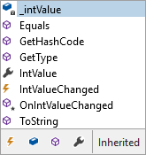

# Completion List

The IntelliPrompt completion list allows you create popups for displaying a list of options used to complete what the end user is typing.  This is most used when editing programming languages.  Features include ctrl+space support, description tips, multiple matching algorithms, matched text highlights, filters, and more.

As the end user types in the editor, the selected item in the completion list is updated to reflect the item that most closely matches what has been typed.  The end user can press `Tab` or `Enter` to insert the complete text associated with the item.  This immensely helps increase the productivity of end users while typing.

## Run-Time Functionality

The completion list bases itself on a text range that is passed in when it is opened.  While open a list of items is displayed.  Arrow keys and the mouse can be used to scroll through the list.  As the end user types, the selected item in the list is changed to best fit the typed text based on various matching algorithms.

Optional filters can be toggled by the end user via buttons and tabs to narrow down the list of displayed items.

The pressing and holding of the `Ctrl` key animates the list to be semi-transparent so that the end user can see the text under the list.

When the `Tab` key is pressed, the completion list is closed and the selected item's text is auto-inserted into the document.  The `Esc` key can be used to cancel the completion list and close it without inserting any text.

## Creating and Opening a Session

Creating and opening a completion list session is very easy.  There are only a few simple steps to follow.

### Creating a Session

The first step is to create a [CompletionSession](xref:@ActiproUIRoot.Controls.SyntaxEditor.IntelliPrompt.Implementation.CompletionSession):

```csharp
CompletionSession session = new CompletionSession();
```

### Configure Options

Next, configure any options that should be set on the session such as whether to allow complete word functionality, set up filters, etc.:

```csharp
session.CanCommitWithoutPopup = true;  // Allow complete word
```

### Add Items

The next step is to populate the list with all the items that should be included.  Items (described in more detail below) must implement [ICompletionItem](xref:@ActiproUIRoot.Controls.SyntaxEditor.IntelliPrompt.ICompletionItem).  The [CompletionItem](xref:@ActiproUIRoot.Controls.SyntaxEditor.IntelliPrompt.Implementation.CompletionItem) class implements this interface and makes it easy to add items.

This code adds a single item for a `Boolean` native type:

```csharp
session.Items.Add(new CompletionItem("bool", 
	new CommonImageSourceProvider(CommonImageKind.StructurePublic), 
	new CustomContentProvider(typeof(bool))));
```

The core implementation of [ICompletionItemCollection](xref:@ActiproUIRoot.Controls.SyntaxEditor.IntelliPrompt.ICompletionItemCollection) is based on an `ObservableCollection<ICompletionItem>`, which raises an event each time an item is added to the collection.  This can cause a performance bottleneck when adding hundreds or thousands of completion items to the `session.Items` collection.

This bottleneck may be eliminated by wrapping all item adds in a batch, which only raises a single collection change event:

```csharp
using (var batch = session.Items.CreateBatch()) {
	session.Items.AddRange(...);
}
```

### Open the Session

The final step is to open the session:

```csharp
session.Open(editor.ActiveView);
```

The [ICompletionSession](xref:@ActiproUIRoot.Controls.SyntaxEditor.IntelliPrompt.ICompletionSession) interface defines an [Open](xref:@ActiproUIRoot.Controls.SyntaxEditor.IntelliPrompt.ICompletionSession.Open*) method overload that just takes the [IEditorView](xref:@ActiproUIRoot.Controls.SyntaxEditor.IEditorView) in which to display.  This overload automatically determines the text range with which to initialize the completion list for you.  Therefore, if the caret is at the end of a partial word when the completion list is opened, the partial word's text will be used to initialize the selection in the completion list.

For most cases, once the session is opened, the built-in functionality handles all the rest for you, including auto-complete of selected items when appropriate.

## Opening a Session in Response to a Typed Character ('.', '<', etc.)

Completion lists are often opened in response to a typed character by the end user.  For instance, in C# or VB, pressing the `.` (dot) character generally opens a completion list for the object represented by the text before the dot.  In HTML a `<` character displays a completion list for available tags.  Some languages also automatically show a completion list when a letter is typed that starts a new word.

### Watching Typed Characters

The [SyntaxEditor](xref:@ActiproUIRoot.Controls.SyntaxEditor.SyntaxEditor).[DocumentTextChanged](xref:@ActiproUIRoot.Controls.SyntaxEditor.SyntaxEditor.DocumentTextChanged) event is the best place to watch for specific characters being typed.  Its event args, [EditorSnapshotChangedEventArgs](xref:@ActiproUIRoot.Controls.SyntaxEditor.EditorSnapshotChangedEventArgs), has a special helper property called [TypedText](xref:@ActiproUIRoot.Controls.SyntaxEditor.EditorSnapshotChangedEventArgs.TypedText) that is normally a null value but is filled in only when the text change is [TextChangeTypes](xref:ActiproSoftware.Text.TextChangeTypes).[Typing](xref:ActiproSoftware.Text.TextChangeTypes.Typing), and the change is not an undo/redo.

If your app allows two or more SyntaxEditor controls to operate on the same document, then all of the samples below should be wrapped with a check to ensure that the view in which the text change occurred is the same editor's view in which the completion session will be requested:

```csharp
if (e.TextChange.Source == editor.ActiveView) {
	...
}
```

### Sample: Showing an HTML Tag List

In this scenario, assume we have an HTML language loaded and wish to show a completion list in response to `<` characters being typed.  Here is sample code for a [DocumentTextChanged](xref:@ActiproUIRoot.Controls.SyntaxEditor.SyntaxEditor.DocumentTextChanged) event handler to do this:

```csharp
switch (e.TypedText) {
	case "<":
		// Open completion list session for HTML tags here
		break;
}
```

### Sample: Showing a C# Object Member List

In this scenario, assume we have a C# language loaded and wish to show a completion list in response to `.` characters being typed after the keyword `this`.  Here is sample code for a [DocumentTextChanged](xref:@ActiproUIRoot.Controls.SyntaxEditor.SyntaxEditor.DocumentTextChanged) event handler to do this:

```csharp
switch (e.TypedText) {
	case ".": {
		// Use a snapshot reader to iterate backwards through the active view's current text
		ITextSnapshotReader reader = editor.ActiveView.GetReader();
		reader.ReadCharacterReverseThrough('.');
		IToken token = reader.ReadTokenReverse();
		
		// In production code, a token ID comparison would be better than this string comparison
		if ((token != null) && (reader.TokenText == "this")) {
			// A dot was typed after a "this" keyword so open the completion list session here
		}
		break;
	}
}
```

Note that in this sample, we used an [ITextSnapshotReader](xref:ActiproSoftware.Text.ITextSnapshotReader) to scan backwards past the dot and to the token before it.  We then did a text compare with the token to see if its text was `this`.  If your language has token IDs available, it's better to do a token ID comparison here instead of a string comparison.  Also, while scanning back, you may wish to skip over whitespace tokens.  If all that criteria was met, the completion list session was opened.

### Sample: Showing a Completion List Automatically When a New Word Is Started

In this scenario, we wish to show a completion list whenever a letter is typed by the end user that is starting a new word.  This prevents the end user from having to do a `Ctrl+Space` to initiate a completion session.

Here is sample code for a [DocumentTextChanged](xref:@ActiproUIRoot.Controls.SyntaxEditor.SyntaxEditor.DocumentTextChanged) event handler to do this:

```csharp
// If the text that was typed is a letter character that is starting a word... 
if (e.IsTypedWordStart) {
	// If no completion session is currently open, show a completion list
	if (!editor.IntelliPrompt.Sessions.Contains(IntelliPromptSessionTypes.Completion)) {
		// Open the completion list session here
	}
}
```

## Having a Language Open a Session in Response to a Typed Character or Ctrl+Space

Syntax languages are fully capable of listening to typed characters like above and opening a completion list session in response.  To do this, they can use the [event sinks](../../language-creation/event-sinks.md) mechanism that allows them to be notified of text changes.

The [IntelliPrompt Completion Provider](../../language-creation/provider-services/completion-provider.md) topic describes a special language service that can be implemented to respond to `Ctrl+Space` and show a completion list.

When a completion provider service is registered for a language, the [IEditorView](xref:@ActiproUIRoot.Controls.SyntaxEditor.IEditorView).[IntelliPrompt](xref:@ActiproUIRoot.Controls.SyntaxEditor.IEditorView.IntelliPrompt).[RequestAutoComplete](xref:@ActiproUIRoot.Controls.SyntaxEditor.IEditorViewIntelliPrompt.RequestAutoComplete*) and [RequestCompletionSession](xref:@ActiproUIRoot.Controls.SyntaxEditor.IEditorViewIntelliPrompt.RequestCompletionSession*) methods can be called to request auto-complete or completion list display respectively.  In that case if the completion provider determines that completion can occur at the current editor caret position, IntelliPrompt action will be taken.

As an example, if a syntax language has an event sink registered that watches for the `.` key to be typed, it may wish to request that a completion session be opened if appropriate.  In that case the event sink handler should call [RequestCompletionSession](xref:@ActiproUIRoot.Controls.SyntaxEditor.IEditorViewIntelliPrompt.RequestCompletionSession*) and if a completion provider is available to handle the request, a completion list will display.

## Completion List Items (Images, Text, Descriptions, etc.)

All completion list items implement the [ICompletionItem](xref:@ActiproUIRoot.Controls.SyntaxEditor.IntelliPrompt.ICompletionItem) interface, which is realized by the [CompletionItem](xref:@ActiproUIRoot.Controls.SyntaxEditor.IntelliPrompt.Implementation.CompletionItem) class.

The interface has several members on it:

<table>
<thead>

<tr>
<th>Member</th>
<th>Description</th>
</tr>

</thead>
<tbody>

<tr>
<td>

[AutoCompletePostText](xref:@ActiproUIRoot.Controls.SyntaxEditor.IntelliPrompt.ICompletionItem.AutoCompletePostText) Property

</td>
<td>Gets or sets the text that is inserted into the document after the caret when auto-complete is executed.</td>
</tr>

<tr>
<td>

[AutoCompletePreText](xref:@ActiproUIRoot.Controls.SyntaxEditor.IntelliPrompt.ICompletionItem.AutoCompletePreText) Property

</td>
<td>Gets or sets the text that is inserted into the document before the caret when auto-complete is executed.</td>
</tr>

<tr>
<td>

[DescriptionProvider](xref:@ActiproUIRoot.Controls.SyntaxEditor.IntelliPrompt.ICompletionItem.DescriptionProvider) Property

</td>
<td>

Gets an [IContentProvider](xref:@ActiproUIRoot.Controls.SyntaxEditor.IntelliPrompt.IContentProvider) that can provide content for a popup displaying a verbose description of the item.

> [!NOTE]
> See the [Content Providers](popup-content-providers.md) topic for details on the [IContentProvider](xref:@ActiproUIRoot.Controls.SyntaxEditor.IntelliPrompt.IContentProvider) interface and the available built-in implementations.

</td>
</tr>

<tr>
<td>

[ImageSourceProvider](xref:@ActiproUIRoot.Controls.SyntaxEditor.IntelliPrompt.ICompletionItem.ImageSourceProvider) Property

</td>
<td>

Gets an [IImageSourceProvider](xref:@ActiproUIRoot.Controls.SyntaxEditor.IntelliPrompt.IImageSourceProvider) that can provide an `ImageSource` for display within a list.

> [!NOTE]
> See the [Image Source Providers](image-source-providers.md) topic for details on the [IImageSourceProvider](xref:@ActiproUIRoot.Controls.SyntaxEditor.IntelliPrompt.IImageSourceProvider) interface and the available built-in implementations.

</td>
</tr>

<tr>
<td>

[InlineDescription](xref:@ActiproUIRoot.Controls.SyntaxEditor.IntelliPrompt.ICompletionItem.InlineDescription) Property

</td>
<td>Gets or sets the optional inline description that is displayed next to an item's text.  For instance, this feature can be used to display a namespace for a type completion item.</td>
</tr>

<tr>
<td>

[Tag](xref:@ActiproUIRoot.Controls.SyntaxEditor.IntelliPrompt.ICompletionItem.Tag) Property

</td>
<td>Gets or sets the object that contains user-defined data about the object.</td>
</tr>

<tr>
<td>

[Text](xref:@ActiproUIRoot.Controls.SyntaxEditor.IntelliPrompt.ICompletionItem.Text) Property

</td>
<td>Gets the text for the item that is displayed within a list.</td>
</tr>

</tbody>
</table>

## Sorting Items

The items in the completion session should always be sorted so that proper selection matching occurs at run-time as the end user types.  You can choose to pre-sort the items yourself before you add them to the [Items](xref:@ActiproUIRoot.Controls.SyntaxEditor.IntelliPrompt.ICompletionSession.Items) collection.

Alternatively, you can call the [SortItems](xref:@ActiproUIRoot.Controls.SyntaxEditor.IntelliPrompt.ICompletionSession.SortItems*) method right before opening the session to ensure they are properly sorted.  This allows you to add items in any order while building the list.  A [SortItems](xref:@ActiproUIRoot.Controls.SyntaxEditor.IntelliPrompt.ICompletionSession.SortItems*) overload allows a custom comparer to be specified in the event that custom sort logic is required.

## Text Insertion

Normally the text displayed in the completion list for an item is the same text that is inserted.  That is what happens by default.

However, SyntaxEditor has the ability to insert alternate text both before and after the caret.  Several variations are shown in the following sections.

### Displayed text inserted before the caret

When using the [CompletionItem](xref:@ActiproUIRoot.Controls.SyntaxEditor.IntelliPrompt.Implementation.CompletionItem) constructor that just takes the text (no auto-complete pre or post text), the text you pass in is displayed in the list and is also what is inserted on auto-complete.  So in essence, that constructor fills in [AutoCompletePreText](xref:@ActiproUIRoot.Controls.SyntaxEditor.IntelliPrompt.ICompletionItem.AutoCompletePreText) with the text value as well.

### Alternate text inserted before the caret

Many times the displayed [Text](xref:@ActiproUIRoot.Controls.SyntaxEditor.IntelliPrompt.ICompletionItem.Text) is not what should be inserted.


*A br tag before and after it is inserted from the completion list*

In the screenshot above, a `br` should be displayed but `<br/>` should be inserted before the caret.  To accomplish this, [Text](xref:@ActiproUIRoot.Controls.SyntaxEditor.IntelliPrompt.ICompletionItem.Text) is set to `br`, [AutoCompletePreText](xref:@ActiproUIRoot.Controls.SyntaxEditor.IntelliPrompt.ICompletionItem.AutoCompletePreText) is set to `<br/>`, and [AutoCompletePostText](xref:@ActiproUIRoot.Controls.SyntaxEditor.IntelliPrompt.ICompletionItem.AutoCompletePostText) is set to a null reference.

### Alternate text inserted to surround the caret

Sometimes auto-completes need to surround the caret with text.


*An HTML comment before and after it is inserted from the completion list*

In the screenshot above, a `!--` should be displayed but `<!-- -->` should surround the caret on auto-complete.  To accomplish this, [Text](xref:@ActiproUIRoot.Controls.SyntaxEditor.IntelliPrompt.ICompletionItem.Text) is set to `!--`, [AutoCompletePreText](xref:@ActiproUIRoot.Controls.SyntaxEditor.IntelliPrompt.ICompletionItem.AutoCompletePreText) is set to `<!--`, and [AutoCompletePostText](xref:@ActiproUIRoot.Controls.SyntaxEditor.IntelliPrompt.ICompletionItem.AutoCompletePostText) is set to `-->`.

## Commit and Cancel

When the completion list is committed, auto-complete is performed on whichever item is selected.  If the completion list is cancelled, auto-complete is not performed and no text is changed in the document.

The completion list can be programmatically committed by calling the [Commit](xref:@ActiproUIRoot.Controls.SyntaxEditor.IntelliPrompt.ICompletionSession.Commit*) method.  Likewise, it can be cancelled by calling the [Cancel](xref:@ActiproUIRoot.Controls.SyntaxEditor.IntelliPrompt.ICompletionSession.Cancel*) method.

If committed, two events fire: [Committing](xref:@ActiproUIRoot.Controls.SyntaxEditor.IntelliPrompt.ICompletionSession.Committing), then [Committed](xref:@ActiproUIRoot.Controls.SyntaxEditor.IntelliPrompt.ICompletionSession.Committed).  The first event allows you to set the `Cancel` property of the event args to cancel auto-complete.

The `Tab` key commits the selected item at run-time and is consumed.  The `Enter` key commits and is normally consumed as well unless the [IsEnterKeyHandledOnCommit](xref:@ActiproUIRoot.Controls.SyntaxEditor.IntelliPrompt.ICompletionSession.IsEnterKeyHandledOnCommit) property is set to `false`.

## Auto-Commit Without Showing a Popup (Complete Word)

There generally are two modes in which to display a completion list. `Ctrl+Space` keypresses typically activate a "complete word" mode where if the text range with which the list was initialized is capable of fully selecting an item in the list, the list item is auto-completed and the list is never displayed.  If no exact match is made, the list displays and operates like normal.  The default mode is to have the list display regardless of whether it can initially match an item.

To enable "complete word" functionality, set the [ICompletionSession](xref:@ActiproUIRoot.Controls.SyntaxEditor.IntelliPrompt.ICompletionSession).[CanCommitWithoutPopup](xref:@ActiproUIRoot.Controls.SyntaxEditor.IntelliPrompt.ICompletionSession.CanCommitWithoutPopup) property to `true`.

## Description Tips

Description tips, which are essentially quick info tips, are displayed when an item is selected within the completion list.  They are optional but can provide some extensive information about the selected item to the end user.

Description tip content is specified on each item via the [ICompletionItem](xref:@ActiproUIRoot.Controls.SyntaxEditor.IntelliPrompt.ICompletionItem).[DescriptionProvider](xref:@ActiproUIRoot.Controls.SyntaxEditor.IntelliPrompt.ICompletionItem.DescriptionProvider) property.  Since this is a property, the info is pulled-on demand, thereby using less memory in most cases.

> [!NOTE]
> See the [Content Providers](popup-content-providers.md) topic for details on the [IContentProvider](xref:@ActiproUIRoot.Controls.SyntaxEditor.IntelliPrompt.IContentProvider) interface and the available built-in implementations.

@if (wpf) {

When links are present in description tip content, the [ICompletionSession](xref:@ActiproUIRoot.Controls.SyntaxEditor.IntelliPrompt.ICompletionSession).[RequestNavigate](xref:@ActiproUIRoot.Controls.SyntaxEditor.IntelliPrompt.ICompletionSession.RequestNavigate) event will fire if a link is clicked, requesting that you take some action. 

}

The [ICompletionSession](xref:@ActiproUIRoot.Controls.SyntaxEditor.IntelliPrompt.ICompletionSession).[DescriptionTipMaxWidth](xref:@ActiproUIRoot.Controls.SyntaxEditor.IntelliPrompt.ICompletionSession.DescriptionTipMaxWidth) property can be set to specify a maximum width for the description tip.

The [ICompletionSession](xref:@ActiproUIRoot.Controls.SyntaxEditor.IntelliPrompt.ICompletionSession).[DescriptionTipShowDelay](xref:@ActiproUIRoot.Controls.SyntaxEditor.IntelliPrompt.ICompletionSession.DescriptionTipShowDelay) accepts a `TimeSpan` value that indicates the delay length between when a completion item is selected and when its related description tip is displayed.  The default value is `400ms`.

## Getting the Selection

The [ICompletionSession](xref:@ActiproUIRoot.Controls.SyntaxEditor.IntelliPrompt.ICompletionSession).[Selection](xref:@ActiproUIRoot.Controls.SyntaxEditor.IntelliPrompt.ICompletionSession.Selection) property indicates the current selection of the list.  Its value is of type [CompletionSelection](xref:@ActiproUIRoot.Controls.SyntaxEditor.IntelliPrompt.CompletionSelection), which indicates the [ICompletionItem](xref:@ActiproUIRoot.Controls.SyntaxEditor.IntelliPrompt.ICompletionItem) that is selected and its selection state (full or partial).  If there is no selection then that property returns a null reference.

When the selection changes, the [SelectionChanged](xref:@ActiproUIRoot.Controls.SyntaxEditor.IntelliPrompt.ICompletionSession.SelectionChanged) event fires.

## Allowed and Commit Characters

By default, only letters, digits, and underscores are allowed characters.  If you type any other character while a completion list is open, it will either auto-complete or cancel depending on whether you have a full selection in the list and if the character is a commit character.

Since sometimes other characters such as `!` need to be allowed characters, the completion list session provides the [ICompletionSession](xref:@ActiproUIRoot.Controls.SyntaxEditor.IntelliPrompt.ICompletionSession).[AllowedCharacters](xref:@ActiproUIRoot.Controls.SyntaxEditor.IntelliPrompt.ICompletionSession.AllowedCharacters) collection.  By adding characters to this collection, they will be allowed to be typed without the session being cancelled.

All letter and digit characters are automatically allowed by the completion popup and therefore do not need to be added to this collection.

The [ICompletionSession](xref:@ActiproUIRoot.Controls.SyntaxEditor.IntelliPrompt.ICompletionSession).[CommitCharacters](xref:@ActiproUIRoot.Controls.SyntaxEditor.IntelliPrompt.ICompletionSession.CommitCharacters) property defaults to contain all characters.  This means that if a typed character is not an allowed character, it will auto-complete the session if there is a full selection in the list.  If you wish to limit the characters that can auto-complete the session, set a new character collection to this property with the appropriate characters.

## Built-In Matching Algorithms

Matching algorithms are what are used to select an item in the completion list as you type in the editor.  SyntaxEditor includes numerous built-in matching algorithms, each used in a priority order.

### Default Matching Algorithm

Normal completion lists match with an algorithm in which the typed characters are compared against the start of each item.  This default algorithm has the highest priority when attempting to match items.

If no match is made, the next active algorithm is used.

### Acronym Matching Algorithm

Next in priority is an optional algorithm in which the first and every uppercase letter is examined for a match.  For words that contain underscores, the first and every character following an underscore are examined for a match instead.

This algorithm is only active if the [ICompletionSession](xref:@ActiproUIRoot.Controls.SyntaxEditor.IntelliPrompt.ICompletionSession).[MatchOptions](xref:@ActiproUIRoot.Controls.SyntaxEditor.IntelliPrompt.ICompletionSession.MatchOptions) flags property has the [CompletionMatchOptions](xref:@ActiproUIRoot.Controls.SyntaxEditor.IntelliPrompt.CompletionMatchOptions).`UseAcronyms` flag specified.

If no match is made, the next active algorithm is used.

### Shorthand Matching Algorithm

Next in priority is another optional algorithm in which the supplied text provides a wildcard sort of pattern.  A match is made if all the characters appear somewhere in the item text.  Shorthand provides the most flexibility since it allows substring matches anywhere in the items.

This algorithm is only active if the [ICompletionSession](xref:@ActiproUIRoot.Controls.SyntaxEditor.IntelliPrompt.ICompletionSession).[MatchOptions](xref:@ActiproUIRoot.Controls.SyntaxEditor.IntelliPrompt.ICompletionSession.MatchOptions) flags property has the [CompletionMatchOptions](xref:@ActiproUIRoot.Controls.SyntaxEditor.IntelliPrompt.CompletionMatchOptions).`UseShorthand` flag specified.

If no match is made, the next active algorithm is used.

### Fallback Partial Matching Algorithm

Finally, if no match has been made yet, a partial match can be made at the item that starts with text closest to the typed text.

## Matched Text Highlights

As described above, the completion list auto-selects the closest matched item in the list as you type.  However, another sort of useful visualization is to be able to see how typed text matches against other items as well.  Matched text highlights highlight the text in each appropriate item that matches what has been typed by the end user.

Just like with normal auto-selection, SyntaxEditor cycles through the prioritized list of item matching algorithms and uses the first one that matches an item to show highlights indicating where matches were made.

This feature is on by default but can be turned off via the [ICompletionSession](xref:@ActiproUIRoot.Controls.SyntaxEditor.IntelliPrompt.ICompletionSession).[CanHighlightMatchedText](xref:@ActiproUIRoot.Controls.SyntaxEditor.IntelliPrompt.ICompletionSession.CanHighlightMatchedText) property.

## Custom Matching Algorithms

SyntaxEditor includes the built-in matching algorithms described above.  However, it's very easy to add custom matching algorithms as well.  Matching algorithms as implementations of the [ICompletionItemMatcher](xref:@ActiproUIRoot.Controls.SyntaxEditor.IntelliPrompt.ICompletionItemMatcher) interface.

The [RegexCompletionItemMatcherBase](xref:@ActiproUIRoot.Controls.SyntaxEditor.IntelliPrompt.Implementation.RegexCompletionItemMatcherBase) class is the best class to inherit when making a custom matching algorithm.  When you inherit that class, all you need to do is override the [GetRegex](xref:@ActiproUIRoot.Controls.SyntaxEditor.IntelliPrompt.Implementation.RegexCompletionItemMatcherBase.GetRegex*) method to return a standard .NET `Regex` (from the System.Text.RegularExpressions namespace) and override the `Key` property to return a string-based key that identifies the matcher.  The `Regex` is used to both identify matches and can even perform matched text highlights (see previous section).

### A Regex Sample

In this sample implementation of the [GetRegex](xref:@ActiproUIRoot.Controls.SyntaxEditor.IntelliPrompt.Implementation.RegexCompletionItemMatcherBase.GetRegex*) method we'll return a `Regex` that matches text that appears after any `.` or `_` character:

```csharp
return new Regex(String.Format("[\\._]({0})", Regex.Escape(text)), 
	RegexOptions.IgnoreCase | RegexOptions.Singleline);
```

> [!NOTE]
> The `GetRegex` method includes an argument to indicate if the pattern should capture groups. When `true`, the actual matched text portion(s) in the regular expression pattern should always be surrounded by parenthesis.  In the example above, `{0}` is surrounded by parenthesis.  This allows the matched text highlights to work automatically based on your regular expression pattern. When the argument is `false`, the parenthesis should not be included since capturing groups can impact matching performance.

### Adding the Custom Item Matcher to the Session

All the item matchers for a session are listed in the [ICompletionSession](xref:@ActiproUIRoot.Controls.SyntaxEditor.IntelliPrompt.ICompletionSession).[ItemMatchers](xref:@ActiproUIRoot.Controls.SyntaxEditor.IntelliPrompt.ICompletionSession.ItemMatchers) collection.  By default, this collection contains all the built-in matchers although some (like Acroynm) may not be active if its match option is not specified (see above).

To enable a custom item matcher to be used in a session, it must be added to the [ItemMatchers](xref:@ActiproUIRoot.Controls.SyntaxEditor.IntelliPrompt.ICompletionSession.ItemMatchers) collection too.  Item matchers are executed in order until one succeeds.  The default "starts-with" item matcher should nearly always be used first so it's best to insert your custom item matcher at index `1`.

This code installs a `CustomCompletionItemMatcher` after the "starts-with" matcher:

```csharp
session.ItemMatchers.Insert(1, new CustomCompletionItemMatcher());
```

## Case Sensitivity

By default, matching is done such that matches that actually match the case of the typed text are returned first.  If none are found, an insensitive match is returned instead.

This default can be disabled so that insensitive matches are always used by ensuring the [ICompletionSession](xref:@ActiproUIRoot.Controls.SyntaxEditor.IntelliPrompt.ICompletionSession).[MatchOptions](xref:@ActiproUIRoot.Controls.SyntaxEditor.IntelliPrompt.ICompletionSession.MatchOptions) flags property has the [CompletionMatchOptions](xref:@ActiproUIRoot.Controls.SyntaxEditor.IntelliPrompt.CompletionMatchOptions).`IsCaseInsensitive` flag specified.

## Match Target Text

Completion list items each have display text and text that is actually inserted into the document.  By default, the text that will be inserted into the document is matched against.  However, you can change it to match against the display text if you prefer.

> [!NOTE]
> In most cases, the display text and text to insert actually are the same thing.

Matching can be made to target the display text by ensuring the [ICompletionSession](xref:@ActiproUIRoot.Controls.SyntaxEditor.IntelliPrompt.ICompletionSession).[MatchOptions](xref:@ActiproUIRoot.Controls.SyntaxEditor.IntelliPrompt.ICompletionSession.MatchOptions) flags property has the [CompletionMatchOptions](xref:@ActiproUIRoot.Controls.SyntaxEditor.IntelliPrompt.CompletionMatchOptions).`TargetsDisplayText` flag specified.

## Requiring an Exact Match

Normally completion list items are fully selected as long as the matched item's text starts with the typed text.  However, there are scenarios where you may wish for matching to be less aggressive, and to only make full selections if the typed text exactly matches the item's text.

In these scenarios, the [ICompletionSession](xref:@ActiproUIRoot.Controls.SyntaxEditor.IntelliPrompt.ICompletionSession).[MatchOptions](xref:@ActiproUIRoot.Controls.SyntaxEditor.IntelliPrompt.ICompletionSession.MatchOptions) flags property should have the [CompletionMatchOptions](xref:@ActiproUIRoot.Controls.SyntaxEditor.IntelliPrompt.CompletionMatchOptions).`RequiresExact` flag specified.

## Filters

Completion list filtering is a feature that allows the presented items in the list to be filtered down.  This is most useful when you potentially have hundreds of items in a completion list and want the ability for the end user to narrow down the items that are displayed.

SyntaxEditor for WPF contains a feature-rich model for supporting filtering, and even makes it easy to add custom buttons and tabs to support filter toggling by the end user.

Filters are designed with the expectation such that each language developer using the extensible filter object model can make customized filters for each language and in some cases, context within a language.  For instance, a completion list for namespaces should have different filters than a type member completion list.

Completion filters are implementations of the [ICompletionFilter](xref:@ActiproUIRoot.Controls.SyntaxEditor.IntelliPrompt.ICompletionFilter) interface.  This interface has a string-based `Key` that identifies the filter, a boolean [IsActive](xref:@ActiproUIRoot.Controls.SyntaxEditor.IntelliPrompt.ICompletionFilter.IsActive) property that indicates if the filter is currently active, and a [Filter](xref:@ActiproUIRoot.Controls.SyntaxEditor.IntelliPrompt.ICompletionFilter.Filter*) method that does the actual filtering work.

The [CompletionFilter](xref:@ActiproUIRoot.Controls.SyntaxEditor.IntelliPrompt.Implementation.CompletionFilter) class is a nice implementation of the [ICompletionFilter](xref:@ActiproUIRoot.Controls.SyntaxEditor.IntelliPrompt.ICompletionFilter) that provides extended functionality for automatically supporting buttons and tabs as described in the next section.

When using the [CompletionFilter](xref:@ActiproUIRoot.Controls.SyntaxEditor.IntelliPrompt.Implementation.CompletionFilter) class, its constructor takes the string-based key that identifies it, and a [CompletionFilterPredicate](xref:@ActiproUIRoot.Controls.SyntaxEditor.IntelliPrompt.Implementation.CompletionFilterPredicate).  This predicate is simply a delegate that returns whether the specified item should be excluded from the available completion items.  The delegate is passed the [ICompletionSession](xref:@ActiproUIRoot.Controls.SyntaxEditor.IntelliPrompt.ICompletionSession) and the [ICompletionItem](xref:@ActiproUIRoot.Controls.SyntaxEditor.IntelliPrompt.ICompletionItem) to examine.  It returns a [CompletionFilterResult](xref:@ActiproUIRoot.Controls.SyntaxEditor.IntelliPrompt.CompletionFilterResult) indicating if the item should be included or excluded from the available completion items.

A filter is added to a completion session via the [ICompletionSession](xref:@ActiproUIRoot.Controls.SyntaxEditor.IntelliPrompt.ICompletionSession).[Filters](xref:@ActiproUIRoot.Controls.SyntaxEditor.IntelliPrompt.ICompletionSession.Filters) property.  This property is a collection of the available filters, not all of which may be active.  If a filter is inactive (even if it is in the collection), it will not be used.

## Filtering via Buttons/Tabs

The [CompletionFilter](xref:@ActiproUIRoot.Controls.SyntaxEditor.IntelliPrompt.Implementation.CompletionFilter) class, when used for filtering, provides some extensive functionality to adding buttons and tabs to the completion list user interface.

The [CompletionFilter](xref:@ActiproUIRoot.Controls.SyntaxEditor.IntelliPrompt.Implementation.CompletionFilter).[DisplayMode](xref:@ActiproUIRoot.Controls.SyntaxEditor.IntelliPrompt.Implementation.CompletionFilter.DisplayMode) is the property that governs how the filter is displayed in UI.  It is an enumeration of type [CompletionFilterDisplayMode](xref:@ActiproUIRoot.Controls.SyntaxEditor.IntelliPrompt.Implementation.CompletionFilterDisplayMode), which has `None`, `ToggleButton`, `Tab`, and `AllTab` options.  When the value is `None`, the default, no user interface is created for the filter.

### Buttons and Button Groups

One option for filter UI is the creation of a toggle button.  If the toggle button is checked, the filter becomes active and is applied.  Leaving all toggle buttons unchecked will not apply any filters.



*A completion list where several filter buttons have been auto-generated for the UI*

In the screenshots above, the left completion list shows the default unfiltered view.  In the right completion list, the inherited filter has been activated, thereby excluding all inherited members from the list.

A filter can be displayed in the UI as a toggle button when its [DisplayMode](xref:@ActiproUIRoot.Controls.SyntaxEditor.IntelliPrompt.Implementation.CompletionFilter.DisplayMode) is set to `ToggleButton`.

In this display mode, the [Content](xref:@ActiproUIRoot.Controls.SyntaxEditor.IntelliPrompt.Implementation.CompletionFilter.Content) property gets or sets the content to display in the generated user interface control for the filter, which is generally an `Image` or `String`.

The [ToolTip](xref:@ActiproUIRoot.Controls.SyntaxEditor.IntelliPrompt.Implementation.CompletionFilter.ToolTip) property sets the content to display in a tooltip for the button.

Groups of buttons can be displayed by placing filters that should be grouped visually in sequence and having their [GroupName](xref:@ActiproUIRoot.Controls.SyntaxEditor.IntelliPrompt.Implementation.CompletionFilter.GroupName) property value match.  In the screenshots above, the first three filters have the same group name and the last filter has a different group name.  Thus, a separator line is drawn between them.

### Tabs

Tabs are another sort of UI that can be generated for filters.  With tabs, the related filter is applied only when the tab is selected.  There is a special “All” tab that can be added that deactivates any filters that are applied by tabs.


*A completion list that shows two filter tabs*

A filter can be displayed in the UI as a tab when its [DisplayMode](xref:@ActiproUIRoot.Controls.SyntaxEditor.IntelliPrompt.Implementation.CompletionFilter.DisplayMode) is set to `Tab` or `AllTab`.  When set to `Tab`, the filter is only applied when it is selected. `AllTab` is special because it will unapply any other `Tab` filters.  Only one `AllTab` filter can be added at a time.

The [Content](xref:@ActiproUIRoot.Controls.SyntaxEditor.IntelliPrompt.Implementation.CompletionFilter.Content) property gets or sets the content to display in the generated user interface control for the filter, which is generally a `String`.

### Combining buttons and tabs

Button and tab filters can be used at the same time.  There is no problem with implementing things this way.

### Keyboard Shortcuts

Button and tab filters both have a [KeyGesture](xref:@ActiproUIRoot.Controls.SyntaxEditor.IntelliPrompt.Implementation.CompletionFilter.KeyGesture) property that can be set to a shortcut to toggle/activate the related UI via the keyboard.  For instance, a "Properties" filter may use an `Alt+P` key gesture.  The key gesture text will be automatically added to the button/tab's tooltip if the tooltip is a string.

## Filtering Unmatched Items (Auto-Shrink)

There is a handy option that can automatically filter out and hide items from the completion list that don't match the text that has been typed by the end user.  This feature is seen when editing Visual Basic files in Visual Studio and using completion lists there.  It is a helpful feature since it allows the end user to focus on items that match the text they've typed, and it continuously updates the visible items in the completion list as text is modified.

Filtering unmatched items is disabled by default, meaning all unmatched items remain visible.  To enable this feature, set the [ICompletionSession](xref:@ActiproUIRoot.Controls.SyntaxEditor.IntelliPrompt.ICompletionSession).[CanFilterUnmatchedItems](xref:@ActiproUIRoot.Controls.SyntaxEditor.IntelliPrompt.ICompletionSession.CanFilterUnmatchedItems) property is set to `true`.

## Custom Actions for an Item Selection (Opening a Dialog, etc.)

Sometimes it is useful to have "special" completion list items that when selected, don't auto-complete and insert text, but rather perform some other custom action.  An example is opening a dialog in response to selecting an item.

The way to accomplish this is to first place some sort of way to identify the special item in its [ICompletionItem](xref:@ActiproUIRoot.Controls.SyntaxEditor.IntelliPrompt.ICompletionItem).[Tag](xref:@ActiproUIRoot.Controls.SyntaxEditor.IntelliPrompt.ICompletionItem.Tag) property.

Then attach to the [ICompletionSession](xref:@ActiproUIRoot.Controls.SyntaxEditor.IntelliPrompt.ICompletionSession).[Committing](xref:@ActiproUIRoot.Controls.SyntaxEditor.IntelliPrompt.ICompletionSession.Committing) event.  In that handler examine the selected item, if any, and look to see if it is a special item.  If it is, set `e.Cancel` to `true`.  This will prevent auto-complete from occurring.  Finally, show your dialog.

## Control Key Down Opacity

The completion list animates to be semi-transparent when the `Ctrl` key is held down, thereby allowing the end user to see the text behind it.  The [ICompletionSession](xref:@ActiproUIRoot.Controls.SyntaxEditor.IntelliPrompt.ICompletionSession).[ControlKeyDownOpacity](xref:@ActiproUIRoot.Controls.SyntaxEditor.IntelliPrompt.ICompletionSession.ControlKeyDownOpacity) property specifies the opacity when the list is semi-transparent.

Set this property to `1.0` to prevent the list from being semi-transparent.
