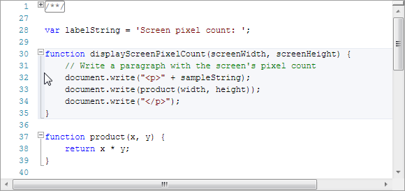

# Code Outlining (Folding)

Code outlining, also commonly referred to as code folding, is a mechanism by which a hierarchy of outlining nodes is maintained and visually rendered in an outlining margin.  Nodes can be expanded and collapsed by the end user.

Automatic outlining mode is used when a syntax language defines an outlining source that tells the outlining manager how to incrementally update nodes as text is changed.  Manual outlining mode is used when the end user wishes to define where outlining nodes occur.

A number of built-in commands provide easy access to all the outlining functionality found in products like Visual Studio.

## Run-Time Features

SyntaxEditor's run-time code outlining features match those found in popular code editors.

*A SyntaxEditor control with Javascript code being outlined*

A margin on the left of the text area visually renders the outlining structure for text within the view.  Small "+" (meaning collapsed) and "-" (meaning expanded) boxes show where outlining nodes start.  Clicking these boxes allows the related outlining node(s) to toggle their collapsed state.  When a node is expanded, a vertical line extending from the node's start box shows view lines that are included in the node's range.  A small horizontal line appears on the view line where the node ends.

Hovering the mouse over a vertical line in the margin will cause a highlight to appear that shows the lines contained by the related outlining node.  The vertical line can be double-clicked to collapse the node.

Once collapsed, the node's text content is hidden and a small adornment appears in its place.  By default this adornment renders "..." text, however that can be [customized via the node's definition](outlining-nodes.md).  Hovering the mouse over the collapsed node adornment will provide a quick info tip displaying the node's contents, if the proper service is registered (see below).  Single-clicking the collapsed node adornment will select the node's text range.  Double-clicking the collapsed node adornment will expand the node.

## Outlining Mode (Automatic, Manual, etc.)

There are two primary ways to supply outlining node data, which are referred to as automatic outlining and manual outlining.

Automatic outlining is language-specific and uses an [outlining source](outlining-sources.md) to tell the outlining manager how to update the nodes.  Manual outlining is where the end user, not the language, dictates the which nodes are present.

The [IEditorDocument](xref:ActiproSoftware.Text.IEditorDocument).[OutliningMode](xref:ActiproSoftware.Text.IEditorDocument.OutliningMode) property dictates which outlining modes are permitted:

- Default - Automatic or manual are permitted and the end user may switch between them at any time.
- Automatic - Only automatic is permitted.
- Manual - Only manual is permitted.
- None - No outlining is permitted.

The currently "active" mode is always available in the [IOutliningManager](xref:ActiproSoftware.Windows.Controls.SyntaxEditor.Outlining.IOutliningManager).[ActiveMode](xref:ActiproSoftware.Windows.Controls.SyntaxEditor.Outlining.IOutliningManager.ActiveMode) property.  This property will never return a value of `OutliningMode.Default`, since it always is a resolved result.

## Outlining Manager

An outlining manager, represented by the [IOutliningManager](xref:ActiproSoftware.Windows.Controls.SyntaxEditor.Outlining.IOutliningManager) interface, maintains the outlining node hierarchy for a particular document.  It can be retrieved via the [IEditorDocument](xref:ActiproSoftware.Text.IEditorDocument).[OutliningManager](xref:ActiproSoftware.Text.IEditorDocument.OutliningManager) property.

The outlining manager tracks outlining data based on its [ActiveMode](xref:ActiproSoftware.Windows.Controls.SyntaxEditor.Outlining.IOutliningManager.ActiveMode) property.  When automatic outlining mode is active, the manager coordinates with an [outlining source](outlining-sources.md) provided by the current language to determine how to update the outlining node hierarchy when text changes occur.  These sorts of updates are generally syntax-driven based on the code in the editor.  When manual outlining mode is active, the end user typically indicates which outlining nodes are present by making a text selections and choosing to create outlining nodes from them.

### Getting Started with Automatic Outlining

The current syntax language must be capable of providing [IOutliningSource](xref:ActiproSoftware.Windows.Controls.SyntaxEditor.Outlining.IOutliningSource) objects that can be used by the outlining manager, if automatic outlining is to be supported.

See the [Outlining Sources and Providers](outlining-sources.md) topic for details on how to add automatic outlining support to a syntax language.

### Getting Started with Manual Outlining

Manual nodes can be created programmatic via the [IOutliningManager](xref:ActiproSoftware.Windows.Controls.SyntaxEditor.Outlining.IOutliningManager).[AddManualNode](xref:ActiproSoftware.Windows.Controls.SyntaxEditor.Outlining.IOutliningManager.AddManualNode*) method and can be removed via the [RemoveManualNode](xref:ActiproSoftware.Windows.Controls.SyntaxEditor.Outlining.IOutliningManager.RemoveManualNode*) or [RemoveAllManualNodes](xref:ActiproSoftware.Windows.Controls.SyntaxEditor.Outlining.IOutliningManager.RemoveAllManualNodes*) methods.

However in most cases the functionality provided by the [HideSelectionAction](xref:ActiproSoftware.Windows.Controls.SyntaxEditor.EditActions.HideSelectionAction) (and related [EditorCommands](xref:ActiproSoftware.Windows.Controls.SyntaxEditor.EditorCommands).[HideSelection](xref:ActiproSoftware.Windows.Controls.SyntaxEditor.EditorCommands.HideSelection) command) should be exposed directly to the end user via a menu/button.  This functionality allows the end user to create manual nodes based on the current selection.

Other commands, all of which are described below, are also used when performing manual outlining.

## Outlining Edit Actions and Commands

These [edit actions](../input-output/edit-actions.md) and related commands deal with code outlining.

| Action, Command | Description |
|-----|-----|
| [ApplyDefaultOutliningExpansionAction](xref:ActiproSoftware.Windows.Controls.SyntaxEditor.EditActions.ApplyDefaultOutliningExpansionAction), [EditorCommands](xref:ActiproSoftware.Windows.Controls.SyntaxEditor.EditorCommands).[ApplyDefaultOutliningExpansion](xref:ActiproSoftware.Windows.Controls.SyntaxEditor.EditorCommands.ApplyDefaultOutliningExpansion) | Applies the default outlining expansion, such that only outlining nodes with an [IOutliningNodeDefinition](xref:ActiproSoftware.Windows.Controls.SyntaxEditor.Outlining.IOutliningNodeDefinition).[IsDefaultCollapsed](xref:ActiproSoftware.Windows.Controls.SyntaxEditor.Outlining.IOutliningNodeDefinition.IsDefaultCollapsed) value of `true` are collapsed. |
| [CollapseToDefinitionsAction](xref:ActiproSoftware.Windows.Controls.SyntaxEditor.EditActions.CollapseToDefinitionsAction), [EditorCommands](xref:ActiproSoftware.Windows.Controls.SyntaxEditor.EditorCommands).[CollapseToDefinitions](xref:ActiproSoftware.Windows.Controls.SyntaxEditor.EditorCommands.CollapseToDefinitions) | Collapses all outlining nodes that have an [IOutliningNodeDefinition](xref:ActiproSoftware.Windows.Controls.SyntaxEditor.Outlining.IOutliningNodeDefinition).[IsImplementation](xref:ActiproSoftware.Windows.Controls.SyntaxEditor.Outlining.IOutliningNodeDefinition.IsImplementation) value of `true`. |
| [ExpandAllOutliningAction](xref:ActiproSoftware.Windows.Controls.SyntaxEditor.EditActions.ExpandAllOutliningAction), [EditorCommands](xref:ActiproSoftware.Windows.Controls.SyntaxEditor.EditorCommands).[ExpandAllOutlining](xref:ActiproSoftware.Windows.Controls.SyntaxEditor.EditorCommands.ExpandAllOutlining) | Expands all outlining nodes. |
| [HideSelectionAction](xref:ActiproSoftware.Windows.Controls.SyntaxEditor.EditActions.HideSelectionAction), [EditorCommands](xref:ActiproSoftware.Windows.Controls.SyntaxEditor.EditorCommands).[HideSelection](xref:ActiproSoftware.Windows.Controls.SyntaxEditor.EditorCommands.HideSelection) | Collapses the current selection. |
| [StartAutomaticOutliningAction](xref:ActiproSoftware.Windows.Controls.SyntaxEditor.EditActions.StartAutomaticOutliningAction), [EditorCommands](xref:ActiproSoftware.Windows.Controls.SyntaxEditor.EditorCommands).[StartAutomaticOutlining](xref:ActiproSoftware.Windows.Controls.SyntaxEditor.EditorCommands.StartAutomaticOutlining) | Starts automatic outlining. |
| [StopHidingCurrentAction](xref:ActiproSoftware.Windows.Controls.SyntaxEditor.EditActions.StopHidingCurrentAction), [EditorCommands](xref:ActiproSoftware.Windows.Controls.SyntaxEditor.EditorCommands).[StopHidingCurrent](xref:ActiproSoftware.Windows.Controls.SyntaxEditor.EditorCommands.StopHidingCurrent) | Stops hiding the outlining node that currently contains the caret, if any. |
| [StopOutliningAction](xref:ActiproSoftware.Windows.Controls.SyntaxEditor.EditActions.StopOutliningAction), [EditorCommands](xref:ActiproSoftware.Windows.Controls.SyntaxEditor.EditorCommands).[StopOutlining](xref:ActiproSoftware.Windows.Controls.SyntaxEditor.EditorCommands.StopOutlining) | Stops outlining. |
| [ToggleAllOutliningExpansionAction](xref:ActiproSoftware.Windows.Controls.SyntaxEditor.EditActions.ToggleAllOutliningExpansionAction), [EditorCommands](xref:ActiproSoftware.Windows.Controls.SyntaxEditor.EditorCommands).[ToggleAllOutliningExpansion](xref:ActiproSoftware.Windows.Controls.SyntaxEditor.EditorCommands.ToggleAllOutliningExpansion) | Toggles the collapsed state of all outlining nodes. |
| [ToggleOutliningExpansionAction](xref:ActiproSoftware.Windows.Controls.SyntaxEditor.EditActions.ToggleOutliningExpansionAction), [EditorCommands](xref:ActiproSoftware.Windows.Controls.SyntaxEditor.EditorCommands).[ToggleOutliningExpansion](xref:ActiproSoftware.Windows.Controls.SyntaxEditor.EditorCommands.ToggleOutliningExpansion) | Toggles the collapsed state of the outlining node that contains the caret, if any. |

The commands can be easily wired up to any button or menu item.

## Collapsed Node Quick Info Tips

By default no quick info tips will appear when hovering the mouse over a collapsed node adornment.  However a [CollapsedRegionQuickInfoProvider](xref:ActiproSoftware.Windows.Controls.SyntaxEditor.IntelliPrompt.Implementation.CollapsedRegionQuickInfoProvider) instance can be registered as a language service to automatically build quick info for collapsed node adornments.
