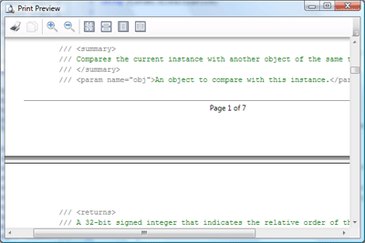

# Print Dialogs

SyntaxEditor provides easy access to built-in print dialogs.

## The Print Dialog

The Print dialog can be displayed by calling the [SyntaxEditor](xref:ActiproSoftware.Windows.Controls.SyntaxEditor.SyntaxEditor).[ShowPrintDialog](xref:ActiproSoftware.Windows.Controls.SyntaxEditor.SyntaxEditor.ShowPrintDialog*) method.


*The Print dialog*

This code shows the dialog:

```csharp
editor.ShowPrintDialog();
```

The printed content is based on the configuration of the [SyntaxEditor](xref:ActiproSoftware.Windows.Controls.SyntaxEditor.SyntaxEditor).[PrintSettings](xref:ActiproSoftware.Windows.Controls.SyntaxEditor.SyntaxEditor.PrintSettings) object.

## The Print Preview Dialog

The Print Preview dialog can be displayed by calling the [SyntaxEditor](xref:ActiproSoftware.Windows.Controls.SyntaxEditor.SyntaxEditor).[ShowPrintPreviewDialog](xref:ActiproSoftware.Windows.Controls.SyntaxEditor.SyntaxEditor.ShowPrintPreviewDialog*) method.



*The Print Preview dialog*

This code shows the dialog:

```csharp
editor.ShowPrintPreviewDialog();
```

The printed content is based on the configuration of the [SyntaxEditor](xref:ActiproSoftware.Windows.Controls.SyntaxEditor.SyntaxEditor).[PrintSettings](xref:ActiproSoftware.Windows.Controls.SyntaxEditor.SyntaxEditor.PrintSettings) object.
