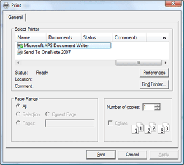

# Print Dialogs

SyntaxEditor provides easy access to built-in print dialogs.

@if (winrt) {

## The Print Flyout

SyntaxEditor fully supports the **Windows Print** flyout:



*The Print flyout*

This code shows an `AttachToPrintManager` method that should be called when a page with SyntaxEditor on it is active:

```csharp
/// <summary>
/// Attaches to the print manager.
/// </summary>
private void AttachToPrintManager() {
	printManager = PrintManager.GetForCurrentView();
	if (printManager != null)
		printManager.PrintTaskRequested += OnPrintManagerPrintTaskRequested;
}

/// <summary>
/// Detaches from the print manager.
/// </summary>
private void DetachFromPrintManager() {
	if (printManager != null) {
		printManager.PrintTaskRequested -= OnPrintManagerPrintTaskRequested;
		printManager = null;
	}
}
```

This code handles print task requests and renders a `PrintDocument` from SyntaxEditor:

```csharp
/// <summary>
/// Occurs when the <see cref="PrintManager"/> requests a print task.
/// </summary>
/// <param name="sender">The sender of the event.</param>
/// <param name="e">The <c>PrintTaskRequestedEventArgs</c> that contains data related to this event.</param>
private void OnPrintManagerPrintTaskRequested(PrintManager sender, PrintTaskRequestedEventArgs e) {
	PrintTask printTask = null;
	printTask = e.Request.CreatePrintTask("SyntaxEditor Printout", async sourceRequestedArgs => {
		var deferral = sourceRequestedArgs.GetDeferral();

		if (editor != null) {
			await editor.Dispatcher.RunAsync(CoreDispatcherPriority.Normal, () => {
				if (editor.PrintSettings != null) {
					// Update the document title for the printout
					editor.PrintSettings.DocumentTitle = editor.Document.FileName;

					// Create a print document
					printDocument = editor.PrintSettings.CreatePrintDocument(editor);
					if (printDocument != null) {
						// Set the source
						sourceRequestedArgs.SetSource(printDocument);
					}
				}
			});
		}

		deferral.Complete();
	});
}
```

Then finally, this code shows the flyout:

```csharp
await PrintManager.ShowPrintUIAsync();
```

The printed content is based on the configuration of the [SyntaxEditor](xref:@ActiproUIRoot.Controls.SyntaxEditor.SyntaxEditor).[PrintSettings](xref:@ActiproUIRoot.Controls.SyntaxEditor.SyntaxEditor.PrintSettings) object.

}

@if (wpf winforms) {

## The Print Dialog

The **Print** dialog can be displayed by calling the [SyntaxEditor](xref:@ActiproUIRoot.Controls.SyntaxEditor.SyntaxEditor).[ShowPrintDialog](xref:@ActiproUIRoot.Controls.SyntaxEditor.SyntaxEditor.ShowPrintDialog*) method.


*The Print dialog*

This code shows the dialog:

```csharp
editor.ShowPrintDialog();
```

The printed content is based on the configuration of the [SyntaxEditor](xref:@ActiproUIRoot.Controls.SyntaxEditor.SyntaxEditor).[PrintSettings](xref:@ActiproUIRoot.Controls.SyntaxEditor.SyntaxEditor.PrintSettings) object.

}

@if (wpf winforms) {

## The Print Preview Dialog

The **Print Preview** dialog can be displayed by calling the [SyntaxEditor](xref:@ActiproUIRoot.Controls.SyntaxEditor.SyntaxEditor).[ShowPrintPreviewDialog](xref:@ActiproUIRoot.Controls.SyntaxEditor.SyntaxEditor.ShowPrintPreviewDialog*) method.


*The Print Preview dialog*

This code shows the dialog:

```csharp
editor.ShowPrintPreviewDialog();
```

The printed content is based on the configuration of the [SyntaxEditor](xref:@ActiproUIRoot.Controls.SyntaxEditor.SyntaxEditor).[PrintSettings](xref:@ActiproUIRoot.Controls.SyntaxEditor.SyntaxEditor.PrintSettings) object.

}
