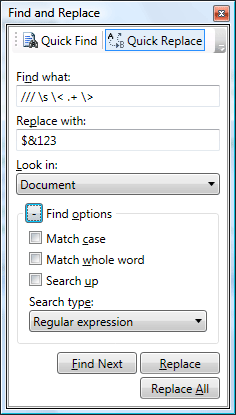

# EditorSearchView Control

The [EditorSearchView](xref:@ActiproUIRoot.Controls.SyntaxEditor.Primitives.EditorSearchView) control is a standalone control that can be used within an application tool window to provide an user interface with Visual Studio-like search capabilities for a [SyntaxEditor](xref:@ActiproUIRoot.Controls.SyntaxEditor.SyntaxEditor).

## The EditorSearchView User Interface

The `EditorSearchView` control is designed to mimic the **Find and Replace** dialog found in some versions of Visual Studio.  Since it is a regular WPF control, it can be included in any container. @if (wpf) {It works great when used with our Docking/MDI tool windows, as seen in the following screenshot:}

*The EditorSearchView control in Quick Replace mode*

### Search Modes

The control offers two search modes: **Quick Find** and **Quick Replace**.  There is a built-in toolbar at the top of the control that allows the end user to toggle between modes.

Programmatically, the mode can be set via the [IsReplaceVisible](xref:@ActiproUIRoot.Controls.SyntaxEditor.Primitives.SearchViewBase.IsReplaceVisible) property.  Set the property to `true` to show replace UI.

### ToolBar Visibility

The modes toolbar is displayed by default.  However, the [CanToggleReplace](xref:@ActiproUIRoot.Controls.SyntaxEditor.Primitives.SearchViewBase.CanToggleReplace) property can be set to `false` to hide it.

This is useful if you only wish to allow the end user to perform "find" operations and not "replace" operations.

### Find All Button Visibility

The **Find All** button is not displayed by default.  The [IsFindAllButtonVisible](xref:@ActiproUIRoot.Controls.SyntaxEditor.Primitives.SearchViewBase.IsFindAllButtonVisible) property can be set to `true` to show it.

This button should only be made visible if the find results will be displayed to the user from within a [SyntaxEditor](xref:@ActiproUIRoot.Controls.SyntaxEditor.SyntaxEditor).[ViewSearch](xref:@ActiproUIRoot.Controls.SyntaxEditor.SyntaxEditor.ViewSearch) event handler.  A common way to do this is to display the results within a **Find Results** tool window.

@if (winrt wpf) {

### Options Panel

The options panel can be expanded or collapsed.  The [IsOptionsPanelExpanded](xref:@ActiproUIRoot.Controls.SyntaxEditor.Primitives.SearchViewBase.IsOptionsPanelExpanded) property determines the current expansion state of the panel.

}

### Search Pattern Providers

The search type drop-down in the options panel allows the end user to select which search pattern provider to use.  It is populated via a [ISearchPatternProviderFactory](xref:ActiproSoftware.Text.Searching.ISearchPatternProviderFactory), which is a factory interface that can create a collection of [ISearchPatternProvider](xref:ActiproSoftware.Text.Searching.ISearchPatternProvider) objects.

Any factory instance can be set to the [SearchPatternProviderFactory](xref:@ActiproUIRoot.Controls.SyntaxEditor.Primitives.SearchViewBase.SearchPatternProviderFactory) property to change which pattern providers are available.  By default, the [DefaultSearchPatternProviderFactory](xref:ActiproSoftware.Text.Searching.Implementation.DefaultSearchPatternProviderFactory) is used.

If you create your own search pattern provider and would like to make it available for use within the `EditorSearchView` control, a custom [ISearchPatternProviderFactory](xref:ActiproSoftware.Text.Searching.ISearchPatternProviderFactory) would be needed.

@if (wpf) {

### Smooth Animation

When switching modes or toggling the display of options, new controls reveal themselves via subtle animated transitions.

Animation can be disabled by setting the [AnimationDuration](xref:@ActiproUIRoot.Controls.SyntaxEditor.Primitives.SearchViewBase.AnimationDuration) property to `0`.

}

### Focusing the Find What TextBox

The [FocusFindWhatTextBox](xref:@ActiproUIRoot.Controls.SyntaxEditor.Primitives.SearchViewBase.FocusFindWhatTextBox*) method can be called to "select all" in the **Find What** textbox and focus it.

## Syncing Options

The [EditorSearchView](xref:@ActiproUIRoot.Controls.SyntaxEditor.Primitives.EditorSearchView).[SearchOptions](xref:@ActiproUIRoot.Controls.SyntaxEditor.Primitives.SearchViewBase.SearchOptions) property accepts an [IEditorSearchOptions](xref:@ActiproUIRoot.Controls.SyntaxEditor.IEditorSearchOptions) instance.  These options are what are used to populate the user interface of the control.

When the end user alters the **Find What** text for instance, the control auto-updates the attached options.  The options can be used with any search operation.

> [!NOTE]
> The [EditorSearchOptions](xref:@ActiproUIRoot.Controls.SyntaxEditor.Implementation.EditorSearchOptions) class provides an implementation of the [IEditorSearchOptions](xref:@ActiproUIRoot.Controls.SyntaxEditor.IEditorSearchOptions) interface.

The default [IEditorSearchOptions](xref:@ActiproUIRoot.Controls.SyntaxEditor.IEditorSearchOptions) instance set to the [SearchOptions](xref:@ActiproUIRoot.Controls.SyntaxEditor.Primitives.SearchViewBase.SearchOptions) property is a static instance from the [EditorSearchOptions](xref:@ActiproUIRoot.Controls.SyntaxEditor.Implementation.EditorSearchOptions).[Default](xref:@ActiproUIRoot.Controls.SyntaxEditor.Implementation.EditorSearchOptions.Default) property.  This allows the search options to be shared amongst multiple `SyntaxEditor` controls out-of-the-box.

## Attaching to a SyntaxEditor Instance

The [EditorSearchView](xref:@ActiproUIRoot.Controls.SyntaxEditor.Primitives.EditorSearchView) control must be attached to a [SyntaxEditor](xref:@ActiproUIRoot.Controls.SyntaxEditor.SyntaxEditor) control so that it knows which control to search.

This is done by setting a [SyntaxEditor](xref:@ActiproUIRoot.Controls.SyntaxEditor.SyntaxEditor) control instance to the [EditorSearchView](xref:@ActiproUIRoot.Controls.SyntaxEditor.Primitives.EditorSearchView).[SyntaxEditor](xref:@ActiproUIRoot.Controls.SyntaxEditor.Primitives.EditorSearchView.SyntaxEditor) property.

## Handling Results

The [SyntaxEditor](xref:@ActiproUIRoot.Controls.SyntaxEditor.SyntaxEditor).[ViewSearch](xref:@ActiproUIRoot.Controls.SyntaxEditor.SyntaxEditor.ViewSearch) event is raised whenever a search is made using [EditorSearchView](xref:@ActiproUIRoot.Controls.SyntaxEditor.Primitives.EditorSearchView).  The event arguments pass along the search options and the result set.  That information can then be presented to the user in a **Find Results** tool window for example.
