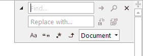

# Search Overlay Pane

The search overlay pane is a control built into SyntaxEditor that allows find and replace operations to be performed.  When active, the pane appears in-line at the upper right corner of the text area.

## Built-in Key Bindings

### SyntaxEditor Search Key Bindings

These key bindings are search-related and are built into the SyntaxEditor control, often triggering the search overlay pane to open.

| Key | Edit Action |
|-----|-----|
| Ctrl+F | Opens the search overlay pane in find mode and focuses the find textbox. |
| F3  | Repeats the last search operation in a forward direction. |
| Ctrl+F3 | Performs a forward find on the current selection, or the current word when there is not selection.  Also opens the search overlay pane in find mode. |
| Shift+F3 | Repeats the last search operation in a backward direction. |
| Ctrl+Shift+F3 | Performs a backward find on the current selection, or the current word when there is not selection.  Also opens the search overlay pane in find mode. |
| Ctrl+H | Opens the search overlay pane in replace mode and focuses the find what textbox. |

### Disabling Built-in Search Functionality

To prevent the end user from activating the built-in search features, set the [SyntaxEditor](xref:@ActiproUIRoot.Controls.SyntaxEditor.SyntaxEditor).[HasSearchOverlayPaneKeyBindings](xref:@ActiproUIRoot.Controls.SyntaxEditor.SyntaxEditor.HasSearchOverlayPaneKeyBindings) property to `false`.

This is useful when your app uses a custom search UI.

### SearchOverlayPane-Only Key Bindings

These key bindings are active when focus is within the search overlay pane, providing quick access to common features.

| Key | Edit Action |
|-----|-----|
| Esc | Closes the search overlay pane. |
| Enter (focus in find textbox) | Performs a find next operation. |
| Shift+Enter (focus in find textbox) | Performs a find previous operation. |
| Ctrl+Enter (focus in find textbox) | Performs a find all operation, if [IsFindAllButtonVisible](xref:@ActiproUIRoot.Controls.SyntaxEditor.Primitives.SearchViewBase.IsFindAllButtonVisible) is `true`. |
| Enter (focus in replace textbox) | Performs a replace next operation. |
| Shift+Enter (focus in replace textbox) | Performs a replace previous operation. |
| Alt+R | When in replace mode, performs a replace next operation. |
| Alt+A | When in replace mode, performs a replaces all operation. |
| Alt+C | Toggles the match case option. |
| Alt+W | Toggles the whole word option. |
| Alt+E | Toggles the use regular expressions option. |
| Alt+U | Toggles the use search up option. |

## The SearchOverlayPane User Interface

The [SearchOverlayPane](xref:@ActiproUIRoot.Controls.SyntaxEditor.Primitives.SearchOverlayPane) control is designed to mimic the in-line find/replace pane found in the Visual Studio editor.



*The SearchOverlayPane control in replace mode*

### Search Modes

The control offers two search modes: find and replace.  Use the expansion arrow on the left side of the control to toggle between them.

The expansion arrow is displayed by default.  However the [CanToggleReplace](xref:@ActiproUIRoot.Controls.SyntaxEditor.Primitives.SearchViewBase.CanToggleReplace) property can be set to `false` to hide it.

This is useful if you only wish to allow the end user to perform find opertions and not replace operations.

### Find All Button Visibility

The `Find All` button is not displayed by default.  The [IsFindAllButtonVisible](xref:@ActiproUIRoot.Controls.SyntaxEditor.Primitives.SearchViewBase.IsFindAllButtonVisible) property can be set to `true` to show it.

This button should only be made visible if the find results will be displayed to the user from within a [SyntaxEditor](xref:@ActiproUIRoot.Controls.SyntaxEditor.SyntaxEditor).[ViewSearch](xref:@ActiproUIRoot.Controls.SyntaxEditor.SyntaxEditor.ViewSearch) event handler.  A common way to do this is to display the results within a `Find Results` tool window.

### Options Panel

The row containing search options (match case, match whole word, use regular expressions, search up, etc.) can be expanded or collapsed.  The [IsOptionsPanelExpanded](xref:@ActiproUIRoot.Controls.SyntaxEditor.Primitives.SearchViewBase.IsOptionsPanelExpanded) property determines the current expansion state of the panel.

@if (winrt wpf) {

### Smooth Animation

When opening/closing the pane or switching between find/replace modes, subtle animated transitions at used.

Animation can be disabled by setting the [AnimationDuration](xref:@ActiproUIRoot.Controls.SyntaxEditor.Primitives.SearchViewBase.AnimationDuration) property to `0`.

}

## Pane Events

The [SyntaxEditor](xref:@ActiproUIRoot.Controls.SyntaxEditor.SyntaxEditor).[OverlayPaneOpened](xref:@ActiproUIRoot.Controls.SyntaxEditor.SyntaxEditor.OverlayPaneOpened) event is fired when the search overlay pane is opened.  The [OverlayPaneEventArgs](xref:@ActiproUIRoot.Controls.SyntaxEditor.OverlayPaneEventArgs).[Pane](xref:@ActiproUIRoot.Controls.SyntaxEditor.OverlayPaneEventArgs.Pane) property contains the [SearchOverlayPane](xref:@ActiproUIRoot.Controls.SyntaxEditor.Primitives.SearchOverlayPane) instance that is opening.  This is where various options may be set on the pane for initialization purposes.

This code shows how to set several options on the pane:

```csharp
private void OnSyntaxEditorOverlayPaneOpened(object sender, OverlayPaneEventArgs e) {
	var pane = e.Pane as SearchOverlayPane;
	if (pane != null) {
		pane.CanToggleReplace = false;  // Hide expansion button to toggle to replace mode
		pane.IsReplaceVisible = false;  // Force find mode, even if Ctrl+H is pressed

		pane.IsFindAllButtonVisible = true;  // Show a "find all" button
	}
}
```

The [SyntaxEditor](xref:@ActiproUIRoot.Controls.SyntaxEditor.SyntaxEditor).[OverlayPaneClosed](xref:@ActiproUIRoot.Controls.SyntaxEditor.SyntaxEditor.OverlayPaneClosed) event is fired when the pane is closed.

## Syncing Options

The [SearchOverlayPane](xref:@ActiproUIRoot.Controls.SyntaxEditor.Primitives.SearchOverlayPane).[SearchOptions](xref:@ActiproUIRoot.Controls.SyntaxEditor.Primitives.SearchViewBase.SearchOptions) property accepts an [IEditorSearchOptions](xref:@ActiproUIRoot.Controls.SyntaxEditor.IEditorSearchOptions) instance that automatically gets assigned the search options instance found in the [SyntaxEditor](xref:@ActiproUIRoot.Controls.SyntaxEditor.SyntaxEditor).[SearchOptions](xref:@ActiproUIRoot.Controls.SyntaxEditor.SyntaxEditor.SearchOptions) property.

When the end user alters the "find what" text for instance, the control auto-updates the attached options.  The options can be used with any search operation.

> [!NOTE]
> The [EditorSearchOptions](xref:@ActiproUIRoot.Controls.SyntaxEditor.Implementation.EditorSearchOptions) class provides an implementation of the [IEditorSearchOptions](xref:@ActiproUIRoot.Controls.SyntaxEditor.IEditorSearchOptions) interface.

The default [IEditorSearchOptions](xref:@ActiproUIRoot.Controls.SyntaxEditor.IEditorSearchOptions) instance set to the [SearchOptions](xref:@ActiproUIRoot.Controls.SyntaxEditor.SyntaxEditor.SearchOptions) property is a static instance from the [EditorSearchOptions](xref:@ActiproUIRoot.Controls.SyntaxEditor.Implementation.EditorSearchOptions).[Default](xref:@ActiproUIRoot.Controls.SyntaxEditor.Implementation.EditorSearchOptions.Default) property.  This allows the search options to be shared amongst multiple SyntaxEditor controls out-of-the-box.

## Handling Results

The [SyntaxEditor](xref:@ActiproUIRoot.Controls.SyntaxEditor.SyntaxEditor).[ViewSearch](xref:@ActiproUIRoot.Controls.SyntaxEditor.SyntaxEditor.ViewSearch) event fires whenever a search is made using [SearchOverlayPane](xref:@ActiproUIRoot.Controls.SyntaxEditor.Primitives.SearchOverlayPane).  The event arguments pass along the search options and the result set.  That information can then be presented to the user in a `Find Results` tool window for example.

## Search Result Highlights

Search results can be highlighted as the find text and other search options are altered in the search overlay pane.  For this functionality to work, please make sure the appropriate display classification type is registered per the requirements listed in the [Search Result Highlighting](search-result-highlighting.md) topic.

## Control Key Down Opacity

The search overlay pane animates to be semi-transparent when the <kbd>Ctrl</kbd> key is held down, thereby allowing the end user to see the text behind it. [SearchOverlayPane](xref:@ActiproUIRoot.Controls.SyntaxEditor.Primitives.SearchOverlayPane).[ControlKeyDownOpacity](xref:@ActiproUIRoot.Controls.SyntaxEditor.Primitives.SearchOverlayPane.ControlKeyDownOpacity) property specifies the opacity when the popup is semi-transparent.

Set this property to `1.0` to prevent the list from being semi-transparent.

## Programmatically Opening the Pane

This code shows how to programmatically the pane:

```csharp
// NOTE: Update the find text in view.SyntaxEditor.SearchOptions here as needed

// If the editor is in multi-line mode...
if (view.SyntaxEditor.IsMultiLine) {
	// Ensure the search pane is open (visible) and in "find" mode
	var searchPane = view.OverlayPanes[OverlayPaneKeys.Search] as SearchOverlayPane;
	if (searchPane != null) {
		searchPane.IsReplaceVisible = false;
		searchPane.SearchOptions = view.SyntaxEditor.SearchOptions;
	}
	else
		searchPane = view.OverlayPanes.AddSearch(false) as SearchOverlayPane;

	// Activate the pane (only if you wish to focus the "find what" TextBox)
	if (searchPane != null)
		searchPane.Activate();
}
```
