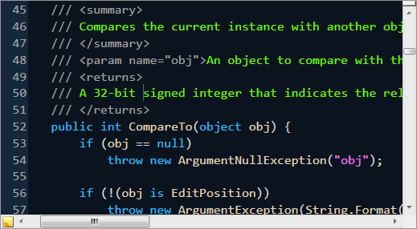

# Highlighting Style Registries

Highlighting style registries provide a mapping from classification types to highlighting styles.  They tell SyntaxEditor how the various ranges of classified text should appear within the text area.

## Basic Concepts

A [classification type](../../text-parsing/tagging/basic-concepts.md) (which could represent an identifier, comment, etc.) is a logical category that can be assigned to ranges of text via a [tagger](../../text-parsing/tagging/taggers.md) for the [IClassificationTag](xref:ActiproSoftware.Text.Tagging.IClassificationTag) type.  Classifications are made within the [text/parsing framework](../../text-parsing/index.md) and therefore are not tied to the user interface.

A highlighting style registry takes these classification types and maps them to highlighting styles.  Highlighting styles define formatting options that should be applied to text.  Therefore via the use of highlighting style registries allows the editor to determine how classified text should be rendered.

Highlighting style registries are implementations of the [IHighlightingStyleRegistry](xref:ActiproSoftware.Windows.Controls.SyntaxEditor.Highlighting.IHighlightingStyleRegistry) interface.  The [HighlightingStyleRegistry](xref:ActiproSoftware.Windows.Controls.SyntaxEditor.Highlighting.Implementation.HighlightingStyleRegistry) class implements this interface.

## The Ambient Registry

The ambient registry is a static registry that is always available and is generally what is used by the editor.  It is available via the [AmbientHighlightingStyleRegistry](xref:ActiproSoftware.Windows.Controls.SyntaxEditor.Highlighting.AmbientHighlightingStyleRegistry) class.

This code shows how to get an instance of the ambient registry:

```csharp
IHighlightingStyleRegistry registry = AmbientHighlightingStyleRegistry.Instance;
```

## Registering and Unregistering Entries

A registry entry consists of an [IClassificationType](xref:ActiproSoftware.Text.IClassificationType) and [IHighlightingStyle](xref:ActiproSoftware.Windows.Controls.SyntaxEditor.Highlighting.IHighlightingStyle) pair.

Registrations can be made by calling the [IHighlightingStyleRegistry](xref:ActiproSoftware.Windows.Controls.SyntaxEditor.Highlighting.IHighlightingStyleRegistry).[Register](xref:ActiproSoftware.Windows.Controls.SyntaxEditor.Highlighting.IHighlightingStyleRegistry.Register*) method.  Registrations can be removed by calling the [IHighlightingStyleRegistry](xref:ActiproSoftware.Windows.Controls.SyntaxEditor.Highlighting.IHighlightingStyleRegistry).[Unregister](xref:ActiproSoftware.Windows.Controls.SyntaxEditor.Highlighting.IHighlightingStyleRegistry.Unregister*) method.

This code registers a highlighting style in the `style` variable for the common `Comment` classification type in the ambient registry:

```csharp
AmbientHighlightingStyleRegistry.Instance.Register(ClassificationTypes.Comment, style);
```

An overload for the [Register](xref:ActiproSoftware.Windows.Controls.SyntaxEditor.Highlighting.IHighlightingStyleRegistry.Register*) method indicates whether any existing entry for the [IClassificationType](xref:ActiproSoftware.Text.IClassificationType) should be overwritten.  The overload in the sample code above will not override an existing entry if one is found.

## Enumerating Classification Types and Highlighting Styles

The [IHighlightingStyleRegistry](xref:ActiproSoftware.Windows.Controls.SyntaxEditor.Highlighting.IHighlightingStyleRegistry).[ClassificationTypes](xref:ActiproSoftware.Windows.Controls.SyntaxEditor.Highlighting.IHighlightingStyleRegistry.ClassificationTypes) property returns the collection of [IClassificationType](xref:ActiproSoftware.Text.IClassificationType) objects that are currently registered.

The [IHighlightingStyleRegistry](xref:ActiproSoftware.Windows.Controls.SyntaxEditor.Highlighting.IHighlightingStyleRegistry).[HighlightingStyles](xref:ActiproSoftware.Windows.Controls.SyntaxEditor.Highlighting.IHighlightingStyleRegistry.HighlightingStyles) property returns the collection of [IHighlightingStyle](xref:ActiproSoftware.Windows.Controls.SyntaxEditor.Highlighting.IHighlightingStyle) objects that are currently registered.

## Classification Type Sort Order

The [IHighlightingStyleRegistry](xref:ActiproSoftware.Windows.Controls.SyntaxEditor.Highlighting.IHighlightingStyleRegistry).[ClassificationTypes](xref:ActiproSoftware.Windows.Controls.SyntaxEditor.Highlighting.IHighlightingStyleRegistry.ClassificationTypes) collection is sorted in a special order.  This allows you to be able to bind the collection to a list in an application options dialog.

The base sorting is performed on the [IClassificationType](xref:ActiproSoftware.Text.IClassificationType).[Description](xref:ActiproSoftware.Text.IClassificationType.Description) property.  If a [IClassificationType](xref:ActiproSoftware.Text.IClassificationType) implements [IOrderable](xref:ActiproSoftware.Text.Utility.IOrderable), it is sorted before any [IClassificationType](xref:ActiproSoftware.Text.IClassificationType) that doesn't implement [IOrderable](xref:ActiproSoftware.Text.Utility.IOrderable).  The [IOrderable](xref:ActiproSoftware.Text.Utility.IOrderable) implementation can be used to indicate the keys of other [IClassificationType](xref:ActiproSoftware.Text.IClassificationType) after which the classification type should be sorted.

## Special Classification Types (Plain Text, Line Numbers, Indicator Margin, etc.)

There are several classification types that have special meaning for SyntaxEditor, all of which are available as properties on the [DisplayItemClassificationTypeProvider](xref:ActiproSoftware.Windows.Controls.SyntaxEditor.DisplayItemClassificationTypeProvider) class.  These classification types are special cased to allow for end user customization of things such as the default text format, line number margin, indicator margin, visible whitespace, etc.

The classification types on [DisplayItemClassificationTypeProvider](xref:ActiproSoftware.Windows.Controls.SyntaxEditor.DisplayItemClassificationTypeProvider) are not used unless they are registered.

Registration into the ambient highlighting style registry can be performed with this code:

```csharp
new DisplayItemClassificationTypeProvider().RegisterAll();
```

These are the special [IClassificationType](xref:ActiproSoftware.Text.IClassificationType) properties on [DisplayItemClassificationTypeProvider](xref:ActiproSoftware.Windows.Controls.SyntaxEditor.DisplayItemClassificationTypeProvider):

<table>
<thead>

<tr>
<th>Member</th>
<th>Description</th>
</tr>


</thead>
<tbody>

<tr>
<td>

[BreakpointDisabled](xref:ActiproSoftware.Windows.Controls.SyntaxEditor.DisplayItemClassificationTypeProvider.BreakpointDisabled) Property

</td>
<td>

Gets the [IClassificationType](xref:ActiproSoftware.Text.IClassificationType) to use for a disabled breakpoint.

Only the border is editable in the default [IHighlightingStyle](xref:ActiproSoftware.Windows.Controls.SyntaxEditor.Highlighting.IHighlightingStyle) that is registered for this classification type.

</td>
</tr>

<tr>
<td>

[BreakpointEnabled](xref:ActiproSoftware.Windows.Controls.SyntaxEditor.DisplayItemClassificationTypeProvider.BreakpointEnabled) Property

</td>
<td>

Gets the [IClassificationType](xref:ActiproSoftware.Text.IClassificationType) to use for an enabled breakpoint.

Only the foreground and background are editable in the default [IHighlightingStyle](xref:ActiproSoftware.Windows.Controls.SyntaxEditor.Highlighting.IHighlightingStyle) that is registered for this classification type.

</td>
</tr>

<tr>
<td>

[CodeSnippetDependentField](xref:ActiproSoftware.Windows.Controls.SyntaxEditor.DisplayItemClassificationTypeProvider.CodeSnippetDependentField) Property

</td>
<td>

Gets the [IClassificationType](xref:ActiproSoftware.Text.IClassificationType) to use for a code snippet dependent field.

Only the border is editable in the default [IHighlightingStyle](xref:ActiproSoftware.Windows.Controls.SyntaxEditor.Highlighting.IHighlightingStyle) that is registered for this classification type.

</td>
</tr>

<tr>
<td>

[CodeSnippetField](xref:ActiproSoftware.Windows.Controls.SyntaxEditor.DisplayItemClassificationTypeProvider.CodeSnippetField) Property

</td>
<td>

Gets the [IClassificationType](xref:ActiproSoftware.Text.IClassificationType) to use for a code snippet field.

Only the background is editable in the default [IHighlightingStyle](xref:ActiproSoftware.Windows.Controls.SyntaxEditor.Highlighting.IHighlightingStyle) that is registered for this classification type.

</td>
</tr>

<tr>
<td>

[CollapsedText](xref:ActiproSoftware.Windows.Controls.SyntaxEditor.DisplayItemClassificationTypeProvider.CollapsedText) Property

</td>
<td>

Gets the [IClassificationType](xref:ActiproSoftware.Text.IClassificationType) to use for collapsed text.

Only the foreground is editable in the default [IHighlightingStyle](xref:ActiproSoftware.Windows.Controls.SyntaxEditor.Highlighting.IHighlightingStyle) that is registered for this classification type.

</td>
</tr>

<tr>
<td>

[CollapsibleRegion](xref:ActiproSoftware.Windows.Controls.SyntaxEditor.DisplayItemClassificationTypeProvider.CollapsibleRegion) Property

</td>
<td>

Gets the [IClassificationType](xref:ActiproSoftware.Text.IClassificationType) to use for collapsible regions.

Only the foreground and background are editable in the default [IHighlightingStyle](xref:ActiproSoftware.Windows.Controls.SyntaxEditor.Highlighting.IHighlightingStyle) that is registered for this classification type.

</td>
</tr>

<tr>
<td>

[CurrentLine](xref:ActiproSoftware.Windows.Controls.SyntaxEditor.DisplayItemClassificationTypeProvider.CurrentLine) Property

</td>
<td>

Gets the [IClassificationType](xref:ActiproSoftware.Text.IClassificationType) to use for the current line highlight.

Only the background and border are editable in the default [IHighlightingStyle](xref:ActiproSoftware.Windows.Controls.SyntaxEditor.Highlighting.IHighlightingStyle) that is registered for this classification type.

</td>
</tr>

<tr>
<td>

[CurrentStatement](xref:ActiproSoftware.Windows.Controls.SyntaxEditor.DisplayItemClassificationTypeProvider.CurrentStatement) Property

</td>
<td>

Gets the [IClassificationType](xref:ActiproSoftware.Text.IClassificationType) to use for a current statement.

Only the foreground and background are editable in the default [IHighlightingStyle](xref:ActiproSoftware.Windows.Controls.SyntaxEditor.Highlighting.IHighlightingStyle) that is registered for this classification type.

</td>
</tr>

<tr>
<td>

[DelimiterMatching](xref:ActiproSoftware.Windows.Controls.SyntaxEditor.DisplayItemClassificationTypeProvider.DelimiterMatching) Property

</td>
<td>

Gets the [IClassificationType](xref:ActiproSoftware.Text.IClassificationType) to use for the delimiter matching highlight.

Only the background is editable in the default [IHighlightingStyle](xref:ActiproSoftware.Windows.Controls.SyntaxEditor.Highlighting.IHighlightingStyle) that is registered for this classification type.

</td>
</tr>

<tr>
<td>

[FindMatchHighlight](xref:ActiproSoftware.Windows.Controls.SyntaxEditor.DisplayItemClassificationTypeProvider.FindMatchHighlight) Property

</td>
<td>

Gets the [IClassificationType](xref:ActiproSoftware.Text.IClassificationType) to use for a find match highlight.

Only the background is editable in the default [IHighlightingStyle](xref:ActiproSoftware.Windows.Controls.SyntaxEditor.Highlighting.IHighlightingStyle) that is registered for this classification type.

</td>
</tr>

<tr>
<td>

[FindScopeHighlight](xref:ActiproSoftware.Windows.Controls.SyntaxEditor.DisplayItemClassificationTypeProvider.FindScopeHighlight) Property

</td>
<td>

Gets the [IClassificationType](xref:ActiproSoftware.Text.IClassificationType) to use for a find scope highlight.

Only the background is editable in the default [IHighlightingStyle](xref:ActiproSoftware.Windows.Controls.SyntaxEditor.Highlighting.IHighlightingStyle) that is registered for this classification type.

</td>
</tr>

<tr>
<td>

[InactiveSelectedText](xref:ActiproSoftware.Windows.Controls.SyntaxEditor.DisplayItemClassificationTypeProvider.InactiveSelectedText) Property

</td>
<td>

Gets the [IClassificationType](xref:ActiproSoftware.Text.IClassificationType) to use for the selected text background when the view doesn't have focus.

Only the background is editable in the default [IHighlightingStyle](xref:ActiproSoftware.Windows.Controls.SyntaxEditor.Highlighting.IHighlightingStyle) that is registered for this classification type.

</td>
</tr>

<tr>
<td>

[IndentationGuides](xref:ActiproSoftware.Windows.Controls.SyntaxEditor.DisplayItemClassificationTypeProvider.IndentationGuides) Property

</td>
<td>

Gets the [IClassificationType](xref:ActiproSoftware.Text.IClassificationType) to use for indentation guides.

Only the background is editable in the default [IHighlightingStyle](xref:ActiproSoftware.Windows.Controls.SyntaxEditor.Highlighting.IHighlightingStyle) that is registered for this classification type.

</td>
</tr>

<tr>
<td>

[IndicatorMargin](xref:ActiproSoftware.Windows.Controls.SyntaxEditor.DisplayItemClassificationTypeProvider.IndicatorMargin) Property

</td>
<td>

Gets the [IClassificationType](xref:ActiproSoftware.Text.IClassificationType) to use for the indicator margin.

Only the background is editable in the default [IHighlightingStyle](xref:ActiproSoftware.Windows.Controls.SyntaxEditor.Highlighting.IHighlightingStyle) that is registered for this classification type.

</td>
</tr>

<tr>
<td>

[LineNumbers](xref:ActiproSoftware.Windows.Controls.SyntaxEditor.DisplayItemClassificationTypeProvider.LineNumbers) Property

</td>
<td>

Gets the [IClassificationType](xref:ActiproSoftware.Text.IClassificationType) to use for the line number margin.

Only the foreground and background are editable in the default [IHighlightingStyle](xref:ActiproSoftware.Windows.Controls.SyntaxEditor.Highlighting.IHighlightingStyle) that is registered for this classification type.

</td>
</tr>

<tr>
<td>

[OutliningMarginSquare](xref:ActiproSoftware.Windows.Controls.SyntaxEditor.DisplayItemClassificationTypeProvider.OutliningMarginSquare) Property

</td>
<td>

Gets the [IClassificationType](xref:ActiproSoftware.Text.IClassificationType) to use for outlining margin squares.

Only the foreground and background are editable in the default [IHighlightingStyle](xref:ActiproSoftware.Windows.Controls.SyntaxEditor.Highlighting.IHighlightingStyle) that is registered for this classification type.

</td>
</tr>

<tr>
<td>

[OutliningMarginVerticalRule](xref:ActiproSoftware.Windows.Controls.SyntaxEditor.DisplayItemClassificationTypeProvider.OutliningMarginVerticalRule) Property

</td>
<td>

Gets the [IClassificationType](xref:ActiproSoftware.Text.IClassificationType) to use for outlining margin vertical rules.

Only the foreground is editable in the default [IHighlightingStyle](xref:ActiproSoftware.Windows.Controls.SyntaxEditor.Highlighting.IHighlightingStyle) that is registered for this classification type.

</td>
</tr>

<tr>
<td>

[PlainText](xref:ActiproSoftware.Windows.Controls.SyntaxEditor.DisplayItemClassificationTypeProvider.PlainText) Property

</td>
<td>

Gets the [IClassificationType](xref:ActiproSoftware.Text.IClassificationType) to use for default text in the text area.

Only the foreground and background are editable in the default [IHighlightingStyle](xref:ActiproSoftware.Windows.Controls.SyntaxEditor.Highlighting.IHighlightingStyle) that is registered for this classification type.

</td>
</tr>

<tr>
<td>

[RevertedChangesMark](xref:ActiproSoftware.Windows.Controls.SyntaxEditor.DisplayItemClassificationTypeProvider.RevertedChangesMark) Property

</td>
<td>

Gets the [IClassificationType](xref:ActiproSoftware.Text.IClassificationType) to use for reverted changes marks.

Only the background is editable in the default [IHighlightingStyle](xref:ActiproSoftware.Windows.Controls.SyntaxEditor.Highlighting.IHighlightingStyle) that is registered for this classification type.

</td>
</tr>

<tr>
<td>

[SavedChangesMark](xref:ActiproSoftware.Windows.Controls.SyntaxEditor.DisplayItemClassificationTypeProvider.SavedChangesMark) Property

</td>
<td>

Gets the [IClassificationType](xref:ActiproSoftware.Text.IClassificationType) to use for saved changes marks.

Only the background is editable in the default [IHighlightingStyle](xref:ActiproSoftware.Windows.Controls.SyntaxEditor.Highlighting.IHighlightingStyle) that is registered for this classification type.

</td>
</tr>

<tr>
<td>

[SelectedText](xref:ActiproSoftware.Windows.Controls.SyntaxEditor.DisplayItemClassificationTypeProvider.SelectedText) Property

</td>
<td>

Gets the [IClassificationType](xref:ActiproSoftware.Text.IClassificationType) to use for the selected text background when the view has focus.

Only the background is editable in the default [IHighlightingStyle](xref:ActiproSoftware.Windows.Controls.SyntaxEditor.Highlighting.IHighlightingStyle) that is registered for this classification type.

</td>
</tr>

<tr>
<td>

[UnsavedChangesMark](xref:ActiproSoftware.Windows.Controls.SyntaxEditor.DisplayItemClassificationTypeProvider.UnsavedChangesMark) Property

</td>
<td>

Gets the [IClassificationType](xref:ActiproSoftware.Text.IClassificationType) to use for unsaved changes marks.

Only the background is editable in the default [IHighlightingStyle](xref:ActiproSoftware.Windows.Controls.SyntaxEditor.Highlighting.IHighlightingStyle) that is registered for this classification type.

</td>
</tr>

<tr>
<td>

[VisibleWhitespace](xref:ActiproSoftware.Windows.Controls.SyntaxEditor.DisplayItemClassificationTypeProvider.VisibleWhitespace) Property

</td>
<td>

Gets the [IClassificationType](xref:ActiproSoftware.Text.IClassificationType) to use for visible whitespace.

Only the foreground is editable in the default [IHighlightingStyle](xref:ActiproSoftware.Windows.Controls.SyntaxEditor.Highlighting.IHighlightingStyle) that is registered for this classification type.

</td>
</tr>

</tbody>
</table>

## Highlighting Styles Options Dialog

Please see the samples for a QuickStart on how to create a highlighting styles options dialog that allows the end user to customize all aspects of the editor's display.

## Importing Visual Studio Settings

The [AmbientHighlightingStyleRegistry](xref:ActiproSoftware.Windows.Controls.SyntaxEditor.Highlighting.AmbientHighlightingStyleRegistry) allows for importing of Visual Studio settings files (.vssettings) to theme SyntaxEditor.



*SyntaxEditor after importing some custom VS settings*

You can see in the screenshot above that everything from basic text to the line number margin is themed.  This is all done using the highlighting style registry and the special classification types in [DisplayItemClassificationTypeProvider](xref:ActiproSoftware.Windows.Controls.SyntaxEditor.DisplayItemClassificationTypeProvider) (see above).  All of these colors, etc. can be configured by the end user as well.

This code imports a .vssettings file (pre-loaded in a `Stream` variable named `stream`) to theme the control:

```csharp
AmbientHighlightingStyleRegistry.Instance.ImportHighlightingStyles(stream);
```

## Defining and Using an Alternate Default Registry

In most cases, the [AmbientHighlightingStyleRegistry](xref:ActiproSoftware.Windows.Controls.SyntaxEditor.Highlighting.AmbientHighlightingStyleRegistry) is the only registry you need to use.  However in some scenarios, you may wish to support more than one highlighting style registry, for instance one for text editors and one for console windows.  Each registry can have different style settings for its known classification types.  In these scenarios, you can use the ambient registry for text editors and can create a custom [HighlightingStyleRegistry](xref:ActiproSoftware.Windows.Controls.SyntaxEditor.Highlighting.Implementation.HighlightingStyleRegistry) to use for console windows.  In fact, any number of custom registries can be created as needed.

The [SyntaxEditor](xref:ActiproSoftware.Windows.Controls.SyntaxEditor.SyntaxEditor).[HighlightingStyleRegistry](xref:ActiproSoftware.Windows.Controls.SyntaxEditor.SyntaxEditor.HighlightingStyleRegistry) property is used to indicate which [IHighlightingStyleRegistry](xref:ActiproSoftware.Windows.Controls.SyntaxEditor.Highlighting.IHighlightingStyleRegistry) to use when mapping classification types to [highlighting styles](highlighting-styles.md).  If the property is left unassigned, then the [AmbientHighlightingStyleRegistry](xref:ActiproSoftware.Windows.Controls.SyntaxEditor.Highlighting.AmbientHighlightingStyleRegistry) is used.

Back to the example scenario, for any [SyntaxEditor](xref:ActiproSoftware.Windows.Controls.SyntaxEditor.SyntaxEditor) that will be used as a console window, you would assign the custom [IHighlightingStyleRegistry](xref:ActiproSoftware.Windows.Controls.SyntaxEditor.Highlighting.IHighlightingStyleRegistry) for console windows to that editor instance.

This code creates a custom registry and assigns it to a console window SyntaxEditor:

```csharp
SyntaxEditor console = new SyntaxEditor();
IHighlightingStyleRegistry consoleWindowRegistry = new HighlightingStyleRegistry();
consoleWindowRegistry.Description = "Console Window";
console.DefaultHighlightingStyleRegistry = consoleWindowRegistry;
```

You must populate the entries into the custom registry.

Note that the [SyntaxLanguageDefinitionSerializer](xref:ActiproSoftware.Text.Implementation.SyntaxLanguageDefinitionSerializer) class has a [HighlightingStyleRegistry](xref:ActiproSoftware.Text.Implementation.SyntaxLanguageDefinitionSerializer.HighlightingStyleRegistry) property where the registry it should use can be specified.  A [TextExporterFactory](xref:ActiproSoftware.Text.Exporters.TextExporterFactory) (used when [exporting text](../../text-parsing/advanced-text/exporting.md)) constructor overload also accepts a custom [IHighlightingStyleRegistry](xref:ActiproSoftware.Windows.Controls.SyntaxEditor.Highlighting.IHighlightingStyleRegistry).  In all cases, if no custom registry is specified, the [AmbientHighlightingStyleRegistry](xref:ActiproSoftware.Windows.Controls.SyntaxEditor.Highlighting.AmbientHighlightingStyleRegistry) is used.

Another alternate registry can be designated for use in printer output only.  See the [Print Options](../printing/print-options.md) topic for more information.

## Classification Tags Providing an Alternate Registry

Although most of the time, the classification types used by classification taggers are registered into the [IHighlightingStyleRegistry](xref:ActiproSoftware.Windows.Controls.SyntaxEditor.Highlighting.IHighlightingStyleRegistry) instance used by the editor, there are cases where you may wish to not add certain classification types into that registry.

One possible scenario is if you wish to have some classification types that should not be included in the list of classification types that are configuarable by the end user.  Another is if your classification tagger just keeps its types private.

In these scenarios, it's possible to have an [IClassificationTag](xref:ActiproSoftware.Text.Tagging.IClassificationTag) specify an alternate [IHighlightingStyleRegistry](xref:ActiproSoftware.Windows.Controls.SyntaxEditor.Highlighting.IHighlightingStyleRegistry) to use.  This is done by having the [IClassificationTag](xref:ActiproSoftware.Text.Tagging.IClassificationTag) implement the [IHighlightingStyleRegistryProvider](xref:ActiproSoftware.Windows.Controls.SyntaxEditor.Highlighting.IHighlightingStyleRegistryProvider) interface.  The classification tag returns the custom registry via the [HighlightingStyleRegistry](xref:ActiproSoftware.Windows.Controls.SyntaxEditor.Highlighting.IHighlightingStyleRegistryProvider.HighlightingStyleRegistry) property.  Classification taggers can use the [StyleRegistryClassificationTag](xref:ActiproSoftware.Text.Tagging.Implementation.StyleRegistryClassificationTag) class for this purpose.  When the normal highlighting style registry is fine for use, use the smaller [ClassificationTag](xref:ActiproSoftware.Text.Tagging.Implementation.ClassificationTag) class instead.

## Switching to a Dark Theme

All of the default styles registered by [DisplayItemClassificationTypeProvider](xref:ActiproSoftware.Windows.Controls.SyntaxEditor.DisplayItemClassificationTypeProvider) and the built-in language implementations are intended to be used on an editor with a light background.  However in cases where a dark application theme has been applied, these default styles will not be very appealing.

The [Actipro Themes](../../../themes/index.md) system supports dark themes, such as Metro Dark.  You can attach to the [ThemeManager](xref:ActiproSoftware.Windows.Themes.ThemeManager).[CurrentThemeChanged](xref:ActiproSoftware.Windows.Themes.ThemeManager.CurrentThemeChanged) event to know when the current theme is changed by the end user.  In this case, add some detection for whether the current theme has changed from a light to dark, or dark to light one.  If a theme is changing but both the old and new themes were light background themes, nothing needs to be done.

Let's see an example of how to reset the [AmbientHighlightingStyleRegistry](xref:ActiproSoftware.Windows.Controls.SyntaxEditor.Highlighting.AmbientHighlightingStyleRegistry) instance.  In cases where the end user is changing to a light theme from a dark theme, or vice versa, add this in the [CurrentThemeChanged](xref:ActiproSoftware.Windows.Themes.ThemeManager.CurrentThemeChanged) event handler:

```csharp
// Unregister all classification types
var classificationTypes = AmbientHighlightingStyleRegistry.Instance.ClassificationTypes.ToArray();
foreach (var classificationType in classificationTypes)
	AmbientHighlightingStyleRegistry.Instance.Unregister(classificationType);

// Re-register common classification types
new DisplayItemClassificationTypeProvider().RegisterAll();

// NOTE: Possibly load up syntax language instances you use so their various customized styles get registered
```

The above code unregisters all the registered classification tyeps from the ambient registry.  Then it re-registers the display item classification types and optionally loads up syntax languages that are used by the app so their customized classification types and styles get re-registered.  At this point, the registry is ready to go for light themes.

If a dark theme is becoming active, there is some additional work to do.  Each of the styles that have been registered into the registry needs to be altered to look good on a dark background.

One way to do this is to enumerate through the registered styles and update the foreground and background colors as appropriate.  You could have stored some pre-defined colors in a custom data structure and used that to know how to update the styles.

Alternatively, you could use the feature described in the "Importing Visual Studio Settings" section above.  The Sample Browser shows an example of this.  It has a pre-defined "Dark.vssettings" file that includes a number of style definitions that render well on dark editor backgrounds.  After the code above is executed, this "Dark.vssettings" file is loaded and it will update the styles of any styles that have already been registered on the registry.

> [!NOTE]
> Don't forget to also update the static [CommonImageSourceProvider.DefaultImageSet](../intelliprompt/image-source-providers.md) property appropriately after a theme change to ensure the proper image theme is loaded for IntelliPrompt.
