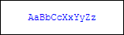

# TextStylePreview Control

The TextStylePreview control is a small control that is used on options dialogs to show the end user a preview of how an [IHighlightingStyle](xref:@ActiproUIRoot.Controls.SyntaxEditor.Highlighting.IHighlightingStyle) will render.

*The TextStylePreview showing a preview of a keyword style*

## Capabilities

The control can display a preview of these highlighting style properties:

- Foreground
- Background
- Bold
- Italic
- Font family
- Font size
- Strike-through
- Underline

## Usage

The control is extremely simple to use.  Simply place a [TextStylePreview](xref:@ActiproUIRoot.Controls.SyntaxEditor.TextStylePreview) control in your application and set its [HighlightingStyle](xref:@ActiproUIRoot.Controls.SyntaxEditor.TextStylePreview.HighlightingStyle) property to the [IHighlightingStyle](xref:@ActiproUIRoot.Controls.SyntaxEditor.Highlighting.IHighlightingStyle) that should be previewed.

The [HighlightingStyle](xref:@ActiproUIRoot.Controls.SyntaxEditor.TextStylePreview.HighlightingStyle) property supports data binding so it can be bound to a `Selector`'s selected item or other data source.

The [HighlightingStyleRegistry](xref:@ActiproUIRoot.Controls.SyntaxEditor.TextStylePreview.HighlightingStyleRegistry) property can be set if you are using an alternate [IHighlightingStyleRegistry](xref:@ActiproUIRoot.Controls.SyntaxEditor.Highlighting.IHighlightingStyleRegistry), meaning one that is not the default [AmbientHighlightingStyleRegistry](xref:@ActiproUIRoot.Controls.SyntaxEditor.Highlighting.AmbientHighlightingStyleRegistry).  That ensures that it displays resolved values properly.
