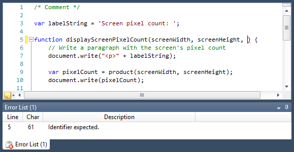

# Overview

The Web Languages Add-on is an optional premium extra for SyntaxEditor customers that includes an advanced implementation of XML, JavaScript, and JSON syntax languages.

The add-on has been built from the ground up by Actipro to take advantage of best practices for syntax language design.  While it is already packed with innovative features, the design is completely extensible and can be enhanced or modified as much as you like.

> [!NOTE]
> Be sure to read through the language's "Getting Started" topic and follow each step in it exactly to ensure that the add-on's features will operate properly.  While it only takes several lines of code to get up and running, those lines are very important and may prevent the add-on from working correctly if they are not present.

Although the add-on is distributed and demoed with the @@PlatformName controls, it is sold separately.

## XML Language

The advanced [XML syntax language](xml/index.md) implementation in the SyntaxEditor Web Languages Add-on includes everything from automated IntelliPrompt and code outlining to validation, and provides a best-of-breed XML editing experience for end users.

See the [XML Language](xml/index.md) topics for more information.

## JavaScript Language

The advanced [JavaScript syntax language](javascript/index.md) implementation in the SyntaxEditor Web Languages Add-on includes everything from code outlining to syntax error reporting.

See the [JavaScript Language](javascript/index.md) topics for more information.

## JSON Language

The advanced [JSON syntax language](json/index.md) implementation in the SyntaxEditor Web Languages Add-on includes everything from code outlining to syntax error reporting.

See the [JSON Language](json/index.md) topics for more information.

## Troubleshooting

This topic provides answers to common questions and problems related to the add-on.

See the [Troubleshooting](troubleshooting.md) topics for more information.
