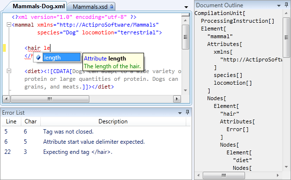

# Overview

The advanced XML syntax language implementation in the SyntaxEditor Web Languages Add-on includes everything from automated IntelliPrompt and code outlining to validation, and provides a best-of-breed XML editing experience for end users.

## Features

The XML language is packed with features, including:

- Automated IntelliPrompt completion lists and quick info for elements, attributes, and values based on one or more loaded .XSD files.
- Syntax highlighting.
- Abstract syntax tree (AST) generation.
- Automatic code outlining based on XML element structure.
- Reporting and automatic squiggle display of errors for invalid XML syntax and non-conformance to schema/DTD.
- Default namespace settings in cases where xmlns attributes are not specified on the root element.
- Mouse hover quick info for syntax/validation errors.
- Easily obtain full XML contextual information for any offset.
- End tag auto-complete.
- Line commenting.
- Smart indent.
- Text formatting.
- Code block selection.
- Support for navigable symbol selector (element/attribute drop-downs).

## Licensing

Even though the Web Languages Add-on is distributed and demoed with the @@PlatformName controls, it is optional and is sold separately from SyntaxEditor and any containing bundles.  The pricing on the add-on is very cheap and licenses are all Enterprise licenses, meaning they cover your entire organization.

See the [Assemblies and Add-on Licensing](../../assemblies.md) topic for more information.

## Getting Started

This topic covers how to get started using the XML language from the Web Languages Add-on, implemented by the [XmlSyntaxLanguage](xref:ActiproSoftware.Text.Languages.Xml.Implementation.XmlSyntaxLanguage) class, and lists its requirements for supporting advanced features like parsing and automated IntelliPrompt.

It is very important to follow the steps in this topic to configure the language correctly so that its advanced features operate as expected.

See the [Getting Started](getting-started.md) topic for more information.

## Parsing and Parse Data

The XML language uses an advanced parser that has been constructed using the Actipro [LL(*) Parser Framework](../../ll-parser-framework/index.md), and provides functionality for building ASTs, reporting parse errors, and more.

The [IXmlParseData](xref:ActiproSoftware.Text.Languages.Xml.Implementation.IXmlParseData) results returned by this parser are consumed by multiple other features of the language, such as automated IntelliPrompt, code outlining, parse error display, etc.

See the [Parsing and Parse Data](parsing.md) topic for more information.

## Schema Resolver

The schema resolver is an essential piece of the XML language since it is what loads the XML schema data that is used to drive features such as automated IntelliPrompt and validation.

See the [Schema Resolver](schema-resolver.md) topic for more information.

## Validator

A Validator executes immediately after the main XML parser runs (still in the parser worker thread) if there are no parser syntax errors found.  The validator then scans the XML to ensure that it adheres to the loaded schemas and/or DTDs, and places any validation errors in the [IXmlParseData](xref:ActiproSoftware.Text.Languages.Xml.Implementation.IXmlParseData).[Errors](xref:ActiproSoftware.Text.Parsing.IParseErrorProvider.Errors) collection that is returned by the parser.

See the [Validator](validator.md) topic for more information.

## End Tag Auto-Completer

An end-tag auto-completer is an object that can be called to attempt to insert an end tag such as when `>` is typed by the end user.

See the [End Tag Auto-Completer](end-tag-auto-completer.md) topic for more information.

## Indent Provider

An indent provider enables support for smart indent features when pressing ENTER.

See the [Indent Provider](indent-provider.md) topic for more information.

## Text Formatter

The built-in XML text formatter can adjust whitespace between elements and attributes to make code more readable.

See the [Text Formatter](text-formatter.md) topic for more information.

## Context

The XML language can return detailed context information about any offset in a document.  The context includes data such as declared namespaces, containing element hierarchy, current element/attribute, and more.  This sort of information is essential in determining what to display in automated IntelliPrompt.

See the [Context](context.md) topic for more information.

## Automated IntelliPrompt

The XML language has built-in automated IntelliPrompt completion list and quick info features that greatly enhance the end user's editing experience.

See the [Automated IntelliPrompt](intelliprompt.md) topic for more information.
