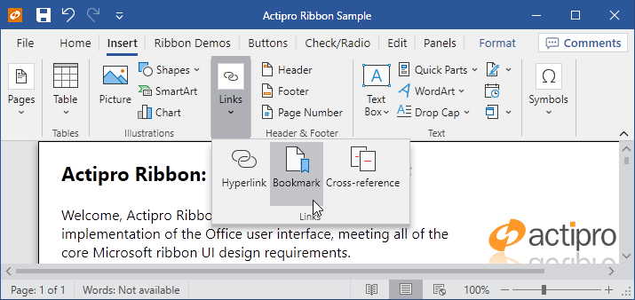

# Getting Started

Leveraging Actipro Themes in your applications is as simple as setting a few properties.



*Ribbon in the OfficeColorfulIndigo theme*

## Predefined Themes and Descriptions

Actipro Themes includes these predefined themes, whose names are defined as constants in the [ThemeNames](xref:@ActiproUIRoot.Themes.ThemeNames) class:

- Standard
  
  - `Black` - Modern black theme.
  - `Dark` - Modern dark theme.
  - `Light` - Modern light theme.
  - `White` - Modern white theme.

- Metro
  
  - `MetroBlack` - Similar to `MetroDark`, except has a black title bar area.
  - `MetroDark` - A very dark variation of `MetroLight`, similar to the Visual Studio's dark theme.
  - `MetroLight` - System default theme for Windows 8.x and newer.
  - `MetroWhite` - Similar to `MetroLight`, except has a white title bar area.

- Office Colorful
  
  - `OfficeColorfulBlue` - Office-like blue accented light theme, similar to Outlook's Colorful theme.
  - `OfficeColorfulGreen` - Office-like green accented light theme, similar to Excel's Colorful theme.
  - `OfficeColorfulIndigo` - Office-like indigo accented light theme, similar to Word's Colorful theme.
  - `OfficeColorfulOrange` - Office-like orange accented light theme, similar to PowerPoint's Colorful theme.
  - `OfficeColorfulPink` - Office-like pink accented light theme, similar to UWP OneNote's Colorful theme.
  - `OfficeColorfulPurple` - Office-like purple accented light theme, similar to OneNote's Colorful theme.
  - `OfficeColorfulRed` - Office-like red accented light theme, similar to Access' Colorful theme.
  - `OfficeColorfulTeal` - Office-like teal accented light theme, similar to Publisher's Colorful theme.
  - `OfficeColorfulYellow` - Office-like yellow accented light theme.

- Office White
  
  - `OfficeWhiteBlue` - Office-like blue accented white theme, similar to Outlook's White theme.
  - `OfficeWhiteGreen` - Office-like green accented white theme, similar to Excel's White theme.
  - `OfficeWhiteIndigo` - Office-like indigo accented white theme, similar to Word's White theme.
  - `OfficeWhiteOrange` - Office-like orange accented white theme, similar to PowerPoint's White theme.
  - `OfficeWhitePink` - Office-like pink accented white theme, similar to UWP OneNote's White theme.
  - `OfficeWhitePurple` - Office-like purple accented white theme, similar to OneNote's White theme.
  - `OfficeWhiteRed` - Office-like red accented white theme, similar to Access' White theme.
  - `OfficeWhiteTeal` - Office-like teal accented white theme, similar to Publisher's White theme.
  - `OfficeWhiteYellow` - Office-like yellow accented white theme.

- Aero-Style *(These themes require the `ActiproSoftware.Themes.Aero.Wpf.dll` assembly, along with special registration as described below) *
  
  - `AeroNormalColor` - Windows 7-like theme.
  - `Office2010Black` - Office 2010-like black theme.
  - `Office2010Blue` - Office 2010-like blue theme.
  - `Office2010Silver` - Office 2010-like silver theme.

- Other
  
  - `HighContrast` - High-contrast theme that should only be activated when the Windows system is in high-contrast mode.

## Add Assembly References

To get started, add a reference to the `ActiproSoftware.Shared.Wpf.dll` assembly.  See the product's Readme for details on the default install location.

### Aero and Office 2010 Theme Registration

If you'd like to leverage the optional `AeroNormalColor` or three supported Office 2010-like themes (`Office2010Black`, `Office2010Blue`, and `Office2010Silver`), you'll need to add a reference to the `ActiproSoftware.Themes.Aero.Wpf.dll` assembly.  The Aero theme in this assembly is similar to the Windows 7 system theme.  The Office themes in this assembly are similar to the Aero-style Office 2010 themes.  For support of themes similar to newer Office versions, use the Office accented themes instead (see above).

> [!TIP]
> Only add this reference if these older-style themes are required for your application.

Once the reference has been added, the Aero theme catalog must be registered with the theme manager in your application's `OnStartup` code:

```csharp
ThemesAeroThemeCatalogRegistrar.Register();
```

## Setting an Application-Wide Theme

The application-wide theme can be changed by setting the [ThemeManager](xref:@ActiproUIRoot.Themes.ThemeManager).[CurrentTheme](xref:@ActiproUIRoot.Themes.ThemeManager.CurrentTheme) property to the name of a registered theme.  By default, no theme will be set, and controls will use their normal WPF theme loading behavior based on system appearance settings.

To change the application-wide theme, set the [CurrentTheme](xref:@ActiproUIRoot.Themes.ThemeManager.CurrentTheme) property to the desired theme name.  When you do so, any themes that have been registered with that name will be loaded.

The list of predefined themes are defined in the [ThemeNames](xref:@ActiproUIRoot.Themes.ThemeNames) class as string constants, but additional custom themes can be registered and used as well.

This sample code shows how to make the application use the Metro Dark theme:

```csharp
ThemeManager.CurrentTheme = ThemeNames.MetroDark;
```

The [ThemeManager](xref:@ActiproUIRoot.Themes.ThemeManager).[CurrentTheme](xref:@ActiproUIRoot.Themes.ThemeManager.CurrentTheme) property setter will throw an exception if the specified theme name is not for a predefined theme or a registered custom theme, thereby warning you that you have not registered a custom theme properly before attempting to use it.  The [ThemeManager](xref:@ActiproUIRoot.Themes.ThemeManager).[IsThemeSupported](xref:@ActiproUIRoot.Themes.ThemeManager.IsThemeSupported*) method provides a quick check for whether a theme is currently supported.

## Enabling Application-Wide Native Control Theming

By default, the native WPF controls will not be implicitly themed.  To enable this behavior for your application, the [ThemeManager](xref:@ActiproUIRoot.Themes.ThemeManager).[AreNativeThemesEnabled](xref:@ActiproUIRoot.Themes.ThemeManager.AreNativeThemesEnabled) property must be set to `true`.  This ensures that your entire application consisting of Actipro and native WPF controls renders with a similar professional appearance.

This sample code shows how to enable native WPF control theming:

```csharp
ThemeManager.AreNativeThemesEnabled = true;
```

## Affecting a Specific Control Hierarchy

Themes and native control theming can also be applied to a specified control hierarchy.  The [ThemeManager](xref:@ActiproUIRoot.Themes.ThemeManager).[ThemeProperty](xref:@ActiproUIRoot.Themes.ThemeManager.ThemeProperty) attached property can be assigned to any `DependencyObject`, which functions the same way that the [CurrentTheme](xref:@ActiproUIRoot.Themes.ThemeManager.CurrentTheme) property does, except that the themes are applied to that control and its children instead of to the entire application.  The [ThemeManager](xref:@ActiproUIRoot.Themes.ThemeManager).[AreNativeThemesEnabledProperty](xref:@ActiproUIRoot.Themes.ThemeManager.AreNativeThemesEnabledProperty) attached property works the same for the native control theming option.

> [!WARNING]
> It is not generally recommended to use these features since they will increase memory usage.  Applications typically should only ever need to set the [ThemeManager](xref:@ActiproUIRoot.Themes.ThemeManager).[CurrentTheme](xref:@ActiproUIRoot.Themes.ThemeManager.CurrentTheme) and [ThemeManager](xref:@ActiproUIRoot.Themes.ThemeManager).[AreNativeThemesEnabled](xref:@ActiproUIRoot.Themes.ThemeManager.AreNativeThemesEnabled) properties.

This sample code shows how to make a `UserControl` named `myUserControl` use the Metro Dark theme and support native control themes:

```csharp
ThemeManager.SetTheme(myUserControl, ThemeNames.MetroDark);
ThemeManager.SetAreNativeThemesEnabled(myUserControl, true);
```

> [!TIP]
> There also are [ThemeManager](xref:@ActiproUIRoot.Themes.ThemeManager).[DesignModeThemeProperty](xref:@ActiproUIRoot.Themes.ThemeManager.DesignModeThemeProperty) and [ThemeManager](xref:@ActiproUIRoot.Themes.ThemeManager).[DesignModeAreNativeThemesEnabledProperty](xref:@ActiproUIRoot.Themes.ThemeManager.DesignModeAreNativeThemesEnabledProperty) attached properties that work the same as above except they only affects design-mode and not run-time.  These are very useful for when developing an application and testing themes in the designer because if you forget to remove an attached property setting, no problem.  They won't affect run-time in any way.

## Optimization

### Application StartupUri vs. Programmatic Window Show

When using Actipro themes, using the `Application.StartupUri` in the application's XAML is the recommended way to open your main window.  Our themes get applied via a `Dispatcher.BeginInvoke` and thus if you created your main window in code and immediately showed it within your application startup, the templates for Actipro controls will get applied a second time after the `BeginInvoke` call applies the themes.  If you do need to show your main window via code, you could `Dispatcher.BeginInvoke` the show code as well to work around this issue.  Otherwise, using `Application.StartupUri` will take care of that for you.

## Consolidated App.OnStartup Logic

Theme settings should generally be configured when the application is starting.  In addition, they can be consolidated and applied as a single change by wrapping them with [ThemeManager](xref:@ActiproUIRoot.Themes.ThemeManager).[BeginUpdate](xref:@ActiproUIRoot.Themes.ThemeManager.BeginUpdate*) and [EndUpdate](xref:@ActiproUIRoot.Themes.ThemeManager.EndUpdate*) calls.

This sample code shows how to change several theme settings as a single unit and ensures the application renders in a green Metro accented theme, similar to Excel.

```csharp
public partial class App : Application {

    protected override void OnStartup(StartupEventArgs e) {
        // Configure the Actipro theme manager
        ThemeManager.BeginUpdate();
        try {
            // The older Aero and Office 2010 themes are in a separate assembly and must be registered if you will use them in the application
            // ThemesAeroThemeCatalogRegistrar.Register();

            // Use the Actipro styles for native WPF controls that look great with Actipro's control products
            ThemeManager.AreNativeThemesEnabled = true;

            // Set the current app theme via a registered theme definition name
            ThemeManager.CurrentTheme = ThemeNames.OfficeColorfulGreen;
        }
        finally {
            ThemeManager.EndUpdate();
        }

        // ...

        // Call the base method
    	base.OnStartup(e);
    }
	
}
```

## Tracking the Recommended Windows System Theme (Light, Dark, High-Contrast)

While the Metro Light theme is used by default on all Windows systems, it's useful to be able to know what the current Windows system theme is so that you have the option to adjust your application's theme to match.

The [ThemeManager](xref:@ActiproUIRoot.Themes.ThemeManager).[SystemApplicationMode](xref:@ActiproUIRoot.Themes.ThemeManager.SystemApplicationMode) property returns a [SystemApplicationMode](xref:@ActiproUIRoot.Themes.SystemApplicationMode) enumeration value that indicates if Windows applications should render in a light theme, dark theme, or in high-contrast mode.  This result is determined by making various Windows API calls to resolve system settings.  The [ThemeManager](xref:@ActiproUIRoot.Themes.ThemeManager).[SystemApplicationModeChanged](xref:@ActiproUIRoot.Themes.ThemeManager.SystemApplicationModeChanged) event is raised whenever the [SystemApplicationMode](xref:@ActiproUIRoot.Themes.ThemeManager.SystemApplicationMode) property changes.

> [!TIP]
> Windows 10 and 11 users can set the desired light/dark mode for applications in the Settings' "Personalization / Colors" page, and the "Choose your default app mode" setting (Windows 10) or "Choose your mode" setting (Windows 11).  High-contrast mode is activated in the Settings' "Ease of Access / High contrast" page (Windows 10) or "Accessibility / Contrast themes" page (Windows 11).  High-contrast mode, when activated, takes priority over light/dark modes.

A handler of the [SystemApplicationModeChanged](xref:@ActiproUIRoot.Themes.ThemeManager.SystemApplicationModeChanged) event could set the [ThemeManager](xref:@ActiproUIRoot.Themes.ThemeManager).[CurrentTheme](xref:@ActiproUIRoot.Themes.ThemeManager.CurrentTheme) property to an appropriate theme based on the [SystemApplicationMode](xref:@ActiproUIRoot.Themes.ThemeManager.SystemApplicationMode) property value.  The special predefined `HighContrast` theme should only be used when the Windows system is in high-contrast mode, indicated by when the [SystemApplicationMode](xref:@ActiproUIRoot.Themes.ThemeManager.SystemApplicationMode) property returns `HighContrast`.

## Automating Theme Changes

A helper [ThemeManager](xref:@ActiproUIRoot.Themes.ThemeManager).[RegisterAutomaticThemes](xref:@ActiproUIRoot.Themes.ThemeManager.RegisterAutomaticThemes*) method can be used to handle the [SystemApplicationModeChanged](xref:@ActiproUIRoot.Themes.ThemeManager.SystemApplicationModeChanged) event and automatically update the [ThemeManager](xref:@ActiproUIRoot.Themes.ThemeManager).[CurrentTheme](xref:@ActiproUIRoot.Themes.ThemeManager.CurrentTheme) property to specified theme names.  Simply call the [RegisterAutomaticThemes](xref:@ActiproUIRoot.Themes.ThemeManager.RegisterAutomaticThemes*) method with the names of predefined or custom-registered themes to use for light, dark, and high-contrast modes and it will do the rest.

Pass a `null` value to one or more parameters of that method to not auto-switch for the related mode.  For instance, if you wish to only specify automatic switching for light and dark modes, but don't wish to offer a high-contrast mode, pass theme names for the light and dark mode parameters, and a `null` value for the high-contrast mode parameter.

Use the [HasAutomaticThemes](xref:@ActiproUIRoot.Themes.ThemeManager.HasAutomaticThemes) property to determine if automatic theme changes are registered.  The [UnregisterAutomaticThemes](xref:@ActiproUIRoot.Themes.ThemeManager.UnregisterAutomaticThemes*) method unregisters automatic theme change behavior.

## Theming Windows with Custom Chrome

Actipro Themes includes a special [WindowChrome](xref:@ActiproUIRoot.Themes.WindowChrome) class that is capable of rendering any WPF `Window` in a custom chrome that matches the current theme and has many advanced features like title bar customization and overlays that aren't available otherwise.

See the [Window Chrome](windowchrome.md) topic for more information on how it works and how to apply it.

## Theming SyntaxEditor

SyntaxEditor will use the current theme's `TextBox` foreground and background for plain text, unless overridden in highlighting styles.  Other syntax highlighting and margin rendering will be based on registered highlighting styles for various syntax language and display classification types, which are usually specified by default for a light theme.  ScrollBars within the editor will use the current theme's `ScrollBar` style.

While the defaults should look fine in lighter themes, darker themes require the registered highlighting styles for all the classification types of syntax languages you use, along with highlighting styles for the editor's display classification types, to be updated with values more appropriate for a dark theme.

See the [Highlighting Style Registries](../syntaxeditor/user-interface/styles/highlighting-style-registries.md) topic for more information on how to properly switch to a dark theme.
