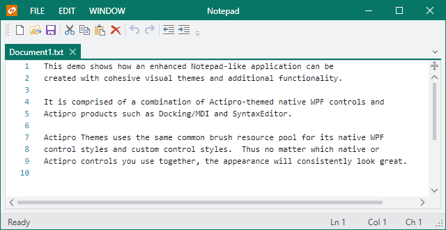

# Overview

Actipro Themes is a complete framework for managing run-time selection of the themes of Actipro and native WPF controls, but can also be used for your own custom controls as well.  Not only can you change an application-wide theme with a single line of code, you can make custom themes via theme definitions, and reuse theme brushes and other assets throughout your application.  All of this is possible with Actipro's themes framework.

A [Theme Designer application](theme-designer.md) is included with the WPF controls that allows for easy configuration of custom theme definitions.  There are settings for everything from colors and grayscale saturation amounts to corner radii and where accent colors are used.  With every theme definition setting change, the application theme is immediately visualized so that you can see the exact outcome of the theme definition configuration.

Also included in Actipro Themes are optional styles and templates for all native WPF controls that have been given a more modernized appearance, and mesh perfectly with Actipro's custom control products.  Like the application-wide theme, this can be configured with a single line of code.

> [!NOTE]
> Actipro Themes is built right into the Actipro Shared Library, which means it may be freely used by any developer who has a license for one of our WPF control products.

## Features

### General Features

- Over 30 professionally-designed themes, including numerous modern themes, Office themes, and Metro themes.
- An entire themes management framework that makes it simple to register themes and swap them in and out at run-time.
- Consolidated and centralized collection of assets, such as brushes, that are used across all our WPF products.
- Easily build a completely custom theme or tweak individual aspects of existing themes without having re-style or re-template controls.
- Define custom resources that will be loaded based on the current theme.
- Quickly integrate custom controls into the theme management framework.
- Reusable styles/templates for common controls such as embedded buttons.
- Reusable glyphs.

### Native Controls Features

- Enhanced and integrated styles/templates for native WPF controls, such as Button and CheckBox.
- Leverages the same assets, such as brushes, as our other WPF products which means they can be tinted or switched dynamically.

### Theme Definition Features

- Intent of a white, light, dark, or black theme.
- Base colors used to define the color palette for color families.
- Hue and saturation to tint grayscale colors.
- Color families used for various UI such as accents and windows.
- Font family and font sizes.
- Arrow and glyph kinds.
- Border contrast amounts.
- Corner radii, padding, and margins.
- Title and status bar backgrounds.

### Theme Designer Application Features

- Easily configure an entire theme definition.
- Instantly see the results of altering theme definition settings via visualizations of all native WPF controls and many Actipro controls.
- Load theme presets from predefined themes.
- Quickly load presets for various options like window title/status bar accents, border contrast, bullet appearance, etc.
- Copy generated code that can be placed in your application's OnStartup method to load the custom theme definition.
- View the entire generated color palette of extensive grayscale and color family shades.
- Browse all generated theme assets, such as brushes, in a filterable list.
- Save and later reopen custom theme definitions in the application for further adjusting.

### WindowChrome Features

- Supports rendering any normal WPF window with a custom chrome that matches the current theme.
- Customize the left, center, and right areas of the window's title bar by injecting custom controls or changing title bar text alignment.
- Customize the left, center, and right areas of the window's title bar.
- Use a custom icon size, adjust the margin around the icon, or hide it altogether.
- Retrieve the final arranged title bar height, and left/right content area widths.
- Optionally extend the window content itself, or just the background, to render in the title bar area.
- Replace the Win32-based system menu with a themeable WPF one, whose menu items can be customized.
- Support for animated overlay UI that temporarily overlays the entire window, such as for a home screen, Backstage, or processing indicator.

### ImageProvider Features

- Chromatic adaptation (color shifting) for images, which allows images designed for light themes to be automatically adjusted for use in dark themes.
- Converting a monochrome vector image to render in the current foreground color.
- Dynamic loading of pre-defined high-DPI and/or theme-specific image variations for raster images.
- Conversion of images to grayscale.
- Conversion of images to monochrome, in a specified color.

*This product is written in 100% pure C#, and includes detailed documentation and samples.*
