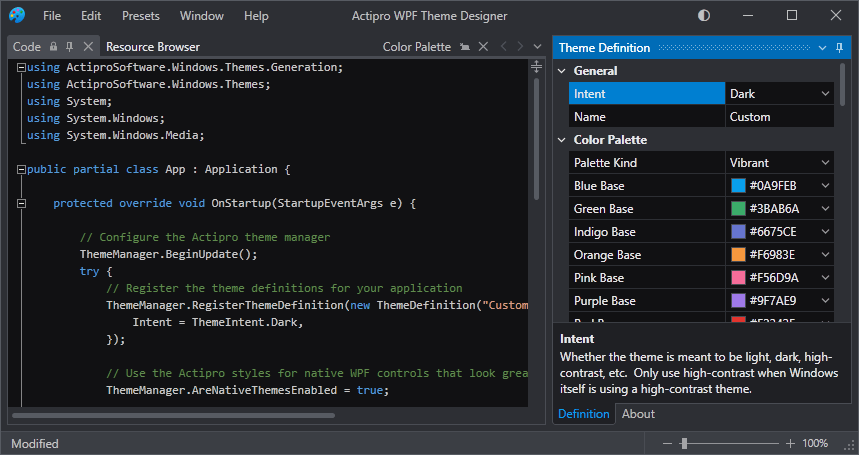

# Theme Designer Application

Actipro's WPF Theme Designer application comes with the WPF Controls, making it easy to fully configure a theme definition.  There are settings for everything from colors and grayscale saturation amounts to corner radii and where accent colors are used.  With every theme definition setting change, the application theme is immediately visualized so that you can see the exact outcome of the theme definition configuration.  The Theme Designer even generates the code necessary to paste into your application `OnStartup` to replicate the theme definition.

*The Theme Designer application*

See the [Architecture](architecture.md) topic for more detailed information on the theme definitions that are edited in the Theme Designer application.

## Running the Application

The application is available via a shortcut in the Windows Programs menu group created for the Actipro WPF Controls after install.

## Configuring the Theme Definition

The Theme Definition tool window contains a property grid that allows for configuring the current theme's definition.  Any changes made to the theme definition trigger a new theme to be generated and for the application to immediately use that new theme.  This allows you to see how the theme definition looks in a real application.

It's important to set a custom [Name](xref:ActiproSoftware.Windows.Themes.Generation.ThemeDefinition.Name) for your theme.  This name should be unique since it is what will be referenced later when setting the [ThemeManager](xref:ActiproSoftware.Windows.Themes.ThemeManager).[CurrentTheme](xref:ActiproSoftware.Windows.Themes.ThemeManager.CurrentTheme) property to switch application themes.

It's also important to set the [Intent](xref:ActiproSoftware.Windows.Themes.Generation.ThemeDefinition.Intent) to indicate if the theme is meant to be a black, dark, light, or white theme.  That setting affects grayscale and color family shade generation, among other things.

Beyond those settings, any of the other theme definition properties can optionally be altered.

The Edit menu's Undo and Redo items can undo and redo changes made to the theme definition.

When you are satisfied with your theme definition configuration, use the Code tab to generate code that can be pasted into your application to use the theme there.

## Using Entire Themes Presets

The Presets menu has an Entire Themes section where selecting a theme item will reset the current theme definition to a predefined theme.

This is a great feature to use when first starting out on a new theme definition since it can provide a starting point for your theme definition.  Note that choosing one of these presets will reset any custom options you've set on your theme.  If you mistakenly select one of these presets, use the undo feature to return your theme definition back to its previous state.

Various theme presets use special theme definition classes.  For instance, Metro themes use the [MetroThemeDefinition](xref:ActiproSoftware.Windows.Themes.Generation.MetroThemeDefinition) class since that pre-initializes a number of theme definition option defaults (like square corners) that are used by all Metro themes.

## Using Pieces and Parts Presets

The Presets menu has a Pieces and Parts section with menu items that can quickly set one or more theme definition options to achieve a certain appearance.  For instance, there is a menu item to implemented a color-accented window title bar title.

If you don't like a chosen preset, use the undo feature to return your theme definition back to its previous state.

## Saving and Loading Theme Definitions

Use the File menu's Save item to save the current theme definition to a .themedef file.

The File menu's Open item can reopen the .themedef file for future editing.

## Viewing Sample UI

The Theme Designer includes many tabs containing sample UI controls (buttons, edits, etc.) so that you can properly visualize the current theme.

Use the Window menu's Open All Sample UI Documents item to open all sample UI tabs.  Or alternatively, individual sample UI tabs can be opened via Window menu items.

## Generating Application.OnStartup Code

The Code tab displays generated C# code that can be pasted into your own application to replicate the current theme based on its theme definition configuration.

The generated [ThemeManager](xref:ActiproSoftware.Windows.Themes.ThemeManager)-related code should be pasted into your application's `OnStartup` logic and executed prior to any UI being displayed.

### Generated Code Overview

The generated code effectively creates a new [ThemeDefinition](xref:ActiproSoftware.Windows.Themes.Generation.ThemeDefinition) object, sets its properties to duplicate the current configuration in the Theme Designer application, and registers the theme definition with the [ThemeManager](xref:ActiproSoftware.Windows.Themes.ThemeManager).  Next it sets the [ThemeManager](xref:ActiproSoftware.Windows.Themes.ThemeManager).[AreNativeThemesEnabled](xref:ActiproSoftware.Windows.Themes.ThemeManager.AreNativeThemesEnabled) property to indicate that native WPF controls should also use the theme.  And finally it updates [ThemeManager](xref:ActiproSoftware.Windows.Themes.ThemeManager).[CurrentTheme](xref:ActiproSoftware.Windows.Themes.ThemeManager.CurrentTheme) to the name of the theme to activate it.

Note that per the [Architecture](architecture.md) topic, you can optionally register more than one theme.  This is often the case if you end up designing both a light and dark theme for your application.

## Viewing the Generated Color Palette

The Color Palette tab renders the entire color palette of generated shades for the current theme's grayscale spectrum and color families in a visually-appealing way.

The nine shades for each grayscale and color family are grouped, and the absolute name and color value are displayed for each shade.

Right-click on a shade to access a context menu item that copies a `DynamicResource` reference to the clipboard for the shade.  This reference can be pasted into any XAML `Brush`-based properties in your application.

## Browsing Asset Resources

The Resource Browser tab allows you to view all the asset resources (brushes, thicknesses, etc.) that are defined in the current theme.  These asset resources are used throughout the styles and templates for Actipro's WPF control products, as well as for Actipro's native WPF control themes.  The browser can generate a `DynamicResource` string for any asset resource that can be pasted into your XAML for usage.

The Resource Browser contains a list of the theme's asset resources, displaying a preview, name, type, and resource key for each.  Use the filter textbox above the list to narrow down the list.  Within the filter, spaces are treated as wildcards and commas can be used to distinguish separate filters.  For instance, a filter of "edit background, button border" would match these resource keys and others:

- ButtonBorderCheckedBrushKey
- EditBackgroundDisabledBrushKey
- EditCaretBackgroundNormalBrushKey
- ScrollBarButtonBorderDisabledBrushKey

### Reusing Brush Resources in Your Application

If you would like to reuse a certain asset resource in your own application, a copy to clipboard button is available below the asset resource list.  Select the asset resource to reuse, press the copy button, and paste the generated `DynamicResource` string into any XAML property value in your application.  That property will then use whatever asset resource value is provided by the current theme in the [ThemeManager](xref:ActiproSoftware.Windows.Themes.ThemeManager).  If you change the [ThemeManager](xref:ActiproSoftware.Windows.Themes.ThemeManager).[CurrentTheme](xref:ActiproSoftware.Windows.Themes.ThemeManager.CurrentTheme), then the property value will be updated to the new asset resource value.

The copied value looks like this:

`{DynamicResource {x:Static themes:AssetResourceKeys.WindowBackgroundNormalBrushKey}}`

The `themes` XML namespace is defined as:

`xmlns:themes="http://schemas.actiprosoftware.com/winfx/xaml/themes"`
