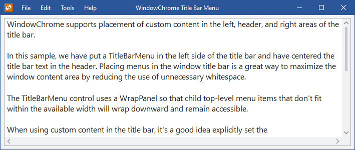
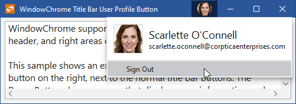
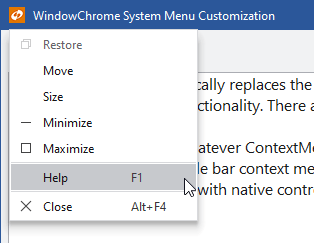
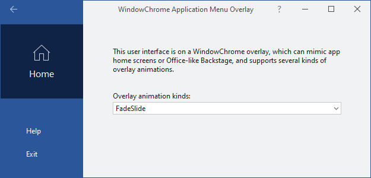

# Window Chrome

Actipro Themes includes a special class that is capable of rendering any WPF `Window` in a custom chrome that matches the current theme.  Window chrome also supports an enormous number of customization features for the window, enabling window UI functionality that is not normally available.



*A menu placed in the window's title bar via WindowChrome*

## What is WindowChrome?

The [WindowChrome](xref:ActiproSoftware.Windows.Themes.WindowChrome) class is a special class that is capable of applying a custom chrome to any normal WPF `Window`.  It effectively hooks into a window and assumes all control of its rendering for the non-client area.

Features include:

- Matches current application theme
- Modern appearance support
- Ability to hide the title bar
- Capability of showing custom size icons
- Ability to set the margin around the icon
- Ability to hide the icon
- Ability to determine which title bar buttons are visible
- Ability to use different title text from the Window.Title
- Change the alignment of the title text (optionally center it)
- Ability to inject a custom header UI in place of default title bar text
- Ability to inject additional UI next to the title bar icon and/or buttons
- Ability to set the minimum title bar height
- Retrieve the final arranged title bar height, and left/right content widths
- Alternate title bar and title bar button styles
- Normal border, or single pixel-border with outer glow effects
- Outer glow areas support window resizing
- Optionally extend the window content itself, or just the background, to render in the title bar area
- Full Aero-snap support
- Full interop (WinForms, etc.) and ClearType support
- Replacement of the Win32-based system menu with a themeable WPF one, whose menu items can be customized
- Support for animated overlay UI that temporarily overlays the entire window, such as for a home screen, Backstage, or processing indicator

The ability to use semi-transparent border outer glow effects and still have full support for interop controls is rather unique, since normally windows with transparent backgrounds don't render interop controls in WPF.  We have created special code to work around this.  By default only modern themes activate the outer glow effects.

It is highly recommended that [native control themes](native-controls.md) are activated when using window chrome, so that everything blends well together.

## Applying Window Chrome

If your app will be using our Metro theme, you may apply the chrome to any existing `Window` via XAML or dynamically via code.

> [!NOTE]
> Do not apply the chrome onto [RibbonWindow](../ribbon/controls/ribbonwindow.md) instances.  Each `RibbonWindow` instance already has a pre-installed `WindowChrome` that is configured to support the QAT and other Ribbon features, and will break functionality if changed.  You can get that existing instance programmatically and alter its properties as needed via a call to [WindowChrome](xref:ActiproSoftware.Windows.Themes.WindowChrome).[GetChrome](xref:ActiproSoftware.Windows.Themes.WindowChrome.GetChrome*).

### Applying Via XAML

This code sample shows how to set a [WindowChrome](xref:ActiproSoftware.Windows.Themes.WindowChrome) instance onto a `Window` and update the window to use a custom 24x24 icon (instead of the standard 16x16 icon).  It also updates the margin around the icon.

```xaml
<Window xmlns:themes="http://schemas.actiprosoftware.com/winfx/xaml/themes"
	...
	>
	<themes:WindowChrome.Chrome>
		<!-- This WindowChrome updates a Window so that it renders in a Metro style... custom-sized icons can even be used -->
		<themes:WindowChrome IconMargin="10,4,10,4" IconSource="/Resources/Images/ActiproMetro24.png" />
	</themes:WindowChrome.Chrome>
	...
</Window>
```

You could also apply a single chrome to multiple windows in an app by defining the chrome in your Application.Resources with an `x:Key`.  Then reference that chrome in each `Window`'s XAML like:

```xaml
<Window xmlns:themes="http://schemas.actiprosoftware.com/winfx/xaml/themes"
	...
	themes:WindowChrome.Chrome="{StaticResource YourWindowChromeKeyHere}">
	...
</Window>
```

Note that if you choose to reuse a chrome instance among multiple windows, be sure to remove the instance from each window if the window is closed and will no longer be referenced.

This code sample shows how the chrome can be removed from within an `OnClosed` override of the `Window`.

```csharp
WindowChrome.SetChrome(this, null);
```

The code above will prevent any possible memory leaks due to the chrome instance remaining alive.

> [!WARNING]
> `WindowChrome` installs a new `Style` onto the window instances that use it.  Therefore, custom window styles cannot be assigned to a window that will be chromed.  And thus, the window chrome cannot be assigned via a style setter since as soon as it would be assigned, our built-in style would end up getting applied (which didn't have the chrome setter) and the chrome would then be removed.  Set the chrome on each window instance as described above instead.

### Applying Via Code

This code sample shows how to set a [WindowChrome](xref:ActiproSoftware.Windows.Themes.WindowChrome) instance onto a `Window` programmatically instead, which can be done at run-time, such as after the Window's `InitializeComponent` call.

```csharp
WindowChrome.SetChrome(this, new WindowChrome());
```

### Removing Via Code

The custom [WindowChrome](xref:ActiproSoftware.Windows.Themes.WindowChrome) can also be removed at run-time if needed, with a call such as this on the `Window`.

```csharp
WindowChrome.SetChrome(this, null);
```

Once removed, the window will render using system defaults again.

## Title Bar Display

By default, the [WindowChrome](xref:ActiproSoftware.Windows.Themes.WindowChrome) will display the window's title bar at the top of the window.

The [HasTitleBar](xref:ActiproSoftware.Windows.Themes.WindowChrome.HasTitleBar) property can be set to `false` to hide the entire title bar.

## Icon Display

By default, the [WindowChrome](xref:ActiproSoftware.Windows.Themes.WindowChrome) will render the window's 16x16 icon.

However if a custom-sized icon is desired (such as a 24x24 icon), its `ImageSource` can be set to the [IconSource](xref:ActiproSoftware.Windows.Themes.WindowChrome.IconSource) property.  The margin around the icon can be adjusted with the [IconMargin](xref:ActiproSoftware.Windows.Themes.WindowChrome.IconMargin) property.

The [HasIcon](xref:ActiproSoftware.Windows.Themes.WindowChrome.HasIcon) property can be set to `false` to hide the icon in the title bar altogether.

## System Title Bar Button Display

These properties on the [WindowChrome](xref:ActiproSoftware.Windows.Themes.WindowChrome) instance govern which system title bar buttons display:

- [HasMinimizeButton](xref:ActiproSoftware.Windows.Themes.WindowChrome.HasMinimizeButton)
- [HasRestoreButton](xref:ActiproSoftware.Windows.Themes.WindowChrome.HasRestoreButton)
- [HasMaximizeButton](xref:ActiproSoftware.Windows.Themes.WindowChrome.HasMaximizeButton)
- [HasCloseButton](xref:ActiproSoftware.Windows.Themes.WindowChrome.HasCloseButton)

## Title Bar Text Display

The attached `WindowChrome.TitleBarHeader` property (set on the `Window` instance) is what renders content in the center of the title bar.  By default, the `Window.Title` string value is bound to this attached property so that the window title appears in the title bar.

This example shows how to display different title text in the window's title bar from the title text that shows in the Windows taskbar, which is useful when your window title bar should show more detail in the text.

```xaml
<Window ...
	Title="Document1.txt - MyApp"
	themes:WindowChrome.TitleBarHeader="Document1.txt - Last modified: October 24">
	<themes:WindowChrome.Chrome>
		<themes:WindowChrome TitleBarHeaderAlignment="Center" />
	</themes:WindowChrome.Chrome>
	...
</Window>
```

Set the attached `WindowChrome.TitleBarHeader` property to `null` to hide the title bar text.

The [TitleBarHeaderAlignment](xref:ActiproSoftware.Windows.Themes.WindowChrome.TitleBarHeaderAlignment) property allows a `HorizontalAlignment` to be specified that changes the horizontal alignment of the header where title text is displayed.  While it defaults to `Left`, it can be changed to a value like `Center` to center-align the title text.

The [TitleBarHeaderMargin](xref:ActiproSoftware.Windows.Themes.WindowChrome.TitleBarHeaderMargin) property sets the margin around the header.  This is useful for creating spacing between the header and other title bar elements.

## Replacing Title Bar Text with Custom Header UI

Custom header UI can be injected in place of the default title bar text rendering.  This feature allows UI such as a button to be used.

Behind the scenes, a `ContentControl` has its `Content` property set to the window's attached `WindowChrome.TitleBarHeader` property value, its `ContentTemplate` property set to the [TitleBarHeaderTemplate](xref:ActiproSoftware.Windows.Themes.WindowChrome.TitleBarHeaderTemplate) property value.  and its `ContentTemplateSelector` property set to the [TitleBarHeaderTemplateSelector](xref:ActiproSoftware.Windows.Themes.WindowChrome.TitleBarHeaderTemplateSelector) property value.  Any of these properties can be customized to inject custom UI using MVVM techniques.

Note that the default value of the [TitleBarHeaderTemplateSelector](xref:ActiproSoftware.Windows.Themes.WindowChrome.TitleBarHeaderTemplateSelector) property is an instance of [WindowChromeTitleBarHeaderTemplateSelector](xref:ActiproSoftware.Windows.Themes.WindowChromeTitleBarHeaderTemplateSelector), which has a default template for string-based `WindowChrome.TitleBarHeader` values.

The object-based content property is an attached property because it is specific to a `Window` instance.  The `DataTemplate`-based content template property is a normal chrome property because [WindowChrome](xref:ActiproSoftware.Windows.Themes.WindowChrome) instances can be reused across multiple windows.

This example shows how the [TitleBarHeaderTemplate](xref:ActiproSoftware.Windows.Themes.WindowChrome.TitleBarHeaderTemplate) property can be set to replace the default `TextBlock`-based rendering of title bar text.  The data context of this template is the attached `WindowChrome.TitleBarHeader` property value, which defaults to `Window.Title`.

```xaml
<Window ...>
	<themes:WindowChrome.Chrome>
		<themes:WindowChrome>
			<themes:WindowChrome.TitleBarHeaderTemplate>
				<DataTemplate>
					<Button Content="{Binding}" Margin="20,0" MaxWidth="300"
						Style="{DynamicResource {x:Static themes:SharedResourceKeys.WindowTitleBarButtonBaseStyleKey}}" 
						Foreground="{Binding RelativeSource={RelativeSource TemplatedParent}, Path=(TextElement.Foreground)}"
						IsTabStop="False" Focusable="False" />
				</DataTemplate>
			</themes:WindowChrome.TitleBarHeaderTemplate>
		</themes:WindowChrome>
	</themes:WindowChrome.Chrome>
	...
</Window>
```

This example shows how the attached `WindowChrome.TitleBarHeader` property can be set instead to accomplish the same sort of goal.

```xaml
<Window x:Name="window" ...>
	<themes:WindowChrome.Chrome>
		<themes:WindowChrome />
	</themes:WindowChrome.Chrome>
	<themes:WindowChrome.TitleBarHeader>
		<Button Content="{Binding ElementName=window, Path=Title}" Margin="20,0" MaxWidth="300"
				Style="{DynamicResource {x:Static themes:SharedResourceKeys.WindowTitleBarButtonBaseStyleKey}}" 
				Foreground="{Binding RelativeSource={RelativeSource TemplatedParent}, Path=(TextElement.Foreground)}"
				IsTabStop="False" Focusable="False" />
	</themes:WindowChrome.TitleBarHeader>
	...
</Window>
```

## Injecting Additional Content in the Title Bar

Custom UI can optionally be injected both on the left side (next to the icon) and right side (next to the system buttons) of the title bar.  This feature can be used to insert any kind of controls such as title bar menus, other title bar buttons (back, help, etc.), or an app-wide search textbox.

Behind the scenes, two `ContentControl` instances are in the title bar, one on the left side and one on the right.  The left-side `ContentControl` has its `Content` property set to the window's attached `WindowChrome.TitleBarLeftContent` property value, its `ContentTemplate` property set to the [TitleBarLeftContentTemplate](xref:ActiproSoftware.Windows.Themes.WindowChrome.TitleBarLeftContentTemplate) property value, and its `ContentTemplateSelector` property set to the [TitleBarLeftContentTemplateSelector](xref:ActiproSoftware.Windows.Themes.WindowChrome.TitleBarLeftContentTemplateSelector) property value.  The right-side `ContentControl` has its `Content` property set to the window's attached `WindowChrome.TitleBarRightContent` property value, its `ContentTemplate` property set to the [TitleBarRightContentTemplate](xref:ActiproSoftware.Windows.Themes.WindowChrome.TitleBarRightContentTemplate) property value, and its `ContentTemplateSelector` property set to the [TitleBarRightContentTemplateSelector](xref:ActiproSoftware.Windows.Themes.WindowChrome.TitleBarRightContentTemplateSelector) property value.  Any of these properties can be customized to inject custom UI using MVVM techniques.

The object-based content properties are attached properties because they are specific to a `Window` instance.  The `DataTemplate`-based content template properties are normal chrome properties because [WindowChrome](xref:ActiproSoftware.Windows.Themes.WindowChrome) instances can be reused across multiple windows.

> [!NOTE]
> The attached `WindowChrome.TitleBarLeftContent` and `TitleBarRightContent` properties are generally bound to the `Window`'s `DataContext` property when there is custom title bar UI in the related title bar side.  This is useful when wanting to pass the same view-model object into the title bar data templates, but any other object can be passed in as well.



*A user profile title bar button added via WindowChrome*

This example shows how the [TitleBarRightContentTemplate](xref:ActiproSoftware.Windows.Themes.WindowChrome.TitleBarRightContentTemplate) property can be set to inject a custom title bar button.  The data context of this template is the attached `WindowChrome.TitleBarRightContent` property value, which we will bind to the `Window.DataContext` property, assumed to have a view-model with a `CustomButtonCommand` property on it.

```xaml
<Window ... themes:WindowChrome.TitleBarRightContent="{Binding RelativeSource={RelativeSource Self}, Path=DataContext}">
	<themes:WindowChrome.Chrome>
		<themes:WindowChrome>
			<themes:WindowChrome.TitleBarRightContentTemplate>
				<DataTemplate>
					<Button Command="{Binding CustomButtonCommand}"
						Style="{DynamicResource {x:Static themes:SharedResourceKeys.WindowTitleBarButtonBaseStyleKey}}"
						themes:ThemeProperties.IsActive="{Binding RelativeSource={RelativeSource AncestorType={x:Type Window}}, Path=IsActive}"
						ToolTip="Custom TitleBar Button">
						<Button.ContentTemplate>
							<DataTemplate>
								<Canvas Margin="6,0" Width="16" Height="16">
									<Path Canvas.Left="3" Canvas.Top="11" 
										  Fill="{Binding RelativeSource={RelativeSource Self}, Path=(TextElement.Foreground)}"
										  Data="M 0,0 L 2,0 L 2,2 L 0,2 Z M 4,0 L 6,0 L 6,2 L 4,2 Z M 8,0 L 10,0 L 10,2 L 8,2 Z"/>
								</Canvas>
							</DataTemplate>
						</Button.ContentTemplate>
					</Button>
				</DataTemplate>
			</themes:WindowChrome.TitleBarRightContentTemplate>
		</themes:WindowChrome>
	</themes:WindowChrome.Chrome>
	...
</Window>
```

## Title Bar Element Layout

Title bar elements consist of controls like the icon, left content (custom UI next to the icon), header (generally title bar text), right content (custom UI next to the system buttons), and system buttons (minimize, maximize, etc. buttons).

[WindowChrome](xref:ActiproSoftware.Windows.Themes.WindowChrome) has some complex logic built into it to arrange all of the title bar elements based on available width.  The icon and system buttons are always rendered at full width when visible.  There are three distinct layout phases that occur for the remaining title bar elements as available width changes.

### All Elements Fit and Center-Aligned Header

This phase only occurs when the [TitleBarHeaderAlignment](xref:ActiproSoftware.Windows.Themes.WindowChrome.TitleBarHeaderAlignment) property is set to `Center`, the header is able to be centered within the title bar without overlapping other elements, and all title bar elements fully fit at their desired widths.  In this phase, all elements appear at their full size and the header is centered within the overall title bar.

### All Elements Fit

This next phase occurs when the [TitleBarHeaderAlignment](xref:ActiproSoftware.Windows.Themes.WindowChrome.TitleBarHeaderAlignment) property anything other than `Center` or the centered header would overlap other elements, and all title bar elements fully fit at their desired widths.  In this phase, all elements appear at their full size.

### Elements Don't All Fit

This final phase occurs when not all elements fit at their desired sizes.  At this point the left-side and right-side content areas are allowed to take up to a percentage of available space designated by the [TitleBarLeftContentMaxWidthOverflowPercentage](xref:ActiproSoftware.Windows.Themes.WindowChrome.TitleBarLeftContentMaxWidthOverflowPercentage) and [TitleBarRightContentMaxWidthOverflowPercentage](xref:ActiproSoftware.Windows.Themes.WindowChrome.TitleBarRightContentMaxWidthOverflowPercentage) properties.  Any unused space is given to the header.  As an example, if a wide menu control is injected into the title bar's left-side, then a wider [TitleBarLeftContentMaxWidthOverflowPercentage](xref:ActiproSoftware.Windows.Themes.WindowChrome.TitleBarLeftContentMaxWidthOverflowPercentage) like `0.5` (50%) should be used so that most of the menu can still be displayed at smaller window widths.

The [TitleBarHeaderMinWidth](xref:ActiproSoftware.Windows.Themes.WindowChrome.TitleBarHeaderMinWidth) property specifies the minimum width to try and make sure the header receives in this phase.  The header will take space from the left and right content areas as needed to ensure it has this minimum width available.  This ensures that a title bar text element in the header can take a higher display priority over the left/right content areas.

In this phase, the left/right content areas will generally be told to render at a width smaller than their desired width.  It is a the responsibility of the controls in the left/right content areas to handle that scenario and adjust their UI as appropriate.  Some implementations may choose to hide elements that don't fit, or move elements that don't fit to an overflow menu.

## Using the TitleBarMenu Control

The [TitleBarMenu](xref:ActiproSoftware.Windows.Controls.TitleBarMenu) control inherits the native `Menu` control but alters the top-level menu item appearance to render properly in title bar scenarios.

It also will wrap menu items that don't fit within the available width to new lines so that they all remain accessible.  Note that when using a title bar menu, the [WindowChrome](xref:ActiproSoftware.Windows.Themes.WindowChrome).[TitleBarLeftContentMaxWidthOverflowPercentage](xref:ActiproSoftware.Windows.Themes.WindowChrome.TitleBarLeftContentMaxWidthOverflowPercentage) property should be set to a relatively high value to avoid the menu from wrapping its top-level menu items too early as available width decreases.

This is an example of using the [TitleBarMenu](xref:ActiproSoftware.Windows.Controls.TitleBarMenu) control on the left side of a [WindowChrome](xref:ActiproSoftware.Windows.Themes.WindowChrome) title bar.

```xaml
<Window ...>
	<themes:WindowChrome.Chrome>
		<themes:WindowChrome x:Name="chrome" TitleBarHeaderAlignment="Center" TitleBarHeaderMinWidth="70" 
			TitleBarLeftContentMaxWidthOverflowPercentage="0.75" TitleBarRightContentMaxWidthOverflowPercentage="0" />
	</themes:WindowChrome.Chrome>
	<themes:WindowChrome.TitleBarLeftContent>
		<shared:TitleBarMenu x:Name="menu" Foreground="{Binding RelativeSource={RelativeSource TemplatedParent}, Path=(TextElement.Foreground)}">
			<MenuItem Header="File">
				<MenuItem Header="New" />
				<MenuItem Header="Open..." />
				<MenuItem Header="Exit" />
			</MenuItem>
			<MenuItem Header="Edit">
				<MenuItem Header="Cut" />
				<MenuItem Header="Copy" />
				<MenuItem Header="Paste" />
			</MenuItem>
			<MenuItem Header="Help">
				<MenuItem Header="Documentation" />
			</MenuItem>
		</shared:TitleBarMenu>
	</themes:WindowChrome.TitleBarLeftContent>
	...
</Window>
```

## Using the AutoCollapseStackPanel Control

When elements don't all fit within their available space in the title bar, some of them may get clipped so that they only partially render.  This isn't a good user experience and to help, we've built a small [AutoCollapseStackPanel](xref:ActiproSoftware.Windows.Controls.Primitives.AutoCollapseStackPanel) control that can be used in the title bar.  This panel arranges child elements horizontally and only shows child elements that fit within the available space, collapsing the rest.

For instance, if you have two buttons that you wish to include in the title bar's right content area, wrap them with an [AutoCollapseStackPanel](xref:ActiproSoftware.Windows.Controls.Primitives.AutoCollapseStackPanel) instance and it will handle hiding the buttons when they don't fit.

## Extending the Content Area Itself or Its Background Into the Title Bar

The `Window.Background` brush is used to render the window's content area background.  Many applications render the title bar area of the window with distinct backgrounds from the window's content area.  This is also the default case with Actipro themes, where the title bar has its own background, even if the brush used to to render the background is the same as the content area brush.

There are some scenarios where it's desirable to have the content area background extend to fill the title bar area as well.  The [TitleBarMergeKind](xref:ActiproSoftware.Windows.Themes.WindowChrome.TitleBarMergeKind) property can be set to `BackgroundOnly` to achieve this.  In this case, the normal theme title bar background isn't rendered and the content area background is updated to include the title bar area.

The [TitleBarMergeKind](xref:ActiproSoftware.Windows.Themes.WindowChrome.TitleBarMergeKind) property can alternatively be set to `Full` to render the `Window.Content` in the title bar areas as well.  In this scenario, the title bar elements still render on top of the content area elements.

Finally, the `ContentOnly` option keeps the content area background where it normally would render, but extends the content area elements to render in the title bar.

## Customizing the System Menu

A window's system menu displays when you right-click the title bar, or you click the icon in the title bar. [WindowChrome](xref:ActiproSoftware.Windows.Themes.WindowChrome) replaces the default Win32-based system menu with a pure WPF-based one that is themeable.  This is especially helpful if you are using a dark theme, since the default Win32-based system menu is jarringly different in appearance from a dark theme menu.



*A themed system menu, with custom Help menu*

The [WindowChrome](xref:ActiproSoftware.Windows.Themes.WindowChrome).[WindowSystemMenuOpening](xref:ActiproSoftware.Windows.Themes.WindowChrome.WindowSystemMenuOpening) event fires when the system menu is opening, allowing for full customization.  If you don't wish to use a custom WPF-based system menu that matches the current application theme, set `e.Menu` to a null reference in the event handler.

### Adding Custom Menu Items

This code sample shows custom menu items can be added to the system menu.

```csharp
private void OnWindowSystemMenuOpening(object sender, ContextMenuOpeningEventArgs e) {
	// If not allowing a custom system menu, clear e.Menu and quit
	if (!true.Equals(useCustomSystemMenuCheckBox.IsChecked)) {
		e.Menu = null;
		return;
	}

	var separator = e.Menu.Items.OfType<Separator>().LastOrDefault();
	var index = (separator != null ? e.Menu.Items.IndexOf(separator) : e.Menu.Items.Count);

	// Inject a Help menu item
	e.Menu.Items.Insert(index++, new Separator());
	e.Menu.Items.Insert(index++, new MenuItem() { 
		Header = "Help", 
		Command = ApplicationCommands.Help,
		CommandTarget = this,
		InputGestureText = "F1"
	});
}
```

## Overlays

Overlays allow for temporary custom content to be positioned over the entire window.  This could be a home screen, an Office-like Backstage, or a processing indicator.



*An application menu overlay*

### Overlay Content

Similar to how title bar customization works, behind the scenes, a `ContentControl` has its `Content` property set to the window's attached `WindowChrome.OverlayContent` property value, its `ContentTemplate` property set to the [OverlayContentTemplate](xref:ActiproSoftware.Windows.Themes.WindowChrome.OverlayContentTemplate) property value and its `ContentTemplateSelector` property set to the [OverlayContentTemplateSelector](xref:ActiproSoftware.Windows.Themes.WindowChrome.OverlayContentTemplateSelector) property value.  Any of these properties can be customized to inject custom UI using MVVM techniques.

### Toggling Overlay Visibility

The overlay is not made visible until the attached `WindowChrome.IsOverlayVisible` property is set to `true`.  Set the attached property back to `false` to hide the overlay.

A [IsOverlayVisibleChanged](xref:ActiproSoftware.Windows.Themes.WindowChrome.IsOverlayVisibleChanged) event fires when the property changes.  This event handler to make any programmatic changes to the UI needed for an overlay visibility change, such as showing/hiding title bar controls that should only be visible when the overlay is displayed.

A static [ToggleIsOverlayVisibleCommand](xref:ActiproSoftware.Windows.Themes.WindowChrome.ToggleIsOverlayVisibleCommand) property is available, which returns an `ICommand` that can toggle the `WindowChrome.IsOverlayVisible` property.

### Choosing the Overlay Animation

The attached `WindowChrome.OverlayAnimationKinds` property can be set on a window to determine what kind of quick animation to use when opening and closing an overlay.  The property value is of type [OverlayAnimationKinds](xref:ActiproSoftware.Windows.Themes.OverlayAnimationKinds), with the default being `Fade`.

When building an Office-like Backstage overlay, use a value of `FadeSlide`.  If you wish to disable animation altogether, use a value of `None`.  Animation is automatically disabled on machines that don't have hardware acceleration.

### Surface Area

The overlay covers the entire window but does sit in z-order behind the title bar's foreground.  This allow for the title bar to continue supporting window dragging, right-click context menus, and for title bar buttons (like Close) to be accessible.

It also allows any custom title bar controls to be accessible, which may or may not be desired.  If a custom title bar control should not be accessible when an overlay is visible, it should be hidden or disabled.  The attached `WindowChrome.IsOverlayVisible` property on the window can be bound to using an appropriate value converter, or you can update the custom title bar control states programmatically in an [IsOverlayVisibleChanged](xref:ActiproSoftware.Windows.Themes.WindowChrome.IsOverlayVisibleChanged) event handler.

## Using an Alternate Title Bar Style

Actipro Themes include resources for two sets of title bar styles, which affect both the title bar and its title bar buttons.  Most of the time, the two sets are the same.  However when using a theme with an accented title bar (like in Office Colorful themes), the "alternate" title bar style renders in a non-accented appearance.  This is commonly seen on Office-like Backstage overlays.

Set the attached `WindowChrome.UseAlternateTitleBarStyle` property to `true` on a window using [WindowChrome](xref:ActiproSoftware.Windows.Themes.WindowChrome) to activate the alternate title bar style.  This property value updates the window template to use alternate colors for the title bar foreground and background, and binds the property value directly to attached [UseAlternateStyleProperty](xref:ActiproSoftware.Windows.Themes.ThemeProperties.UseAlternateStyleProperty) properties on each title bar button.

When an attached [UseAlternateStyleProperty](xref:ActiproSoftware.Windows.Themes.ThemeProperties.UseAlternateStyleProperty) value is set to `true` on a title bar button, it will render in the alternate style.  If you define custom title bar buttons, you can manually set that attached property to determine which style to use.

It's a common practice with Office-like Backstage overlays to bind the attached [UseAlternateStyleProperty](xref:ActiproSoftware.Windows.Themes.ThemeProperties.UseAlternateStyleProperty) property to the attached `WindowChrome.IsOverlayVisible` property value.  This tells the title bar to use the alternate title bar style whenever the overlay is visible.

```xaml
<Window x:Name="window" ...
	themes:WindowChrome.UseAlternateTitleBarStyle="{Binding RelativeSource={RelativeSource Self}, Path=(themes:WindowChrome.IsOverlayVisible)}">
```

## Setting the Minimum Title Bar Height

The minimum title bar height can be set using the attached [TitleBarMinHeightProperty](xref:ActiproSoftware.Windows.Themes.WindowChrome.TitleBarMinHeightProperty) property.

```xaml
<Window x:Name="window" ...
	themes:WindowChrome.TitleBarMinHeight="28">
```

## Getting the Title Bar Height

When using extending the window's content area into the title bar via [TitleBarMergeKind](xref:ActiproSoftware.Windows.Themes.WindowChrome.TitleBarMergeKind), or when using overlays, it's handy to know the final arranged height of the title bar.  This allows the content extended up into the title bar area to possibly have a top margin to place certain elements back where they would have appeared in the normal window content area.

The title bar arrange logic sets the attached `WindowChrome.TitleBarHeight` property to the final title bar height.

This code shows how the title bar height can be used as a top margin for a control:

```xaml
<Window.Resources>
	<shared:ThicknessConverter x:Key="ThicknessConverter" />
<Window.Resources>
...
<Grid Margin="{Binding ElementName=window, Path=(themes:WindowChrome.TitleBarHeight), Converter={StaticResource ThicknessConverter}, ConverterParameter='Top'}">
```

## WindowChrome Samples

Please see the main sample project's Themes WindowChrome samples for a number of in-depth examples of using all the features described above.  These examples show best practices for each feature, such as implementing various XAML bindings, etc.
