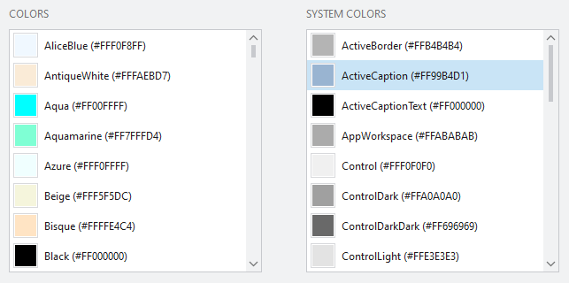

# Color Browser

The Color Browser is a helpful utility that displays all the current `Color` values found in the static `Colors` and `SystemColors` class properties.

It is available from the View menu within the Sample Browser's title bar.

*The Color Browser examining the current Windows color scheme*

## Using the Color Browser

You can right-click on the items in either of the lists to be presented with several useful copy to clipboard options.
