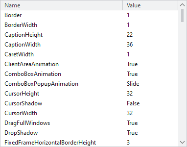

# System Parameters Browser

The SystemParameters Browser is a helpful utility that displays all the values found in the static `SystemParameters` class properties.

It is available from the View menu within the Sample Browser's title bar.

*The SystemParameters Browser examining the current Windows settings*

## Using the SystemParameters Browser

The browser can be used to view the system parameters of the current system.
