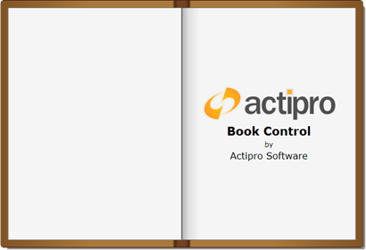
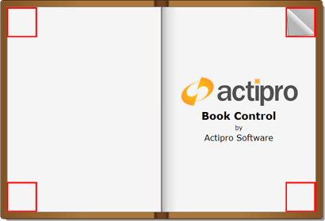

# Book

The [Book](xref:@ActiproUIRoot.Controls.Views.Book) control is an `ItemsControl` that presents the items as pages in a book.

## Overview

The [Book](xref:@ActiproUIRoot.Controls.Views.Book) control can be used to recreate a real-world book, including support for page turn animations.  The pages can be turned by clicking and/or dragging the corners from one side to the other, or programmatically using routed commands or public methods.  Includes support for horizontal and vertical orientations and several other options.

All the items presented in a [Book](xref:@ActiproUIRoot.Controls.Views.Book) are wrapped in an instance of [BookPage](xref:@ActiproUIRoot.Controls.Views.BookPage), just like a `ListBox` wraps items with a `ListBoxItem`.

## Orientation

The Book control supports `Horizontal` and `Vertical` orientations. This parameter refers to the way the pages turn and is perpendicular to the spine of the Book.

*The Book in horizontal orientation*

*The Book in vertical orientation*

In both orientations shown above, the "1" page (left/top) is considered a `Back` page, and the "2" page (right/bottom) is considered a `Front` page.  Each sheet of page has a front and a back.  In the examples above, the sheet of paper on the right/bottom has "2" on the front and its back is not visible.  If the sheet on the right/bottom was turned, then its back would be visible, and its front would not.

Each [BookPage](xref:@ActiproUIRoot.Controls.Views.BookPage) has a [Face](xref:@ActiproUIRoot.Controls.Views.BookPage.Face) property to indicate which side or face of the sheet it is on.

## First Page Placement

The first page of a [Book](xref:@ActiproUIRoot.Controls.Views.Book) can either be on the front or back of the first sheet of paper.  When oriented horizontally, this effectively determines whether the first page is on the left (back) or right (front) side of the book.  The [IsFirstPageFront](xref:@ActiproUIRoot.Controls.Views.Book.IsFirstPageFront) property controls which side (`Front` or `Back`) the first page is placed on.

## Populating the Book

A [Book](xref:@ActiproUIRoot.Controls.Views.Book) can be populated with content by adding content to the `Items` collection, or by setting the `ItemsSource` property.  The `ItemsSource` property can be data-bound to a collection, just like any other `ItemsControl`.  The [Book](xref:@ActiproUIRoot.Controls.Views.Book) can be populated with any type of object.

The [Book](xref:@ActiproUIRoot.Controls.Views.Book) control supports UI virtualization when the underlying items are not instances of [BookPage](xref:@ActiproUIRoot.Controls.Views.BookPage).  See the "Virtualization" section below for more information.

### Applying a Custom DataTemplate

When the [Book](xref:@ActiproUIRoot.Controls.Views.Book) is populated with objects that are not instances of [BookPage](xref:@ActiproUIRoot.Controls.Views.BookPage), a custom `DataTemplate` is generally needed to properly present the data.  The [Book](xref:@ActiproUIRoot.Controls.Views.Book).`ItemTemplate` property can be used to apply a custom `DataTemplate` to all generated pages.  Or, you can achieve more granular control using the  by utilizing a [BookPageTemplateSelector](xref:@ActiproUIRoot.Controls.Views.BookPageTemplateSelector).

Alternatively, more granular control can be achieved using the [Book](xref:@ActiproUIRoot.Controls.Views.Book).`ItemTemplateSelector` property.  This allows the `DataTemplate` to be chosen dynamically based on the item being presented and its associated [BookPage](xref:@ActiproUIRoot.Controls.Views.BookPage).  For convenience, [BookPageTemplateSelector](xref:@ActiproUIRoot.Controls.Views.BookPageTemplateSelector) can be used to set the `DataTemplate` for the first, last, back-facing, and front-facing pages.

> [!NOTE]
> `ItemTemplate` or `ItemTemplateSelector` are only applied if the [BookPage](xref:@ActiproUIRoot.Controls.Views.BookPage) is an automatically generated container.

### Applying a Custom Style

A custom look can be achieved by styling the [Book](xref:@ActiproUIRoot.Controls.Views.Book) and/or [BookPage](xref:@ActiproUIRoot.Controls.Views.BookPage).  This may include adding page accents, margins, rounded corners, etc.

A [Book](xref:@ActiproUIRoot.Controls.Views.Book) can be styled by setting the `Style` property explicitly or using an implicit `Style`.

One or more instances of [BookPage](xref:@ActiproUIRoot.Controls.Views.BookPage) can also be styled by setting the `Style` properties explicitly or using an implicit `Style`.  The latter approach is automatically applied to all pages and makes styling a bit easier, as any new pages will automatically pick up the new style. One drawback to this approach is that it doesn't allow the `Style` to be selected based on whether the page is the first or last, or whether it's back or front facing.

The [Book](xref:@ActiproUIRoot.Controls.Views.Book).`ItemContainerStyle` property can be used to explicitly set the [BookPage](xref:@ActiproUIRoot.Controls.Views.BookPage).`Style` property for all the pages in a book.  But this again, doesn't allow dynamic selection of the `Style` based on the page's properties.

More granular control can be achieved using the [Book](xref:@ActiproUIRoot.Controls.Views.Book).`ItemContainerStyleSelector` property.  This allows the page's `Style` to be chosen dynamically based on the item being presented and it's associated [BookPage](xref:@ActiproUIRoot.Controls.Views.BookPage).  For convenience, [BookPageStyleSelector](xref:@ActiproUIRoot.Controls.Views.BookPageStyleSelector) can be used to set the `Style` differently based on whether the page is the first or last page, or whether it's back or front facing.

> [!NOTE]
> `ItemContainerStyle` and `ItemContainerStyleSelector` are applied to all instances of [BookPage](xref:@ActiproUIRoot.Controls.Views.BookPage) in a book, regardless of whether they were automatically generated or not, and will override any implicit styles.

## Turning Pages

### Using the Mouse

There are two ways of turning the page with the mouse. The four outermost corners of the [Book](xref:@ActiproUIRoot.Controls.Views.Book) are "hotspots". You can either click in a hotspot to turn the page, or you can click and drag the corner to the opposite side of the [Book](xref:@ActiproUIRoot.Controls.Views.Book). Clicking the hotspot will invoke an automated page flipping animation. Dragging the hotspot allows you to turn the page at your own pace. You can complete the page flip by releasing the drag on the opposite side of the [Book](xref:@ActiproUIRoot.Controls.Views.Book) or cancel the page flip by releasing the drag on the original side of the [Book](xref:@ActiproUIRoot.Controls.Views.Book).

The [HotspotExtent](xref:@ActiproUIRoot.Controls.Views.Book.HotspotExtent) property allows you to specify the size of the hotspot. The property is of the [Unit](xref:@ActiproUIRoot.Unit) type, allowing plenty of flexibility in how you specify the size of the hotspot.

*The hotpots of a Book control*

### Using the Keyboard

The [Book](xref:@ActiproUIRoot.Controls.Views.Book) control supports keyboard navigation. Here are the shortcuts that are supported by default:

| Key(s) | Action |
|-----|-----|
| <kbd>Home</kbd> | First page |
| <kbd>End</kbd> | Last page |
| <kbd>Right Arrow</kbd> | Next page |
| <kbd>Left Arrow</kbd> | Previous page |
| <kbd>Down Arrow</kbd> | Next page |
| <kbd>Up Arrow</kbd> | Previous page |

The [Book](xref:@ActiproUIRoot.Controls.Views.Book) control's keyboard navigation can be customized two ways. First, the [ResetInputBindings](xref:@ActiproUIRoot.Controls.Views.Book.ResetInputBindings*) member function can be completely overridden with custom input bindings. The base method can be optionally called, depending on whether the bindings are being customized or completely replaced.  Second, the `InputBindings` collection can be manually updated to remove or add specific items.

See the "Commands and Methods" section below for more information on the commands that are used by the [Book](xref:@ActiproUIRoot.Controls.Views.Book) control.

> [!TIP]
> Events (discussed below) are raised in the same sequence when turning a page using the keyboard as when using the mouse, even though no page curl actually occurs. The page curl/flip can still be cancelled in the same way as with mouse navigation.

## Commands and Methods

Pages can be programmatically turned using several routed command or public methods.  By default, support for the following `NavigationCommands` commands is included:

- `FirstPage`
- `GoToPage`
- `LastPage`
- `PreviousPage`
- `NextPage`

The following [Book](xref:@ActiproUIRoot.Controls.Views.Book) methods can also be used directly:

- [GoToFirstPage](xref:@ActiproUIRoot.Controls.Views.Book.GoToFirstPage*)
- [GoToLastPage](xref:@ActiproUIRoot.Controls.Views.Book.GoToLastPage*)
- [GoToNextPage](xref:@ActiproUIRoot.Controls.Views.Book.GoToNextPage*)
- [GoToPreviousPage](xref:@ActiproUIRoot.Controls.Views.Book.GoToPreviousPage*)
- [GoToPage](xref:@ActiproUIRoot.Controls.Views.Book.GoToPage*)

## Events

### PageCurlActivating

The [PageCurlActivating](xref:@ActiproUIRoot.Controls.Views.Book.PageCurlActivating) event is raised when the mouse hovers over a hotspot. A handler of this event will receive a [CancelBookPageRoutedEventArgs](xref:@ActiproUIRoot.Controls.Views.CancelBookPageRoutedEventArgs) instance, which indicates the corner being curled and its associated face.  In addition, the [Cancel](xref:@ActiproUIRoot.Controls.Views.CancelBookPageRoutedEventArgs.Cancel) property can be used to cancel the event.

Canceling the [PageCurlActivating](xref:@ActiproUIRoot.Controls.Views.Book.PageCurlActivating) event prevents the page curl from occurring, therefore the end-user will not receive any visual feedback as to whether the mouse is hovering the hotspot.

### PageCurlActivated

The [PageCurlActivated](xref:@ActiproUIRoot.Controls.Views.Book.PageCurlActivated) event is raised when a page corner has curled. A handler of this event will receive a [BookPageRoutedEventArgs](xref:@ActiproUIRoot.Controls.Views.BookPageRoutedEventArgs) instance, which indicates the corner being curled and its associated face.

### PageCurlDeactivated

The [PageCurlDeactivated](xref:@ActiproUIRoot.Controls.Views.Book.PageCurlDeactivated) event is raised when a page corner has stopped being curled. A handler of this event will receive a [BookPageRoutedEventArgs](xref:@ActiproUIRoot.Controls.Views.BookPageRoutedEventArgs) instance, which indicates the corner was previously curled and its associated face.

### PageFlipping

The [PageFlipping](xref:@ActiproUIRoot.Controls.Views.Book.PageFlipping) event is raised when a page is about to flip. A handler of this event will receive a [CancelBookPageRoutedEventArgs](xref:@ActiproUIRoot.Controls.Views.CancelBookPageRoutedEventArgs) instance, which indicates the corner being curled and its associated face.  In addition, the [Cancel](xref:@ActiproUIRoot.Controls.Views.CancelBookPageRoutedEventArgs.Cancel) property can be used to cancel the event.

Canceling the [PageFlipping](xref:@ActiproUIRoot.Controls.Views.Book.PageFlipping) event prevents the page flip from occurring, therefore preventing the end-user from navigating away from a page.

### SelectedViewChanged

The [SelectedViewChanged](xref:@ActiproUIRoot.Controls.Views.Book.SelectedViewChanged) event is raised when the selected view has changed. A pair of visible page faces is referred to as a view. A handler of this event will receive a `PropertyChangedRoutedEventArgs<int>` instance, which indicates the old and new view indexes.

### PageFlipped

The [PageFlipped](xref:@ActiproUIRoot.Controls.Views.Book.PageFlipped) event is raised when a page has flipped. A handler of this event will receive a [BookPageRoutedEventArgs](xref:@ActiproUIRoot.Controls.Views.BookPageRoutedEventArgs) instance, which indicates the corner being curled and its associated face.

## Virtualization

The [Book](xref:@ActiproUIRoot.Controls.Views.Book) control includes UI virtualization to allow a large number of pages to be presented. [BookPage](xref:@ActiproUIRoot.Controls.Views.BookPage) container objects are only realized for pages that are close to the selected view index. By minimizing the number of realized container objects at any given time, the [Book](xref:@ActiproUIRoot.Controls.Views.Book) control runs faster and uses less memory.

The number of pages that are realized at any given time is determined by the [PageDepth](xref:@ActiproUIRoot.Controls.Views.Book.PageDepth) property.  This value indicates the number of pages realized on each side of the book.  Typically, with opaque pages, the default value can be left untouched.  This value is only useful when using transparent pages, as pages that are not realized will not be visible.

Keep in mind that all pages on either side count towards the [PageDepth](xref:@ActiproUIRoot.Controls.Views.Book.PageDepth).  This includes opposing faces, which are not visible until the page is being turned, so these need to be accounted for.

## Transparency

The [BookPage](xref:@ActiproUIRoot.Controls.Views.BookPage).`Background` can be set to a transparent or semi-transparent brush, thus making the page itself transparent/semi-transparent.

As mentioned in the "Virtualization" section above, the [PageDepth](xref:@ActiproUIRoot.Controls.Views.Book.PageDepth) property is very important when using pages with transparency. The pages behind the transparency need to be realized to avoid "popping" when the page is turned. In general, the [PageDepth](xref:@ActiproUIRoot.Controls.Views.Book.PageDepth) should be high enough to accommodate the largest number of consecutive transparent pages that will occur in the entire Book.
