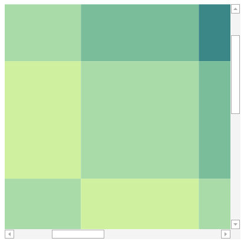

# InertiaScrollViewer

The [InertiaScrollViewer](xref:ActiproSoftware.Windows.Controls.Views.InertiaScrollViewer) is a smooth-scrolling ScrollViewer-like control that reacts to touch and continues gliding to a stop when flicked.

## Overview

The [InertiaScrollViewer](xref:ActiproSoftware.Windows.Controls.Views.InertiaScrollViewer) is a `ContentControl` that scrolls its content. Like a `ScrollViewer`, it will display whatever `UIElement` you set the `Content` property to.

> [!NOTE]
> When scrolling with a mouse wheel, vertical scrolling will always take priority. If vertical scrolling is not possible, [InertiaScrollViewer](xref:ActiproSoftware.Windows.Controls.Views.InertiaScrollViewer) will attempt to scroll horizontally instead.

## Scroll Bar Visibility

The direction of scrolling can be controlled using [InertiaScrollViewer](xref:ActiproSoftware.Windows.Controls.Views.InertiaScrollViewer).[HorizontalScrollBarVisibility](xref:ActiproSoftware.Windows.Controls.Views.InertiaScrollViewer.HorizontalScrollBarVisibility) and [InertiaScrollViewer](xref:ActiproSoftware.Windows.Controls.Views.InertiaScrollViewer).[VerticalScrollBarVisibility](xref:ActiproSoftware.Windows.Controls.Views.InertiaScrollViewer.VerticalScrollBarVisibility).

- `ScrollBarVisibility.Auto` will show a scrollbar if the `Content` size is larger than the size of the viewport.

- `ScrollBarVisibility.Disabled` will not show a scrollbar, regardless of whether or not `Content` fits in the viewport. Scrolling in this direction will be disabled.

- `ScrollBarVisibility.Hidden` will not show a scrollbar, regardless of whether or not `Content` fits in the viewport, however scrolling in this direction will still be possible.

- `ScrollBarVisibility.Visible` will always show a scrollbar, regardless of whether or not `Content` fits in the viewport. If content is larger than the viewport, scrolling will be possible.

## Adjusting Inertia Scrolling

Inertia scrolling (how scrolling continues to glide after a flick gesture) can be adjusted using several properties.

- [InertiaScrollViewer](xref:ActiproSoftware.Windows.Controls.Views.InertiaScrollViewer).[EasingFunction](xref:ActiproSoftware.Windows.Controls.Views.InertiaScrollViewer.EasingFunction) is the easing function that determines the curve of the scrolling. It defaults to `QuarticEase`, but can be set to any `System.Windows.Media.Animation.EasingFunctionBase`. There are several available in the `System.Windows.Media.Animation` namespace, such as `QuadraticEase`, `BounceEase`, and more.

- [InertiaScrollViewer](xref:ActiproSoftware.Windows.Controls.Views.InertiaScrollViewer).[VelocityDistanceRatio](xref:ActiproSoftware.Windows.Controls.Views.InertiaScrollViewer.VelocityDistanceRatio) is the ratio of distance to velocity that determines the distance travelled when scrolling. A smaller number means less travel when scrolling with inertia, while a larger number means more travel.

- [InertiaScrollViewer](xref:ActiproSoftware.Windows.Controls.Views.InertiaScrollViewer).[VelocityTimeRatio](xref:ActiproSoftware.Windows.Controls.Views.InertiaScrollViewer.VelocityTimeRatio) is the ratio of time to velocity that determines the duration of the scrolling animation.  A smaller number means the scrolling animation will be faster, while a larger number means the animation will be slower.
