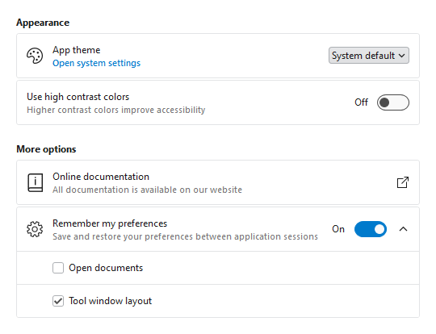
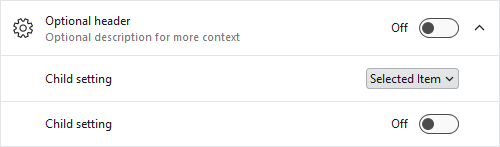
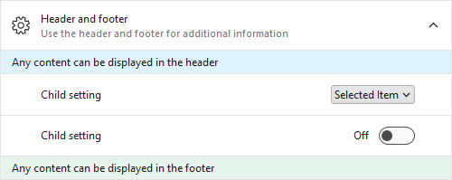
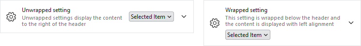

# SettingsExpander

The [SettingsCard](settings-card.md), [SettingsExpander](xref:@ActiproUIRoot.Controls.Views.SettingsExpander), and [SettingsGroup](settings-group.md) controls are used together to organize and present configurable settings.



*SettingsCard and SettingsExpander displayed within a SettingsGroup*

A [SettingsExpander](xref:@ActiproUIRoot.Controls.Views.SettingsExpander) has functionality similar to a [SettingsCard](settings-card.md) but can also be expanded to show additional child settings.



*SettingsExpander with header, description, header icon, and ToggleSwitch content in the expanded state with two SettingsCard children*

## Primary Content Areas

The [SettingsExpander](xref:@ActiproUIRoot.Controls.Views.SettingsExpander) control is defined by multiple content areas:

- [Header](xref:@ActiproUIRoot.Controls.Views.SettingsExpander.Header) - The primary label for the setting.
- [Description](xref:@ActiproUIRoot.Controls.Views.SettingsExpander.Description) - An additional description for the setting.
- [HeaderIcon](xref:@ActiproUIRoot.Controls.Views.SettingsExpander.HeaderIcon) - The primary icon for the setting.
- [ExpanderIcon](xref:@ActiproUIRoot.Controls.Views.SettingsExpander.ExpanderIcon) - The primary icon for the expansion indicator.
- `Content` (Editor) - The control used to edit the setting (e.g., `ToggleSwitch`, `ComboBox`).

Each content area, including the icons, can optionally be set to any value supported by `ContentPresenter` and the layout will adjust to only show the areas where content is defined.

> [!NOTE]
> In some scenarios, content may not be automatically detected. For instance, if a `DataTemplate` is used to define content without setting the corresponding content property, the control will not know that content is available.  Use the [IsHeaderVisible](xref:@ActiproUIRoot.Controls.Views.SettingsExpander.IsHeaderVisible), [IsDescriptionVisible](xref:@ActiproUIRoot.Controls.Views.SettingsExpander.IsDescriptionVisible), [IsHeaderIconVisible](xref:@ActiproUIRoot.Controls.Views.SettingsExpander.IsHeaderIconVisible), and [IsExpanderIconVisible](xref:@ActiproUIRoot.Controls.Views.SettingsExpander.IsExpanderIconVisible) properties to manually control the visibility of each content area.

> [!TIP]
> The [SettingsExpander](xref:@ActiproUIRoot.Controls.Views.SettingsExpander) control has all the same content areas as [SettingsCard](settings-card.md) *except* [ActionIcon](xref:@ActiproUIRoot.Controls.Views.SettingsCard.ActionIcon) since the expansion indicator is displayed in this area.

### Header and Description

The [Header](xref:@ActiproUIRoot.Controls.Views.SettingsExpander.Header) and [Description](xref:@ActiproUIRoot.Controls.Views.SettingsExpander.Description) are typically `string` values describing the setting, and both are optional.  The following demonstrates how to create a [SettingsExpander](xref:@ActiproUIRoot.Controls.Views.SettingsExpander) with a header and description:

@if (avalonia) {
```xaml
xmlns:actipro="http://schemas.actiprosoftware.com/avaloniaui"
...
<actipro:SettingsExpander Header="Setting name" Description="Use the description for additional context" ... />
```
}
@if (wpf) {
```xaml
xmlns:views="http://schemas.actiprosoftware.com/winfx/xaml/views"
...
<views:SettingsExpander Header="Setting name" Description="Use the description for additional context" ... />
```
}

Since both properties can be set to any content supported by `ContentPresenter`, either property can be configured with more complex content.  The following example demonstrates how a hyperlink could be used as the [Description](xref:@ActiproUIRoot.Controls.Views.SettingsExpander.Description) @if (avalonia) { (using the [HyperlinkTextBlock](../../shared/controls/hyperlink-textblock.md) control) }:

@if (avalonia) {
```xaml
xmlns:actipro="http://schemas.actiprosoftware.com/avaloniaui"
...
<actipro:SettingsExpander Header="Setting name">

	<actipro:SettingsExpander.Description>
		<actipro:HyperlinkTextBlock Text="Click here for more"
			Command="{Binding SomeCommand}"
			FontSize="{actipro:ThemeResource DefaultFontSizeSmall}"
			FontWeight="DemiBold" />
	</actipro:SettingsExpander.Description>

	...

</actipro:SettingsExpander>
```
}
@if (wpf) {
```xaml
xmlns:views="http://schemas.actiprosoftware.com/winfx/xaml/views"
xmlns:themes="http://schemas.actiprosoftware.com/winfx/xaml/themes"
...
<views:SettingsExpander Header="Setting name">

	<views:SettingsExpander.Description>
		<TextBlock>
			<Hyperlink
				FontSize="{DynamicResource {x:Static themes:AssetResourceKeys.SmallFontSizeDoubleKey}}"
				FontWeight="DemiBold"
				Command="{Binding SomeCommand}"
				TextDecorations="None">
				Click here for more
			</Hyperlink>
		</TextBlock>
	</views:SettingsExpander.Description>

	...

</views:SettingsExpander>
```
}

### Header Icon

The [SettingsExpander](xref:@ActiproUIRoot.Controls.Views.SettingsExpander) supports a [HeaderIcon](xref:@ActiproUIRoot.Controls.Views.SettingsExpander.HeaderIcon).  This icon is displayed on the left side of the card with a default size of `24x24`.  This icon is typically related to the value(s) defined by the setting.  For example, a speaker icon might be used for a setting related to output sound volume.

@if (wpf) {
> [!TIP]
> The [HeaderIconTemplateSelector](xref:@ActiproUIRoot.Controls.Views.SettingsExpander.HeaderIconTemplateSelector) is pre-configured with a default [ImageTemplateSelector](xref:@ActiproUIRoot.Controls.ImageTemplateSelector), so it supports `ImageSource` and `Geometry` data values.  See the [Template Selectors](../../shared/windows-controls/template-selectors.md) topic for more details.
}

@if (avalonia) {
The following sample demonstrates using a `PathIcon` for defining the icon, but any content supported by [Icon Presenter](../../themes/icon-presenter.md) can be used to define the icon (like `IImage` data or [DynamicImage](../../shared/controls/dynamic-image.md) control):

```xaml
xmlns:actipro="http://schemas.actiprosoftware.com/avaloniaui"
...
<actipro:SettingsExpander Header="Setting name">

	<!-- Use a PathIcon as the primary icon -->
	<actipro:SettingsExpander.HeaderIcon>
		<PathIcon Data="M19,13H5V11H19V13Z" />
	</actipro:SettingsExpander.HeaderIcon>

	...

</actipro:SettingsExpander>
```
}
@if (wpf) {
The following sample demonstrates using a `Geometry` for defining the icon, but any content supported by `ContentPresenter` can be used to define the icon (like `Image` or [DynamicImage](../../shared/windows-controls/dynamicimage.md) controls):
```xaml
xmlns:views="http://schemas.actiprosoftware.com/winfx/xaml/views"
...
<views:SettingsExpander Header="Setting name" HeaderIcon="M19,13H5V11H19V13Z">
	...
</views:SettingsExpander>
```
}

> [!TIP]
> The [HeaderIconTemplate](xref:@ActiproUIRoot.Controls.Views.SettingsExpander.HeaderIconTemplate) property can also be used to define an icon. If this property is used when [HeaderIcon](xref:@ActiproUIRoot.Controls.Views.SettingsExpander.HeaderIcon) is not defined, the icon will not be automatically detected and [IsHeaderIconVisible](xref:@ActiproUIRoot.Controls.Views.SettingsExpander.IsHeaderIconVisible) must also be set to `true`.

### Expander Icon

The [SettingsExpander](xref:@ActiproUIRoot.Controls.Views.SettingsExpander) supports an [ExpanderIcon](xref:@ActiproUIRoot.Controls.Views.SettingsExpander.ExpanderIcon).  This icon is displayed on the right side of the card with a default size of `16x16`.

@if (wpf) {
> [!TIP]
> The [ExpanderIconTemplateSelector](xref:@ActiproUIRoot.Controls.Views.SettingsExpander.ExpanderIconTemplateSelector) is pre-configured with a default [ImageTemplateSelector](xref:@ActiproUIRoot.Controls.ImageTemplateSelector), so it supports `ImageSource` and `Geometry` data values.  See the [Template Selectors](../../shared/windows-controls/template-selectors.md) topic for more details.
}

@if (avalonia) {
This icon is typically used to indicate the expansion state and defaults to a down arrow that rotates when expanded.  Rotation can be disabled by setting [CanRotateExpanderIcon](xref:@ActiproUIRoot.Controls.SettingsExpander.CanRotateExpanderIcon) to `false`.

The following sample demonstrates using a `PathIcon` for defining the icon, but any content supported by [Icon Presenter](../../themes/icon-presenter.md) can be used to define the icon (like `IImage` data or [DynamicImage](../../shared/controls/dynamic-image.md) control):

```xaml
xmlns:actipro="http://schemas.actiprosoftware.com/avaloniaui"
...
<actipro:SettingsExpander Header="Setting name" ExpanderIconTemplate="{x:Null}">

	<!-- Use a PathIcon as the primary icon -->
	<actipro:SettingsExpander.ExpanderIcon>
		<PathIcon Data="M0,640h2048L1024 1664z" />
	</actipro:SettingsExpander.ExpanderIcon>

	...

</actipro:SettingsExpander>
```
}
@if (wpf) {
This icon is typically used to indicate the expansion state and defaults to a down arrow when collapsed or an up arrow when expanded.

The following sample demonstrates using a `Geometry` for defining the icon, but any content supported by `ContentPresenter` can be used to define the icon (like `Image` or [DynamicImage](../../shared/windows-controls/dynamicimage.md) controls):

```xaml
xmlns:views="http://schemas.actiprosoftware.com/winfx/xaml/views"
...
<views:SettingsExpander Header="Setting name" ExpanderIcon="M0,640h2048L1024 1664z" ExpanderIconTemplate="{x:Null}">
	...
</views:SettingsExpander>
```
}

@if (avalonia) {
> [!IMPORTANT]
> By default, the control template sets the [ExpanderIconTemplate](xref:@ActiproUIRoot.Controls.SettingsExpander.ExpanderIconTemplate) to a down arrow glyph and sets [IsExpanderIconVisible](xref:@ActiproUIRoot.Controls.SettingsExpander.IsExpanderIconVisible) to `true` to force visibility.  If a custom icon is assigned to [ExpanderIcon](xref:@ActiproUIRoot.Controls.SettingsExpander.ExpanderIcon), the corresponding [ExpanderIconTemplate](xref:@ActiproUIRoot.Controls.SettingsExpander.ExpanderIconTemplate) must be set to `null` to allow a default template to be used for the icon content.  Additionally, setting [IsExpanderIconVisible](xref:@ActiproUIRoot.Controls.SettingsExpander.IsExpanderIconVisible) to `null` will restore the default behavior of only showing the icon when [ExpanderIcon](xref:@ActiproUIRoot.Controls.SettingsExpander.ExpanderIcon) is defined.
}
@if (wpf) {
> [!IMPORTANT]
> By default, the control template sets the [ExpanderIconTemplate](xref:@ActiproUIRoot.Controls.Views.SettingsExpander.ExpanderIconTemplate) to either a down or up arrow glyph based on expansion state and sets [IsExpanderIconVisible](xref:@ActiproUIRoot.Controls.Views.SettingsExpander.IsExpanderIconVisible) to `true` to force visibility.  If a custom icon is assigned to [ExpanderIcon](xref:@ActiproUIRoot.Controls.Views.SettingsExpander.ExpanderIcon), the corresponding [ExpanderIconTemplate](xref:@ActiproUIRoot.Controls.Views.SettingsExpander.ExpanderIconTemplate) must be set to `null` to allow a default template to be used for the icon content.  Additionally, setting [IsExpanderIconVisible](xref:@ActiproUIRoot.Controls.Views.SettingsExpander.IsExpanderIconVisible) to `null` will restore the default behavior of only showing the icon when [ExpanderIcon](xref:@ActiproUIRoot.Controls.Views.SettingsExpander.ExpanderIcon) is defined.
}

> [!TIP]
> The [ExpanderIconTemplate](xref:@ActiproUIRoot.Controls.Views.SettingsExpander.ExpanderIconTemplate) property can also be used to define an icon. If this property is used when [ExpanderIcon](xref:@ActiproUIRoot.Controls.Views.SettingsExpander.ExpanderIcon) is not defined, the icon will not be automatically detected and [IsExpanderIconVisible](xref:@ActiproUIRoot.Controls.Views.SettingsExpander.IsExpanderIconVisible) must also be set to `true`.

### Content (Editor)

In additional to organizing child settings, a [SettingsExpander](xref:@ActiproUIRoot.Controls.Views.SettingsExpander) may also use the `Content` property to present a control for an individual setting.  Any content supported by `ContentPresenter` can be used, but a setting is typically defined by common controls like `CheckBox`, `ComboBox`, `Slider`, and `ToggleSwitch`.

> [!IMPORTANT]
> Unlike [SettingsCard](settings-card.md), the default property for [SettingsExpander](xref:@ActiproUIRoot.Controls.Views.SettingsExpander) is the `Items` collection and *not* the `Content`. Make sure the `Content` property is explicitly used when defining the control.

The following demonstrates defining a [SettingsExpander](xref:@ActiproUIRoot.Controls.Views.SettingsExpander) that uses a `ToggleSwitch` control as the `Content`:

@if (avalonia) {
```xaml
xmlns:actipro="http://schemas.actiprosoftware.com/avaloniaui"
...
<actipro:SettingsExpander Header="Setting name" ... >

	<actipro:SettingsExpander.Content>
		<ToggleSwitch actipro:ThemeProperties.ToggleSwitchHasFarAffinity="True" IsChecked="{Binding SomeProperty}" />
	</actipro:SettingsExpander.Content>

	<!-- Define child settings here -->

</actipro:SettingsExpander>
```
}
@if (wpf) {
```xaml
xmlns:shared="http://schemas.actiprosoftware.com/winfx/xaml/shared"
xmlns:views="http://schemas.actiprosoftware.com/winfx/xaml/views"
...
<views:SettingsExpanderHeader="Setting name" ... >

	<views:SettingsExpander.Content>
		<shared:ToggleSwitch IsChecked="{Binding SomeProperty}" />
	</views:SettingsExpander.Content>

	<!-- Define child settings here -->

</views:SettingsExpander>
```
}

See the [SettingsCard](settings-card.md) topic for more examples on using different controls for settings.

## Items (Child Settings)

The [SettingsExpander](xref:@ActiproUIRoot.Controls.Views.SettingsExpander) is an `ItemsControl` that supports defining one or more [SettingsCard](settings-card.md) instances as child settings that are only displayed when the control is expanded.

The following sample demonstrates defining a [SettingsExpander](xref:@ActiproUIRoot.Controls.Views.SettingsExpander) with multiple child settings and sets the [IsExpanded](xref:@ActiproUIRoot.Controls.Views.SettingsExpander.IsExpanded) property to `true` so the child settings are visible by default:

@if (avalonia) {
```xaml
xmlns:actipro="http://schemas.actiprosoftware.com/avaloniaui"
...
<actipro:SettingsExpander Header="Setting name" IsExpanded="True" ... >

	<actipro:SettingsCard Header="Child setting">
		<ComboBox> ... </ComboBox>
	</actipro:SettingsCard>

	<actipro:SettingsCard Header="Child setting">
		<ToggleSwitch actipro:ThemeProperties.ToggleSwitchHasFarAffinity="True" />
	</actipro:SettingsCard>

</actipro:SettingsExpander>
```
}
@if (wpf) {
```xaml
xmlns:shared="http://schemas.actiprosoftware.com/winfx/xaml/shared"
xmlns:views="http://schemas.actiprosoftware.com/winfx/xaml/views"
...
<views:SettingsExpanderHeader="Setting name" IsExpanded="True" ... >

	<views:SettingsCard Header="Child setting">
		<ComboBox> ... </ComboBox>
	</views:SettingsCard>

	<views:SettingsCard Header="Child setting">
		<shared:ToggleSwitch />
	</views:SettingsCard>

</views:SettingsExpander>
```
}

See the [SettingsCard](settings-card.md) topic for more details.

### Indentation

By default, child settings of a [SettingsExpander](xref:@ActiproUIRoot.Controls.Views.SettingsExpander) are indented by setting both [IsHeaderIconVisible](xref:@ActiproUIRoot.Controls.Views.SettingsCard.IsHeaderIconVisible) and [IsActionIconVisible](xref:@ActiproUIRoot.Controls.Views.SettingsCard.IsActionIconVisible) to `true`.  This reserves space in the layout for the [HeaderIcon](xref:@ActiproUIRoot.Controls.Views.SettingsCard.HeaderIcon) and [ActionIcon](xref:@ActiproUIRoot.Controls.Views.SettingsCard.ActionIcon) even if those icons are not defined.

To change this behavior, modify the @if (avalonia) { `ItemContainerTheme` }@if (wpf) { `ItemContainerStyle` } property as desired, like demonstrated in the following sample:

@if (avalonia) {
```xaml
xmlns:actipro="http://schemas.actiprosoftware.com/avaloniaui"
...
<actipro:SettingsExpander Header="Setting name" ... >

	<actipro:SettingsExpander.ItemContainerTheme>
		<ControlTheme TargetType="actipro:SettingsCard" BasedOn="{actipro:ControlTheme SettingsCardSettingsExpanderItem}">
			<Setter Property="IsHeaderIconVisible" Value="{x:Null}" />
			<Setter Property="IsActionIconVisible" Value="{x:Null}" />
		</ControlTheme>
	</actipro:SettingsExpander.ItemContainerTheme>

	<!-- Define child settings here -->

</actipro:SettingsExpander>
```
}
@if (wpf) {
```xaml
xmlns:shared="http://schemas.actiprosoftware.com/winfx/xaml/shared"
xmlns:themes="http://schemas.actiprosoftware.com/winfx/xaml/themes"
xmlns:views="http://schemas.actiprosoftware.com/winfx/xaml/views"
...
<views:SettingsExpanderHeader="Setting name" ... >

	<views:SettingsExpander.ItemContainerStyle>
		<Style TargetType="views:SettingsCard" BasedOn="{StaticResource {x:Static themes:ViewsResourceKeys.SettingsCardSettingsExpanderItemStyleKey}}">
			<Setter Property="IsHeaderIconVisible" Value="{x:Null}" />
			<Setter Property="IsActionIconVisible" Value="{x:Null}" />
		</Style>
	</views:SettingsExpander.ItemContainerStyle>

	<!-- Define child settings here -->

</views:SettingsExpander>
```
}

## Items Header and Footer



*SettingsExpander showing ItemsHeader and ItemsFooter*

[SettingsExpander](xref:@ActiproUIRoot.Controls.Views.SettingsExpander) allows for additional content to be displayed above and below the child settings.  Any content supported by `ContentPresenter` can be defined in the [ItemsHeader](xref:@ActiproUIRoot.Controls.Views.SettingsExpander.ItemsHeader) or [ItemsFooter](xref:@ActiproUIRoot.Controls.Views.SettingsExpander.ItemsFooter).

The following sample demonstrates adding an informational message in the [ItemsHeader](xref:@ActiproUIRoot.Controls.Views.SettingsExpander.ItemsHeader):

@if (avalonia) {
```xaml
xmlns:actipro="http://schemas.actiprosoftware.com/avaloniaui"
...
<actipro:SettingsExpander Header="Setting name" ... >

	<actipro:SettingsExpander.ItemsHeader>
		<TextBlock Padding="12">Any content can be displayed above the child settings</TextBlock>
	</actipro:SettingsExpander.ItemsHeader>

	<!-- Define child settings here -->

</actipro:SettingsExpander>
```
}
@if (wpf) {
```xaml
xmlns:views="http://schemas.actiprosoftware.com/winfx/xaml/views"
...
<views:SettingsExpanderHeader="Setting name" ... >

	<views:SettingsExpander.ItemsHeader>
		<TextBlock Padding="12">Any content can be displayed above the child settings</TextBlock>
	</views:SettingsExpander.ItemsHeader>

	<!-- Define child settings here -->

</views:SettingsExpander>
```
}

> [!NOTE]
> In some scenarios, content may not be automatically detected. For instance, if a `DataTemplate` is used to define content without setting the corresponding content property, the control will not know that content is available.  Use the [IsItemsHeaderVisible](xref:@ActiproUIRoot.Controls.Views.SettingsExpander.IsItemsHeaderVisible) and [IsItemsFooterVisible](xref:@ActiproUIRoot.Controls.Views.SettingsExpander.IsItemsHeaderVisible) properties to manually control the visibility of each content area.

## Wrapping



*SettingsExpander displayed in the unwrapped and wrapped states*

If enough space is available, the `Content` (Editor) of the setting is displayed to the right of the [Header](xref:@ActiproUIRoot.Controls.Views.SettingsExpander.Header) and/or [Description](xref:@ActiproUIRoot.Controls.Views.SettingsExpander.Description) with default right alignment.  When the width of the expander is less than or equal to the [WrapThreshold](xref:@ActiproUIRoot.Controls.Views.SettingsExpander.WrapThreshold), the `Content` will be wrapped to the bottom of the expander with default left alignment.

Use the [IsWrapped](xref:@ActiproUIRoot.Controls.Views.SettingsExpander.IsWrapped) property to manually control wrap behavior.  When set to `null` (the default), wrapping is based on the [WrapThreshold](xref:@ActiproUIRoot.Controls.Views.SettingsExpander.WrapThreshold). Set the property to `true` to force wrapping at any width, and `false` to prevent wrapping at any width.

> [!NOTE]
> Wrapping is only applicable if [Header](xref:@ActiproUIRoot.Controls.Views.SettingsExpander.Header) and/or [Description](xref:@ActiproUIRoot.Controls.Views.SettingsExpander.Description) are defined. Otherwise, the `Content` (Editor) will always be aligned left, by default.

## Animation

Fluent animation in the control is enabled by default but can be disabled by setting the [IsAnimationEnabled](xref:@ActiproUIRoot.Controls.Views.SettingsExpander.IsAnimationEnabled) property to `false`.

@if (avalonia) {

## Pseudo-classes

The following pseudo-classes are available and can be used when styling the control:

| Class | Description |
| ----- | ----- |
| `:expanded` | Added when the control is expanded. |
| `:wrapped` | Added when the `Content` (Editor) has wrapped due to the available width being less than or equal to the [WrapThreshold](xref:@ActiproUIRoot.Controls.SettingsExpander.WrapThreshold) or when [IsWrapped](xref:@ActiproUIRoot.Controls.SettingsExpander.IsWrapped) is set to `true`. |
}

@if (avalonia) {
## Theme Resources

The following theme resources are available for customizing the appearance of the control:

| Theme Resource | Description |
| ----- | ----- |
| [Container1BackgroundBrush](xref:@ActiproUIRoot.Themes.ThemeResourceKind.Container1BackgroundBrush) | The default `Background`. |
| [Container2BackgroundBrush](xref:@ActiproUIRoot.Themes.ThemeResourceKind.Container1BackgroundBrush) | The default `Background` of a clickable card when the mouse is over the control. |
| [Container3BackgroundBrush](xref:@ActiproUIRoot.Themes.ThemeResourceKind.Container1BackgroundBrush) | The default `Background` of a clickable card when the control is pressed. |
| [Container1BorderBrush](xref:@ActiproUIRoot.Themes.ThemeResourceKind.Container1BorderBrush) | The default `BorderBrush`. |
| [Container2BorderBrush](xref:@ActiproUIRoot.Themes.ThemeResourceKind.Container1BorderBrush) | The default `BorderBrush` of a clickable card when the mouse is over the control. |
| [Container3BorderBrush](xref:@ActiproUIRoot.Themes.ThemeResourceKind.Container1BorderBrush) | The default `BorderBrush` of a clickable card when the control is pressed. |
| [SettingsCardBorderThickness](xref:@ActiproUIRoot.Themes.ThemeResourceKind.SettingsCardBorderThickness) | The default `BorderThickness`. |
| [SettingsCardCornerRadius](xref:@ActiproUIRoot.Themes.ThemeResourceKind.SettingsCardCornerRadius) | The default `CornerRadius`. |
| [DefaultFontSizeExtraSmall](xref:@ActiproUIRoot.Themes.ThemeResourceKind.DefaultFontSizeExtraSmall) | The default `FontSize` of the [Description](xref:@ActiproUIRoot.Controls.SettingsExpander.Description) content. |
| [DefaultForegroundBrush](xref:@ActiproUIRoot.Themes.ThemeResourceKind.DefaultForegroundBrush) | The default `Foreground`. |
| [DefaultForegroundBrushTertiary](xref:@ActiproUIRoot.Themes.ThemeResourceKind.DefaultForegroundBrushTertiary) | The default `Foreground` of the [Description](xref:@ActiproUIRoot.Controls.SettingsExpander.Description) content. |
| [DefaultForegroundBrushDisabled](xref:@ActiproUIRoot.Themes.ThemeResourceKind.DefaultForegroundBrushDisabled) | The default `Foreground` when the control is disabled. |
| [SettingsCardPadding](xref:@ActiproUIRoot.Themes.ThemeResourceKind.SettingsCardPadding) | The default `Padding`. |
| [SettingsCardHeaderIconLength](xref:@ActiproUIRoot.Themes.ThemeResourceKind.SettingsCardHeaderIconLength) | The default `Width` and `Height` of the [HeaderIcon](xref:@ActiproUIRoot.Controls.SettingsExpander.HeaderIcon). |
| [SettingsCardWrapThreshold](xref:@ActiproUIRoot.Themes.ThemeResourceKind.SettingsCardWrapThreshold) | The default [WrapThreshold](xref:@ActiproUIRoot.Controls.SettingsExpander.WrapThreshold). |

See the [Theme Assets](../../themes/theme-assets.md) topic for more details on working with theme resources.
}
@if (wpf) {
## Theme Assets

See the [Theme Reusable Assets](../../themes/reusable-assets.md) topic for more details on using and customizing theme assets.  The following reusable assets are used by [SettingsExpander](xref:@ActiproUIRoot.Controls.Views.SettingsExpander):

| Asset Resource Key | Description |
|-----|-----|
| [ContainerBackgroundLowestBrushKey](xref:@ActiproUIRoot.Themes.AssetResourceKeys.ContainerBackgroundLowestBrushKey) | The default `Background`. |
| [ContainerBackgroundLowerBrushKey](xref:@ActiproUIRoot.Themes.AssetResourceKeys.ContainerBackgroundLowerBrushKey) | The default `Background` when the mouse is over the control. |
| [ContainerBackgroundLowBrushKey](xref:@ActiproUIRoot.Themes.AssetResourceKeys.ContainerBackgroundLowBrushKey) | The default `Background` when the control is pressed. |
| [ContainerBorderLowerBrushKey](xref:@ActiproUIRoot.Themes.AssetResourceKeys.ContainerBorderLowerBrushKey) | The default `BorderBrush`. |
| [ContainerBorderLowBrushKey](xref:@ActiproUIRoot.Themes.AssetResourceKeys.ContainerBorderLowBrushKey) | The default `BorderBrush` when the mouse is over the control. |
| [ContainerBorderMidLowBrushKey](xref:@ActiproUIRoot.Themes.AssetResourceKeys.ContainerBorderMidLowBrushKey) | The default `BorderBrush` when the control is pressed. |
| [SettingsCardBorderNormalThicknessKey](xref:@ActiproUIRoot.Themes.AssetResourceKeys.SettingsCardBorderNormalThicknessKey) | The default `BorderThickness`. |
| [SettingsCardBorderNormalCornerRadiusKey](xref:@ActiproUIRoot.Themes.AssetResourceKeys.SettingsCardBorderNormalCornerRadiusKey) | The default [CornerRadius](xref:@ActiproUIRoot.Controls.Views.SettingsExpander.CornerRadius). |
| [SmallFontSizeDoubleKey](xref:@ActiproUIRoot.Themes.AssetResourceKeys.SmallFontSizeDoubleKey) | The default `FontSize` of the [Description](xref:@ActiproUIRoot.Controls.Views.SettingsExpander.Description) content. |
| [ContainerForegroundLowestNormalBrushKey](xref:@ActiproUIRoot.Themes.AssetResourceKeys.ContainerForegroundLowestNormalBrushKey) | The default `Foreground`. |
| [ContainerForegroundLowestSubtleBrushKey](xref:@ActiproUIRoot.Themes.AssetResourceKeys.ContainerForegroundLowestSubtleBrushKey) | The default `Foreground` of the [Description](xref:@ActiproUIRoot.Controls.Views.SettingsExpander.Description) content. |
| [ContainerForegroundLowestDisabledBrushKey](xref:@ActiproUIRoot.Themes.AssetResourceKeys.ContainerForegroundLowestDisabledBrushKey) | The default `Foreground` when the control is disabled. |
| [SettingsCardPaddingNormalThicknessKey](xref:@ActiproUIRoot.Themes.AssetResourceKeys.SettingsCardPaddingNormalThicknessKey) | The default `Padding`. |
| [SettingsCardHeaderIconLengthDoubleKey](xref:@ActiproUIRoot.Themes.AssetResourceKeys.SettingsCardHeaderIconLengthDoubleKey) | The default `Width` and `Height` of the [HeaderIcon](xref:@ActiproUIRoot.Controls.Views.SettingsExpander.HeaderIcon). |
| [SettingsCardWrapThresholdDoubleKey](xref:@ActiproUIRoot.Themes.AssetResourceKeys.SettingsCardWrapThresholdDoubleKey) | The default [WrapThreshold](xref:@ActiproUIRoot.Controls.Views.SettingsExpander.WrapThreshold). |
}