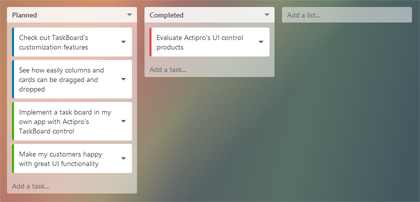

# TaskBoard

The [TaskBoard](xref:ActiproSoftware.Windows.Controls.Views.TaskBoard) control makes it easy to add interactive task scheduling and prioritization to your apps.  A task board consists of zero to many columns, each of which can contain zero to many cards.  Columns and cards can be dragged around and reordered, all using pleasing sway animations.



## Data Binding

The task board has been designed specifically to work with MVVM environments.  The root [TaskBoard](xref:ActiproSoftware.Windows.Controls.Views.TaskBoard) control is an `ItemsControl`, and thus its `ItemsSource` property should be bound to a collection property, which will be used to generate the board's columns.

The [TaskColumn](xref:ActiproSoftware.Windows.Controls.Views.TaskColumn) control is also an `ItemsControl`, and its `ItemsSource` should be bound to a collection property on the data item used for each column.  This collection property will be used to generate the column's cards.  Since the column is nested within the board as a second-level control, the property to bind to for card data can be set via the [TaskBoard](xref:ActiproSoftware.Windows.Controls.Views.TaskBoard).[ColumnItemsSourcePath](xref:ActiproSoftware.Windows.Controls.Views.TaskBoard.ColumnItemsSourcePath) property.  This is a string value that indicates the property name on the data item.

## Customizing the Appearance

As described above, the task board is meant to be data-driven.  It provides a number of `Style`, `DataTemplate`, etc. properties that allow for complete customization of how the board renders and what UI is available.  Any interactive controls, such as buttons, can be placed within a `DataTemplate` to support advanced functionality like popups within the cards.  By using a `DataTemplateSelector`, different appearances can be supplied for cards depending on the data item.

Each task board renders its columns in a horizontal layout, followed by an optional board footer.  A task planning app might put an "Add a list" button in the board footer template.  Each column renders a header at the top, typically displaying a bold title.  The vertical list of cards within the column renders under the header.  This is followed by an optional column footer.  A task planning app mgiht put an "Add a task" button in the column footer template.

These properties on [TaskBoard](xref:ActiproSoftware.Windows.Controls.Views.TaskBoard) allow for appearance customization:

| Member | Description |
|-----|-----|
| [CardContainerStyle](xref:ActiproSoftware.Windows.Controls.Views.TaskBoard.CardContainerStyle) Property | The `Style` to use for card containers. |
| [CardContainerStyleSelector](xref:ActiproSoftware.Windows.Controls.Views.TaskBoard.CardContainerStyleSelector) Property | The `StyleSelector` to use for card containers. |
| [CardCornerRadius](xref:ActiproSoftware.Windows.Controls.Views.TaskBoard.CardCornerRadius) Property | The card corner radius.  The default value is `3.0`. |
| [CardSpacing](xref:ActiproSoftware.Windows.Controls.Views.TaskBoard.CardSpacing) Property | The spacing between cards.  The default value is `7.0`. |
| [CardTemplate](xref:ActiproSoftware.Windows.Controls.Views.TaskBoard.CardTemplate) Property | The DataTemplate to use for cards. |
| [CardTemplateSelector](xref:ActiproSoftware.Windows.Controls.Views.TaskBoard.CardTemplateSelector) Property | The DataTemplateSelector to use for cards. |
| [ColumnCornerRadius](xref:ActiproSoftware.Windows.Controls.Views.TaskBoard.ColumnCornerRadius) Property | The column corner radius.  The default value is `3.0`. |
| [ColumnPadding](xref:ActiproSoftware.Windows.Controls.Views.TaskBoard.ColumnPadding) Property | The column padding.  The default value is `7.0`. |
| [ColumnSpacing](xref:ActiproSoftware.Windows.Controls.Views.TaskBoard.ColumnSpacing) Property | The spacing between columns.  The default value is `10.0`. |
| [FooterTemplate](xref:ActiproSoftware.Windows.Controls.Views.TaskBoard.FooterTemplate) Property | The DataTemplate to use for a footer. |
| [ItemFooterTemplate](xref:ActiproSoftware.Windows.Controls.Views.TaskBoard.ItemFooterTemplate) Property | The DataTemplate to use for column footers. |
| [ItemFooterTemplateSelector](xref:ActiproSoftware.Windows.Controls.Views.TaskBoard.ItemFooterTemplateSelector) Property | The DataTemplateSelector to use for column footers. |
| [ItemHeaderTemplate](xref:ActiproSoftware.Windows.Controls.Views.TaskBoard.ItemHeaderTemplate) Property | The DataTemplate to use for column headers. |
| [ItemHeaderTemplateSelector](xref:ActiproSoftware.Windows.Controls.Views.TaskBoard.ItemHeaderTemplateSelector) Property | The DataTemplateSelector to use for column headers. |

## Animated Drag Reordering

The task board uses smooth sway animations to help convey that a column or card is dragging.  The maximum degrees that a column or card can rotate is based on the [TaskBoard](xref:ActiproSoftware.Windows.Controls.Views.TaskBoard).[ColumnDragRotationAngle](xref:ActiproSoftware.Windows.Controls.Views.TaskBoard.ColumnDragRotationAngle) and [CardDragRotationAngle](xref:ActiproSoftware.Windows.Controls.Views.TaskBoard.CardDragRotationAngle) properties respectively.  Both default to `3.0` but can be altered as needed.  Set them to `0.0` to prevent swaying.

Column and card dragging to reorder is enabled by default as long as the source data item collections implement `IList`.  Set the [TaskBoard](xref:ActiproSoftware.Windows.Controls.Views.TaskBoard).[CanColumnsDrag](xref:ActiproSoftware.Windows.Controls.Views.TaskBoard.CanColumnsDrag) and [CanCardsDrag](xref:ActiproSoftware.Windows.Controls.Views.TaskBoard.CanCardsDrag) properties to `false` to prevent dragging of columns/cards altogether.

Note that when using touch to drag a column or card, you must first hold your finger down on the column/card for at least a quarter second before moving it.  Otherwise, if you touch down and immediately drag, the control will think you are trying to scroll the control.

When dragging is enabled, an event is raised whenever a drag is initiated.  Columns raise the [TaskBoard](xref:ActiproSoftware.Windows.Controls.Views.TaskBoard).[ColumnDragging](xref:ActiproSoftware.Windows.Controls.Views.TaskBoard.ColumnDragging) event and cards raise the [CardDragging](xref:ActiproSoftware.Windows.Controls.Views.TaskBoard.CardDragging) event.  Both of these events support blocking the drag by setting the event arguments' `e.Cancel` property to `true`.  Logic for setting it can be done on an individual data item basis via these events.

When a drag is completed, columns raise the [TaskBoard](xref:ActiproSoftware.Windows.Controls.Views.TaskBoard).[ColumnDropped](xref:ActiproSoftware.Windows.Controls.Views.TaskBoard.ColumnDropped) event and cards raise the [CardDropped](xref:ActiproSoftware.Windows.Controls.Views.TaskBoard.CardDropped) event.  The event includes arguments that tell the old and new locations of the droped column/card.  The drop can also be canceled by setting `e.Cancel` to `true` on the event arguments.

### Selectively Blocking Drop Targets

When dragging a column or card over another target column/card, the [TaskBoard](xref:ActiproSoftware.Windows.Controls.Views.TaskBoard).[ColumnDragOver](xref:ActiproSoftware.Windows.Controls.Views.TaskBoard.ColumnDragOver) and [CardDragOver](xref:ActiproSoftware.Windows.Controls.Views.TaskBoard.CardDragOver) events will be raised when appropriate.  These events provide arguments with the source and target information.  Set `e.Cancel` to `true` to prevent a certain target from being allowed.  These events are where complex logic can be added to determine if certain column/card drops are permitted.

## Card Tap Notifications

When a card is tapped, the [TaskBoard](xref:ActiproSoftware.Windows.Controls.Views.TaskBoard).[CardTapped](xref:ActiproSoftware.Windows.Controls.Views.TaskBoard.CardTapped) event is raised.

## Hit Testing

Sometimes it's handy to be able to hit test for a card or column that is at a certain location.  Perhaps the app is watching for certain hotkeys to be pressed and needs to know which card is under the mouse.  This is a scenario where hit testing is needed.

The [TaskBoard](xref:ActiproSoftware.Windows.Controls.Views.TaskBoard).[HitTestForColumn](xref:ActiproSoftware.Windows.Controls.Views.TaskBoard.HitTestForColumn*) method takes a [TaskBoard](xref:ActiproSoftware.Windows.Controls.Views.TaskBoard)-relative location and returns the [TaskColumn](xref:ActiproSoftware.Windows.Controls.Views.TaskColumn) under that location, if any.

The [TaskColumn](xref:ActiproSoftware.Windows.Controls.Views.TaskColumn).[HitTestForCard](xref:ActiproSoftware.Windows.Controls.Views.TaskColumn.HitTestForCard*) method takes a [TaskColumn](xref:ActiproSoftware.Windows.Controls.Views.TaskColumn)-relative location and returns the [TaskCard](xref:ActiproSoftware.Windows.Controls.Views.TaskCard) under that location, if any.

By using both those methods, it's possible to determine which card is at a certain point location.

## Sample Usage

This basic XAML shows how to create the basic appearance for the Task Planning demo, whose complete source is in the sample project.

```xaml
<views:TaskBoard x:Name="taskBoard" ItemsSource="{Binding Lists}" ColumnItemsSourcePath="Tasks" 
					Padding="15" ColumnSpacing="15" ColumnPadding="10" FontSize="14">
	<views:TaskBoard.ItemContainerStyle>
		<Style TargetType="views:TaskColumn">
			<Setter Property="Background" Value="#80ffffff" />
			<Setter Property="BorderThickness" Value="0" />
			<Setter Property="Foreground" Value="#202020" />
			<Setter Property="Width" Value="260" />
		</Style>
	</views:TaskBoard.ItemContainerStyle>
	<views:TaskBoard.ItemHeaderTemplate>
		<DataTemplate>
			<sample:ColumnHeaderControl />
		</DataTemplate>
	</views:TaskBoard.ItemHeaderTemplate>
	<views:TaskBoard.CardContainerStyle>
		<Style TargetType="views:TaskCard">
			<Setter Property="Background" Value="#ffffff" />
			<Setter Property="BorderThickness" Value="0" />
			<Setter Property="Foreground" Value="#404040" />
		</Style>
	</views:TaskBoard.CardContainerStyle>
	<views:TaskBoard.CardTemplate>
		<DataTemplate>
			<sample:CardContentControl />
		</DataTemplate>
	</views:TaskBoard.CardTemplate>
	<views:TaskBoard.ItemFooterTemplate>
		<DataTemplate>
			<sample:AddTaskControl />
		</DataTemplate>
	</views:TaskBoard.ItemFooterTemplate>
	<views:TaskBoard.FooterTemplate>
		<DataTemplate>
			<sample:AddListControl Width="260" VerticalAlignment="Top" />
		</DataTemplate>
	</views:TaskBoard.FooterTemplate>
</views:TaskBoard>
```

Some of the data templates above reference other `UserControl` objects that are defined in the full sample source.

In this example, the root `DataContext` is a `TaskBoardModel` instance, which has a `Lists` collection property used to define the columns.  The `TaskListModel` class has a `Tasks` collection property (referenced by the [ColumnItemsSourcePath](xref:ActiproSoftware.Windows.Controls.Views.TaskBoard.ColumnItemsSourcePath) property in the XAML) used to define the cards in each column.
