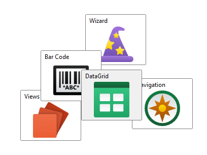

# AnimatedCanvas

This panel allows child elements to be precisely positioned using coordinates that are relative to the panel's bounds.



> [!NOTE]
> This panel can be used as a drop-in replacement for the native `Canvas` panel.

## Overview

The [AnimatedCanvas](xref:@ActiproUIRoot.Controls.Views.AnimatedCanvas) does not have any inherent layout logic.  Child elements are positioned at the specified locations and are always allotted their desired size.

The `Panel.ZIndex` property is used to determine the order of child elements that overlap.  Elements with a higher `ZIndex` will appear on top of elements with a lower value.

Child elements are positioned using the attached properties [AnimatedCanvas](xref:@ActiproUIRoot.Controls.Views.AnimatedCanvas).[LeftProperty](xref:@ActiproUIRoot.Controls.Views.AnimatedCanvas.LeftProperty), [AnimatedCanvas](xref:@ActiproUIRoot.Controls.Views.AnimatedCanvas).[TopProperty](xref:@ActiproUIRoot.Controls.Views.AnimatedCanvas.TopProperty), [AnimatedCanvas](xref:@ActiproUIRoot.Controls.Views.AnimatedCanvas).[RightProperty](xref:@ActiproUIRoot.Controls.Views.AnimatedCanvas.RightProperty), and/or [AnimatedCanvas](xref:@ActiproUIRoot.Controls.Views.AnimatedCanvas).[BottomProperty](xref:@ActiproUIRoot.Controls.Views.AnimatedCanvas.BottomProperty).  The `LeftProperty` indicates the offset of the element from the left edge of the panel, using either a positive (moving to the right) or a negative (moving offscreen to the left) value.  The `TopProperty` indicates the offset of the element from the top edge of the panel, using either a positive (moving downwards) or a negative (moving upwards and offscreen) value.  Likewise, the `RightProperty` and `BottomProperty` specify the offset of the element from the right and bottom edges, respectively.

> [!NOTE]
> If both the `LeftProperty` and `RightProperty` are specified on an element, then the `LeftProperty` takes precedence and the `RightProperty` is ignored. Similarly, the `TopProperty` takes precedence over the `BottomProperty`.

## Getting Started with AnimatedCanvas

This code shows typical XAML code used to position elements in an [AnimatedCanvas](xref:@ActiproUIRoot.Controls.Views.AnimatedCanvas):

```xaml
xmlns:views="http://schemas.actiprosoftware.com/winfx/xaml/views"
...
<views:AnimatedCanvas>
	<!-- Positioned 10 pixels to the right and 10 pixels down from the top-left corner of the panel. -->
	<Button Content="One" views:AnimatedCanvas.Left="10" views:AnimatedCanvas.Top="10" \>
	<!-- Positioned 10 pixels to the left and 10 pixels up from the bottom-right corner of the panel. -->
	<Button Content="Two" views:AnimatedCanvas.Right="10" views:AnimatedCanvas.Bottom="10" \>
</views:AnimatedCanvas>
```

## Important Members

The following [AnimatedCanvas](xref:@ActiproUIRoot.Controls.Views.AnimatedCanvas) members are key to its use:

| Member | Description |
|-----|-----|
| [BottomProperty](xref:@ActiproUIRoot.Controls.Views.AnimatedCanvas.BottomProperty) Attached Property | Gets or sets the offset of the element from the bottom edge of the panel. |
| [LeftProperty](xref:@ActiproUIRoot.Controls.Views.AnimatedCanvas.LeftProperty) Attached Property | Gets or sets the offset of the element from the left edge of the panel. |
| [RightProperty](xref:@ActiproUIRoot.Controls.Views.AnimatedCanvas.RightProperty) Attached Property | Gets or sets the offset of the element from the right edge of the panel. |
| [TopProperty](xref:@ActiproUIRoot.Controls.Views.AnimatedCanvas.TopProperty) Attached Property | Gets or sets the offset of the element from the top edge of the panel. |
| `ZIndex` Attached Property (defined on `Panel`) | Gets or sets the z-order of the element in the panel. |
