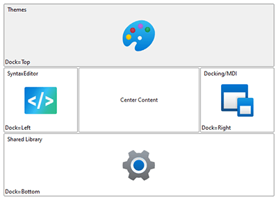

# AnimatedDockPanel

This panel allows child elements to be positioned either horizontally or vertically, relative to each other.



> [!NOTE]
> This panel can be used as a drop-in replacement for the native WPF `DockPanel` panel.

## Overview

Child elements are positioned or "docked" to a specified edge, and relative to other child elements.  The [AnimatedDockPanel](xref:@ActiproUIRoot.Controls.Views.AnimatedDockPanel).[DockProperty](xref:@ActiproUIRoot.Controls.Views.AnimatedDockPanel.DockProperty) attached property is used to specify the edge to which the element should be docked.

If two child elements are docked to the left side of the panel, the first element will be aligned with the left edge of the panel, while the second element will be aligned with the right edge of the first element.  As elements are docked, their allotted space is reserved, and any remaining child elements will be docked around them.

Special handling can be applied to the last child element. It can either be set to fill any remaining space, which is the default behavior.  Alternatively, it can be docked like other elements. This behavior can be customized using the [AnimatedDockPanel](xref:@ActiproUIRoot.Controls.Views.AnimatedDockPanel).[LastChildFill](xref:@ActiproUIRoot.Controls.Views.AnimatedDockPanel.LastChildFill) property.  When `LastChildFill` is set to `true`, the `DockProperty` on the last element is ignored.

## Getting Started with AnimatedDockPanel

This code shows typical XAML code used to position elements in an [AnimatedDockPanel](xref:@ActiproUIRoot.Controls.Views.AnimatedDockPanel):

```xaml
xmlns:views="http://schemas.actiprosoftware.com/winfx/xaml/views"
...
<views:AnimatedDockPanel LastChildFill="True">
	<!-- Docked to the left side of the panel -->
	<Button Content="One" views:AnimatedDockPanel.Dock="Left" \>
	<!-- Fills the remaining space of the panel -->
	<Button Content="Two" \>
</views:AnimatedDockPanel>
```

## Important Members

The following [AnimatedDockPanel](xref:@ActiproUIRoot.Controls.Views.AnimatedDockPanel) members are key to its use:

| Member | Description |
|-----|-----|
| [DockProperty](xref:@ActiproUIRoot.Controls.Views.AnimatedDockPanel.DockProperty) Attached Property | Gets or sets the edge of the panel to which the element will be docked. |
| [LastChildFill](xref:@ActiproUIRoot.Controls.Views.AnimatedDockPanel.LastChildFill) Property | Gets or sets a value that indicates whether the last child element within the panel stretches to fill the remaining available space. |
