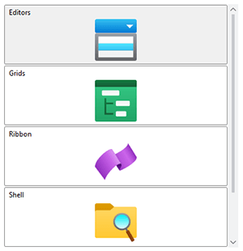
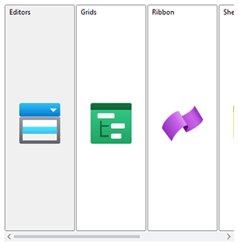

# AnimatedStackPanel

This panel allows child elements to be positioned in sequential order, either horizontally or vertically.



> [!NOTE]
> This panel can be used as a drop-in replacement for the native `StackPanel` panel.

## Overview

Child elements are positioned or "stacked" based on the order that the elements were added to the panel, or more specifically, their position in the `Children` collection.  Elements can be stacked either vertically or horizontally, which is determined by the [AnimatedStackPanel](xref:ActiproSoftware.Windows.Controls.Views.AnimatedStackPanel).[Orientation](xref:ActiproSoftware.Windows.Controls.Views.AnimatedStackPanel.Orientation) property.



*`AnimatedStackPanel` with the elements stacked vertically (left) and horizontally (right)*

Like the native WPF `StackPanel`, the `AnimatedStackPanel` implents `IScrollInfo` to support logical scrolling.  Physical scrolling is based on the size of the element being scrolled and can be thought of as "pixel-based" scrolling.  Logical scrolling is based on the number of elements in the `AnimatedStackPanel`, so it effectively moves a given element completely into the view (when possible).  If `ScrollViewer`.`CanContentScroll` is set to `false`, then logical scrolling will be disabled and physical scrolling will be used.

## Getting Started with AnimatedStackPanel

This code shows typical XAML code used to position elements in an [AnimatedStackPanel](xref:ActiproSoftware.Windows.Controls.Views.AnimatedStackPanel):

```xaml
xmlns:views="http://schemas.actiprosoftware.com/winfx/xaml/views"
...
<views:AnimatedStackPanel Orientation="Vertical">
	<Button Content="One" \>
	<!-- Positioned just below the button above -->
	<Button Content="Two" \>
</views:AnimatedStackPanel>
```

## Important Members

The following [AnimatedStackPanel](xref:ActiproSoftware.Windows.Controls.Views.AnimatedStackPanel) members are key to its use:

| Member | Description |
|-----|-----|
| [Orientation](xref:ActiproSoftware.Windows.Controls.Views.AnimatedStackPanel.Orientation) Property | Gets or sets the orientation that the child elements are arranged. |
