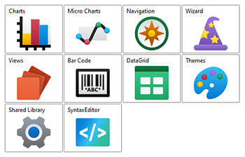
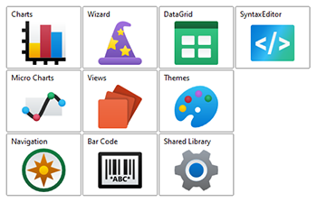
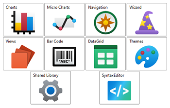

# AnimatedWrapPanel

This panel allows child elements to be positioned in sequential order, either horizontally or vertically, breaking content to the next row or column at the edge of the containing box. Subsequent ordering happens sequentially from top to bottom or from right to left, depending on the orientation.



> [!NOTE]
> This panel can be used as a drop-in replacement for the native WPF `WrapPanel` panel.

## Overview

Child elements are positioned or "stacked" based on the order that the elements were added to the panel, or more specifically, their position in the `Children` collection.  Elements can be stacked either vertically or horizontally, which is determined by the [AnimatedWrapPanel](xref:@ActiproUIRoot.Controls.Views.AnimatedWrapPanel).[Orientation](xref:@ActiproUIRoot.Controls.Views.AnimatedWrapPanel.Orientation) property.



*`AnimatedWrapPanel` with the elements stacked horizontally (left) and vertically (right)*

## Item Size

Elements will be given as much, or as little, space as they request during the measure phase.  The height and/or width of the elements can be fixed using the [AnimatedWrapPanel](xref:@ActiproUIRoot.Controls.Views.AnimatedWrapPanel).[ItemHeight](xref:@ActiproUIRoot.Controls.Views.AnimatedWrapPanel.ItemHeight) and/or [AnimatedWrapPanel](xref:@ActiproUIRoot.Controls.Views.AnimatedWrapPanel).[ItemWidth](xref:@ActiproUIRoot.Controls.Views.AnimatedWrapPanel.ItemWidth) properties.  When one or both of these properties are set to a valid number, then the elements will be restricted to the specified size.

## Empty Space

By default, elements will be stacked next to each other and wrap to the next row/column when needed.  This can leave a lot of extra space in each row/column.  The `AnimatedWrapPanel` can be configured to evenly distribute the empty space along the oriented axis.

By setting the [AnimatedWrapPanel](xref:@ActiproUIRoot.Controls.Views.AnimatedWrapPanel).[IsEmptySpaceEvenlyDistributed](xref:@ActiproUIRoot.Controls.Views.AnimatedWrapPanel.IsEmptySpaceEvenlyDistributed) property to `true`, the space will be divided up evenly between the items.



*`AnimatedWrapPanel` with the elements stacked horizontally and evenly spaced*

## Use in ScrollViewer

If an `AnimatedWrapPanel` is used in a `ScrollViewer`, which typically includes `ListBox` and other `ItemsControl`-derived controls, then special consideration is needed.  Scrolling needs to be disabled in the same orientation as the `AnimatedWrapPanel`.  Otherwise, the `ScrollViewer` will give the `AnimatedWrapPanel` unlimited space in which to arrange it's children, which effectively disables the "wrapping" feature.

To disabled scrolling, the `ScrollViewer.HorizontalScrollBarVisibility` or `ScrollViewer.VerticalScrollBarVisibility` property can be set to `Disabled`. When using a `ListBox`, the scrollbar visibility properties can be set directly on the `ListBox`, as it's an attached property.

## Getting Started with AnimatedWrapPanel

This code shows typical XAML code used to position elements in an [AnimatedWrapPanel](xref:@ActiproUIRoot.Controls.Views.AnimatedWrapPanel):

```xaml
xmlns:views="http://schemas.actiprosoftware.com/winfx/xaml/views"
...
<views:AnimatedWrapPanel Orientation="Horizontal">
	<Button Content="One" \>
	<!-- Positioned to the right or below the button above, depending on the width of the panel. -->
	<Button Content="Two" \>
</views:AnimatedWrapPanel>
```

## Important Members

The following [AnimatedWrapPanel](xref:@ActiproUIRoot.Controls.Views.AnimatedWrapPanel) members are key to its use:

| Member | Description |
|-----|-----|
| [IsEmptySpaceEvenlyDistributed](xref:@ActiproUIRoot.Controls.Views.AnimatedWrapPanel.IsEmptySpaceEvenlyDistributed) Property | Gets or sets a value indicating whether any empty space in a row/column will be evenly distributed around the elements. |
| [ItemHeight](xref:@ActiproUIRoot.Controls.Views.AnimatedWrapPanel.ItemHeight) Property | Gets or sets a value that specifies the height of all items. |
| [ItemWidth](xref:@ActiproUIRoot.Controls.Views.AnimatedWrapPanel.ItemWidth) Property | Gets or sets a value that specifies the width of all items. |
| [Orientation](xref:@ActiproUIRoot.Controls.Views.AnimatedWrapPanel.Orientation) Property | Gets or sets the orientation that the child elements are arranged. |
