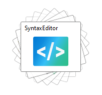

# FanPanel

This panel allows child elements to be positioned in sequential order along the z-axis, while keeping a focal item centered in the view.

## Overview

Child elements are positioned or "stacked" along the z-axis based on the order that the elements were added to the panel, or more specifically, their position in the `Children` collection.

A focal item (or an item of interest) is centered in the view, which is specified by the [FanPanel](xref:@ActiproUIRoot.Controls.Views.FanPanel).[FocalIndex](xref:@ActiproUIRoot.Controls.Views.FanPanel.FocalIndex) property.  By default, the focal element will have a higher z-index and will be on top of the other elements.  This can be tied to the selected index of an associated `ListBox`, or any other control such as a `Slider`.



*`FanPanel` with several elements and the default settings*

The `FanPanel` implements `IScrollInfo` to support logical scrolling.  Physical scrolling is based on the size of the element being scrolled and can be thought of as "pixel-based" scrolling.  Logical scrolling is based on the number of elements in the `FanPanel`, so it effectively moves a given element completely into the view (when possible).  If `ScrollViewer`.`CanContentScroll` is set to `false`, then logical scrolling will be disabled and physical scrolling will be used.  This causes a problem as the `FanPanel` centers the focal item, so the physical scrolling will be offset.  Therefore, physical scrolling cannot be used with the `FanPanel`.

## Fore and Back Elements

Elements that are defined in the `Children` collection before the focal element are considered "fore" elements.  Therefore, elements that are defined in the `Children` collection after the focal element are considered "back" elements.  The various settings below can be set separately for the fore and back elements.

By default, fore elements are hidden from view. This behavior can be changed using the [FanPanel](xref:@ActiproUIRoot.Controls.Views.FanPanel).[ForeElementLayoutPlacement](xref:@ActiproUIRoot.Controls.Views.FanPanel.ForeElementLayoutPlacement) property.  The fore elements can be placed above or below the focal element along the z-axis using the `Above` or `Below` setting, respectively.  When using these settings, the fore elements can be offset, faded, or rotated so that the focal element is still visible.

The `Wrap` setting will wrap the fore elements so they are stacked below any back elements.  When using this setting, the [ForeAngleStep](xref:@ActiproUIRoot.Controls.Views.FanPanel.ForeAngleStep), [ForeOffsetStep](xref:@ActiproUIRoot.Controls.Views.FanPanel.ForeOffsetStep), and [ForeOpacityStep](xref:@ActiproUIRoot.Controls.Views.FanPanel.ForeOpacityStep) properties are not used.  Instead, the associated back properties are applied to every element, except the focal element.

## Offsetting Elements

The [FanPanel](xref:@ActiproUIRoot.Controls.Views.FanPanel).[BackOffsetStep](xref:@ActiproUIRoot.Controls.Views.FanPanel.BackOffsetStep) and [FanPanel](xref:@ActiproUIRoot.Controls.Views.FanPanel).[ForeOffsetStep](xref:@ActiproUIRoot.Controls.Views.FanPanel.ForeOffsetStep) properties configure an incremental offsets along the X axis and Y axis for the fore and back elements.  The focal element will always be centered in the view.


*`FanPanel` with a back and fore offset of "3,0"*

## Rotating Elements

The [FanPanel](xref:@ActiproUIRoot.Controls.Views.FanPanel).[BackAngleStep](xref:@ActiproUIRoot.Controls.Views.FanPanel.BackAngleStep) and [FanPanel](xref:@ActiproUIRoot.Controls.Views.FanPanel).[ForeAngleStep](xref:@ActiproUIRoot.Controls.Views.FanPanel.ForeAngleStep) properties configure an incremental angle rotation for the fore and back elements.  The focal element will always use an angle of `0`, so it is never rotated.

## Fading Elements

The [FanPanel](xref:@ActiproUIRoot.Controls.Views.FanPanel).[BackOpacityStep](xref:@ActiproUIRoot.Controls.Views.FanPanel.BackOpacityStep) and [FanPanel](xref:@ActiproUIRoot.Controls.Views.FanPanel).[ForeOpacityStep](xref:@ActiproUIRoot.Controls.Views.FanPanel.ForeOpacityStep) properties configure an incremental opacity value for the fore and back elements.  The focal element will always use an opacity of `1`, so it is never rotated.

> [!NOTE]
> When [FanPanel](xref:@ActiproUIRoot.Controls.Views.FanPanel).[ForeElementLayoutPlacement](xref:@ActiproUIRoot.Controls.Views.FanPanel.ForeElementLayoutPlacement) is set to `Hidden` the fore elements are always faded to `0` when hidden.

## Getting Started with FanPanel

This code shows typical XAML code used to position elements in an [FanPanel](xref:@ActiproUIRoot.Controls.Views.FanPanel):

```xaml
xmlns:views="http://schemas.actiprosoftware.com/winfx/xaml/views"
...
<views:FanPanel>
	<!-- Positioned in the center of the view, as it's considered the focal item by default -->
	<Button Content="One" \>
	<!-- Positioned just below the button above in the z-order -->
	<Button Content="Two" \>
</views:FanPanel>
```

## Important Members

The following [FanPanel](xref:@ActiproUIRoot.Controls.Views.FanPanel) members are key to its use:

| Member | Description |
|-----|-----|
| [BackAngleStep](xref:@ActiproUIRoot.Controls.Views.FanPanel.BackAngleStep) Property | Gets or sets a value used to increment the angle of elements after the focal element based on their distance. |
| [BackOffsetStep](xref:@ActiproUIRoot.Controls.Views.FanPanel.BackOffsetStep) Property | Gets or sets a value used to increment the X and Y coordinate of the elements after the focal element based on their distance. |
| [BackOpacityStep](xref:@ActiproUIRoot.Controls.Views.FanPanel.BackOpacityStep) Property | Gets or sets a value used to decrement the opacity of the elements after the focal element based on their distance. |
| [FocalIndex](xref:@ActiproUIRoot.Controls.Views.FanPanel.FocalIndex) Property | Gets or sets the index of the focal child, which should be centered in the panel. |
| [ForeAngleStep](xref:@ActiproUIRoot.Controls.Views.FanPanel.ForeAngleStep) Property | Gets or sets a value used to increment the angle of elements before the focal element based on their distance. |
| [ForeElementLayoutPlacement](xref:@ActiproUIRoot.Controls.Views.FanPanel.ForeElementLayoutPlacement) Property | Gets or sets the placement of any elements before the focal element in the panel. |
| [ForeOffsetStep](xref:@ActiproUIRoot.Controls.Views.FanPanel.ForeOffsetStep) Property | Gets or sets a value used to increment the X and Y coordinate of the elements before the focal element based on their distance. |
| [ForeOpacityStep](xref:@ActiproUIRoot.Controls.Views.FanPanel.ForeOpacityStep) Property | Gets or sets a value used to decrement the opacity of the elements before the focal element based on their distance. |
| [IsFocalIndexAutoBound](xref:@ActiproUIRoot.Controls.Views.FanPanel.IsFocalIndexAutoBound) Property | Gets or sets a value indicating whether the `FocalIndex` property is automatically bound to the associated `Selector.SelectedIndex` property when used as an items host. |
