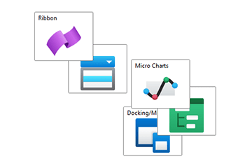
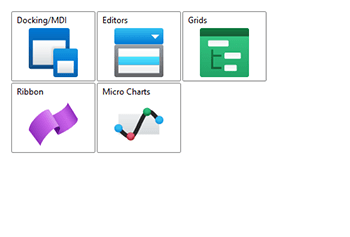

# SwitchPanel

This panel delegates the positioning of child elements to one or more child panels, which allows the layout logic to be dynamically changed during runtime.

## Overview

The [SwitchPanel](xref:@ActiproUIRoot.Controls.Views.SwitchPanel) relies on one or more [PanelBase](xref:@ActiproUIRoot.Controls.Views.Primitives.PanelBase)-derived panels to provide the current layout logic. These delegate panels are specified in the [Panels](xref:@ActiproUIRoot.Controls.Views.SwitchPanel.Panels) collection. The active delegate panel is determined by the [ActiveIndex](xref:@ActiproUIRoot.Controls.Views.SwitchPanel.ActiveIndex) property, which specifies an index into the `Panels` collection.

Once configured, the layout logic of the `SwitchPanel` can be quickly altered by updating the `ActiveIndex` property.



*`SwitchPanel` with the elements arranged by an `AnimatedCanvas`*



*`SwitchPanel` with the elements arranged by an `AnimatedWrapPanel`*

## Getting Started with SwitchPanel

This code shows typical XAML code used to position elements in an [SwitchPanel](xref:@ActiproUIRoot.Controls.Views.SwitchPanel):

```xaml
xmlns:views="http://schemas.actiprosoftware.com/winfx/xaml/views"
...
<views:SwitchPanel>
	<views:SwitchPanel.Panels>
		<views:AnimatedCanvas />
		<views:AnimatedWrapPanel IsEmptySpaceEvenlyDistributed="True" />
	</views:SwitchPanel.Panels>
	<!-- Positioned is top-left corner, since the AnimatedCanvas is active -->
	<Button Content="One" views:AnimatedCanvas.Left="0" views:AnimatedCanvas.Top="0"  \>
	<!-- Positioned is bottom-right corner, since the AnimatedCanvas is active -->
	<Button Content="Two" views:AnimatedCanvas.Right="0" views:AnimatedCanvas.Bottom="0" \>
</views:SwitchPanel>
```

## Important Members

The following [SwitchPanel](xref:@ActiproUIRoot.Controls.Views.SwitchPanel) members are key to its use:

| Member | Description |
|-----|-----|
| [ActiveIndex](xref:@ActiproUIRoot.Controls.Views.SwitchPanel.ActiveIndex) Property | Gets or sets the index of the [PanelBase](xref:@ActiproUIRoot.Controls.Views.Primitives.PanelBase) from the [Panels](xref:@ActiproUIRoot.Controls.Views.SwitchPanel.Panels) collection that is active. |
| [ActivePanel](xref:@ActiproUIRoot.Controls.Views.SwitchPanel.ActivePanel) Property | Gets the [PanelBase](xref:@ActiproUIRoot.Controls.Views.Primitives.PanelBase) from the [Panels](xref:@ActiproUIRoot.Controls.Views.SwitchPanel.Panels) collection that is active. collection that is active. |
| [Panels](xref:@ActiproUIRoot.Controls.Views.SwitchPanel.Panels) Property | Gets or sets the panels that can be used to layout the children. |
