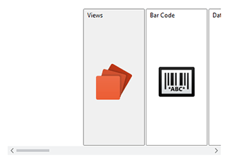
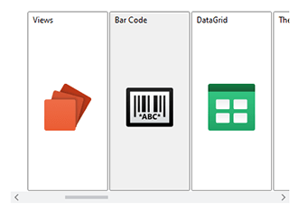
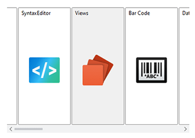

# ZapPanel

This panel allows child elements to be positioned in sequential order, either horizontally or vertically, while keeping a focal item centered in the view.  Includes support for wrapping items around, to produce a circular effect.

## Overview

Child elements are positioned or "stacked" based on the order that the elements were added to the panel, or more specifically, their position in the `Children` collection.  Elements can be stacked either vertically or horizontally, which is determined by the [ZapPanel](xref:@ActiproUIRoot.Controls.Views.ZapPanel).[Orientation](xref:@ActiproUIRoot.Controls.Views.ZapPanel.Orientation) property.

Unlike an [AnimatedStackPanel](xref:@ActiproUIRoot.Controls.Views.AnimatedStackPanel), a focal item (or an item of interest) is centered in the view.  This can be tied to the selected index of an associated `ListBox`, or any other control such as a `Slider`.



*`ZapPanel` with the first element selected (left) and the second element selected (right)*

The `ZapPanel` implements `IScrollInfo` to support logical scrolling.  Physical scrolling is based on the size of the element being scrolled and can be thought of as "pixel-based" scrolling.  Logical scrolling is based on the number of elements in the `ZapPanel`, so it effectively moves a given element completely into the view (when possible).  If `ScrollViewer`.`CanContentScroll` is set to `false`, then logical scrolling will be disabled and physical scrolling will be used.  This causes a problem as the `ZapPanel` centers the focal item, so the physical scrolling will be offset.  Therefore, physical scrolling cannot be used with the `ZapPanel`, and instead an [AnimatedStackPanel](xref:@ActiproUIRoot.Controls.Views.AnimatedStackPanel) should be used.

In general, the width of the `ZapPanel` should be restricted when oriented horizontally, and height should be restricted when oriented vertically.  If the `ZapPanel` is given unlimited width/height when oriented horizontally/vertically then it will not be able to center the focal item.

## Wrapping

By default, the child elements are stacked in order from beginning to end.  The [ZapPanel](xref:@ActiproUIRoot.Controls.Views.ZapPanel) can wrap elements around to the opposing side to produce a circular effect.  This feature can be enabled by setting `ZapPanel`.[AreChildrenWrapped](xref:@ActiproUIRoot.Controls.Views.ZapPanel.AreChildrenWrapped) to `true`.



*`ZapPanel` using wrapping with the first element selected (left) and the second element selected (right)*

## Getting Started with ZapPanel

This code shows typical XAML code used to position elements in an [ZapPanel](xref:@ActiproUIRoot.Controls.Views.ZapPanel):

```xaml
xmlns:views="http://schemas.actiprosoftware.com/winfx/xaml/views"
...
<views:ZapPanel Orientation="Vertical">
	<!-- Positioned in the center of the view, as it's considered the focal item by default -->
	<Button Content="One" \>
	<!-- Positioned just below the button above -->
	<Button Content="Two" \>
</views:ZapPanel>
```

## Important Members

The following [ZapPanel](xref:@ActiproUIRoot.Controls.Views.ZapPanel) members are key to its use:

| Member | Description |
|-----|-----|
| [AreChildrenWrapped](xref:@ActiproUIRoot.Controls.Views.ZapPanel.AreChildrenWrapped) Property | Gets or sets a value indicating whether the child items are wrapped around the item currently centered. |
| [FocalIndex](xref:@ActiproUIRoot.Controls.Views.ZapPanel.FocalIndex) Property | Gets or sets the index of the focal child, which should be centered in the panel. |
| [IsFocalIndexAutoBound](xref:@ActiproUIRoot.Controls.Views.ZapPanel.IsFocalIndexAutoBound) Property | Gets or sets a value indicating whether the `FocalIndex` property is automatically bound to the associated `Selector.SelectedIndex` property when used as an items host. |
| [Orientation](xref:@ActiproUIRoot.Controls.Views.ZapPanel.Orientation) Property | Gets or sets the orientation that the child elements are arranged. |
