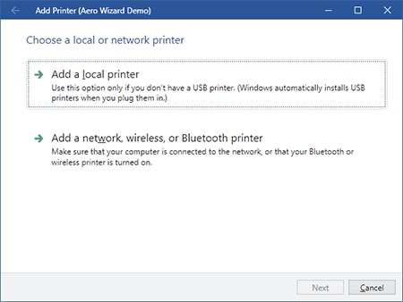

# Aero Wizards

Wizard includes a special class that is used for the creation of wizards the conform to the Aero Wizard standard.

> [!TIP]
> To get started in seconds with an Aero Wizard, use the `Aero Wizard Window (WPF)` new item template in Visual Studio.

## Aero Wizard Style Introduction

Aero Wizards have a large title area that is Aero glass with the Back button for the wizard appearing in the upper left corner of the window.  This provides for consistency with the other explorer-like dialogs in Windows.  The window title appears to the right of the Back button.



*An Aero Wizard that mimics the an Add Printer wizard*

Since the Back button is located in the title area, there is no Back button in the button container at the bottom of the wizard.

There is no concept of exterior pages in Aero wizards.  Instead, all pages are treated more like interior pages since they have their caption displayed at the top of the client area of the window.

## The AeroWizard Control

### Configuring the Window

When creating a `Window` for an Aero wizard, you will want to set its `Icon` and `Title` properties like you would for a normal window.  A [WindowChrome](../../themes/windowchrome.md) instance can be used to place a "back" button in the title bar.

The complete sample code is:

```xaml
<Window
	x:Name="wizardDemo" 
	xmlns="http://schemas.microsoft.com/winfx/2006/xaml/presentation"
	xmlns:x="http://schemas.microsoft.com/winfx/2006/xaml"
	xmlns:shared="http://schemas.actiprosoftware.com/winfx/xaml/shared"
	xmlns:themes="http://schemas.actiprosoftware.com/winfx/xaml/themes"
	xmlns:wizard="http://schemas.actiprosoftware.com/winfx/xaml/wizard"
	Icon="/Images/Icons/Actipro.ico"
	Title="Aero Wizard Demo"
	Width="600" Height="450"
	WindowStartupLocation="CenterScreen"
	themes:WindowChrome.TitleBarLeftContent="{Binding ElementName=wizard}"
	FocusManager.FocusedElement="{Binding ElementName=wizard}"
	>
							
	<themes:WindowChrome.Chrome>
		<themes:WindowChrome HasIcon="False">
			<themes:WindowChrome.TitleBarLeftContentTemplate>
				<DataTemplate>
					<Button Style="{DynamicResource {x:Static themes:SharedResourceKeys.WindowTitleBarButtonBaseStyleKey}}" 
							ContentTemplate="{DynamicResource {x:Static themes:SharedResourceKeys.WindowTitleBarButtonBackGlyphTemplateKey}}"
							Command="{x:Static wizard:WizardCommands.PreviousPage}" CommandTarget="{Binding}" />
				</DataTemplate>
			</themes:WindowChrome.TitleBarLeftContentTemplate>
		</themes:WindowChrome>
	</themes:WindowChrome.Chrome>
	
	<wizard:AeroWizard x:Name="wizard">
		...
	</wizard:AeroWizard>
	
</Window>
```

### Configuring the AeroWizard

The [AeroWizard](xref:@ActiproUIRoot.Controls.Wizard.AeroWizard) class inherits [Wizard](xref:@ActiproUIRoot.Controls.Wizard.Wizard) directly and as such, inherits all of the great features found in wizard that are described in this documentation.

The title bar text should be assigned with the [AeroWizard](xref:@ActiproUIRoot.Controls.Wizard.AeroWizard).[WindowTitleBaseText](xref:@ActiproUIRoot.Controls.Wizard.Wizard.WindowTitleBaseText) property as described in the [Page Captions, Descriptions, and Titles](../page-button-features/page-titles.md) topic.

That's all that is needed to configure an Aero Wizard.  Just use the information in the rest of the Wizard documentation to harness the power of Wizard's large feature set.

## Command Buttons

The screenshot above shows two [CommandButton](xref:@ActiproUIRoot.Controls.Wizard.CommandButton) controls in the wizard's page.  These are special buttons with a title and content.  They have smooth animations that change state when the mouse moves over them or when they are clicked.

They usually are presented on pages where large branching choices must be made.  In this scenario, disable the Next button for that page and allow the command buttons to choose the wizard's path instead.

The [CommandButton](xref:@ActiproUIRoot.Controls.Wizard.CommandButton).[Title](xref:@ActiproUIRoot.Controls.Wizard.CommandButton.Title) property lets you specify the large title for the button and the button's `Content` is what appears below the title.

The [CommandButton](xref:@ActiproUIRoot.Controls.Wizard.CommandButton).[BulletTemplate](xref:@ActiproUIRoot.Controls.Wizard.CommandButton.BulletTemplate) property will contain an arrow by default, but can be changed.

Use the [BackgroundHover](xref:@ActiproUIRoot.Controls.Wizard.CommandButton.BackgroundHover) and [BackgroundPressed](xref:@ActiproUIRoot.Controls.Wizard.CommandButton.BackgroundPressed) properties to further customize the backgrounds that are faded in and out during mouse hover and press events.

You can reuse the command buttons outside of wizard if you wish.  This is great in case you want to place them on a custom task dialog.
