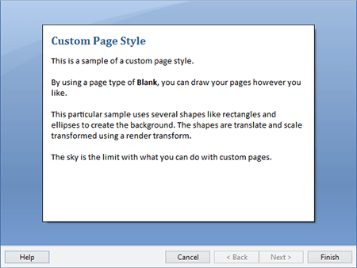

# Custom Pages

While Wizard has some built-in [page types](../page-button-features/page-types.md), exterior and interior pages, there also is a blank page type.  By using this page type you can completely create your own visual design for a page.

## Creating a Custom Page

A custom page can be created by setting the [WizardPage](xref:ActiproSoftware.Windows.Controls.Wizard.WizardPage).[PageType](xref:ActiproSoftware.Windows.Controls.Wizard.WizardPage.PageType) property to `Blank`.

This XAML code shows how the `Blank` page type can be set declaratively:

```xaml
<wizard:WizardPage x:Name="customPage" PageType="Blank"></wizard:WizardPage>
```

A blank page has no margin so it allows you to built its contents from scratch, while still being able to take advantage of standard [WizardPage](xref:ActiproSoftware.Windows.Controls.Wizard.WizardPage) features such as button control, etc.

The following sample uses a `Grid` root element with some shapes to fill in the background.  Then some `TextBlock` elements are added.



*A custom page that looks similar to Word 2007*

With custom pages, you are only limited by your imagination as far as what you can create.
