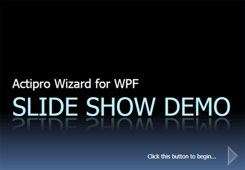

# Slide Shows

Since Actipro Wizard can completely be restyled and templated, it is possible to harness it for many non-traditional uses.  One great sample is for making a WPF-based slide show presentation.

*A Wizard with a custom template that allows it to function property for a slide show presentation*

The screenshot above was made by applying custom styles to the [Wizard](xref:@ActiproUIRoot.Controls.Wizard.Wizard) and [WizardPage](xref:@ActiproUIRoot.Controls.Wizard.WizardPage) classes.  The [WizardButtonContainer](xref:@ActiproUIRoot.Controls.Wizard.WizardButtonContainer) was also re-templated so that the **Back** and **Next** buttons appear as arrows, are the only ones present in the wizard, and hide when disabled.  The **Back** button is hidden in the screenshot since that is the first "title" slide in the slide show.

The Shared Library's [ReflectionContentControl](xref:@ActiproUIRoot.Controls.ReflectionContentControl) is used to provide the reflection effect for the slide title.
