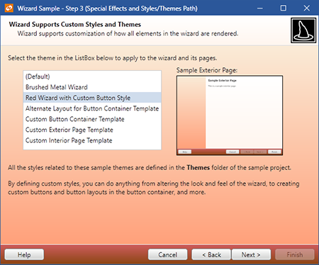

# Styles and Templates

Wizard makes extensive use of the style and template features provided in the WPF framework.

Everything from pages to the button container can be completely customized on multiple levels.  You may choose to apply certain types of images and backgrounds to pages via our simple [WizardPage](xref:@ActiproUIRoot.Controls.Wizard.WizardPage)-level properties.  You may wish to define more of a theme for all the pages in your wizard.  Or you may even want to redefine the way the pages or the button container look via templates.  By doing this, you can determine which controls are in a page's header or in the button container and add your own as needed.

## WizardPage Properties

The [WizardPage](xref:@ActiproUIRoot.Controls.Wizard.WizardPage) has a couple properties that control the visual style of the header on the page.  For an interior page, the header is the area that is at the top of the page.  For an exterior page, the header is the watermark area on the left side of the page.

| Member | Description |
|-----|-----|
| [HeaderBackground](xref:@ActiproUIRoot.Controls.Wizard.WizardPage.HeaderBackground) Property | Gets or sets the `Brush` used to draw the background that is displayed in the page header. |
| [HeaderImage](xref:@ActiproUIRoot.Controls.Wizard.WizardPage.HeaderImage) Property | Gets or sets the `ImageSource` that is displayed at the right side of the page header. |

This XAML code shows how to load a header image and header background for a page.  Both images are specified using `"pack://"` syntax (see the WPF documentation for more info).  In this code snippet, the image *HatLogo.png* is a resource in an assembly named `Sample` and is in an `Images` folder.  The image *WelcomeBG.png* is located in the same folder as a resource.

```xaml
<wizard:WizardPage x:Name="welcomePage" HeaderImage="/Sample;component/Images/HatLogo.png">
	<wizard:WizardPage.HeaderBackground>
		<ImageBrush TileMode="Tile" Stretch="None" Viewport="0,0,164,450"
		            ViewportUnits="Absolute" ImageSource="/Sample;component/Images/WelcomeBG.png" />
	</wizard:WizardPage.HeaderBackground>
</wizard:WizardPage>
```

Since the header background needs a `Brush`, the sample above says to tile the image if needed and to not stretch it.  It also specifies the absolute size of the image, which is 164x450 so that tiling performs correctly.

## Applying Styles

The next level of customization is to apply styles to the parts of the wizard.  The wizard parts that can be customized are the exterior page style, the interior page style, and the button container style.

Of course, the default styles of any other type of control can be updated.  For instance, you may wish to apply a new style to any `Button` in the button container that matches the new style you apply to the button container.



*Styles allow for easy application of custom themes*

The WPF documentation does a great job of explaining how styles may be applied to controls.  In a nutshell, styles may be applied anywhere within a control hierarchy, at an application-level, or in a *Generic.xaml* resource dictionary.

## Styling the Button Container

It's a little easier to style the button container.  For that control, simply target the [WizardButtonContainer](xref:@ActiproUIRoot.Controls.Wizard.WizardButtonContainer) type.

This XAML code shows a style for the button container to apply a gradient background and a new border:

```xaml
<Style TargetType="{x:Type wizard:WizardButtonContainer}">
	<Setter Property="Background">
		<Setter.Value>
			<LinearGradientBrush StartPoint="0,0" EndPoint="0,1">
				<GradientStop Offset="0" Color="#EBEEFA" />
				<GradientStop Offset="0.4" Color="#D6DAE4" />
				<GradientStop Offset="0.41" Color="#C5C7D1" />
				<GradientStop Offset="1" Color="#D4D8E2" />
			</LinearGradientBrush>
		</Setter.Value>
	</Setter>
	<Setter Property="BorderBrush" Value="#6F7074" />
	<Setter Property="BorderThickness" Value="0,1,0,0" />
</Style>
```

## Templates

Custom templates may be applied via styles for the wizard, pages, or the button container.

The sample project contains numerous style/template examples in the `Themes` child folder.  You may use those samples as a base for your own templates.

The real power of templates becomes apparent when you start rearranging where template child controls appear and add your own controls.  For instance, perhaps you wish to have a `Hyperlink` back to your web site in the left part of the button container.  No problem... just make a custom button container template.

## Changing Button Positions (Next/Finish Button Shared Space)

Some developers prefer to have the **Help** button on the right side of the button container and others prefer to have the **Next** and **Finish** buttons share the same space.  In this scenario, the **Finish** button is only visible on a finish page.

This code shows how to alter the [WizardButtonContainer](xref:@ActiproUIRoot.Controls.Wizard.WizardButtonContainer) template:

```xaml
<Style x:Key="{x:Type wizard:WizardButtonContainer}" TargetType="wizard:WizardButtonContainer">
	<Setter Property="Template">
		<Setter.Value>
			<ControlTemplate TargetType="wizard:WizardButtonContainer">
				<Border Background="{TemplateBinding Background}"
				        BorderBrush="{TemplateBinding BorderBrush}"
				        BorderThickness="{TemplateBinding BorderThickness}"
				        Padding="{TemplateBinding Padding}"
				        SnapsToDevicePixels="True">
					<StackPanel Orientation="Horizontal" HorizontalAlignment="Right">
						<Button x:Name="PART_CancelButton" Margin="0,0,7,0" MinWidth="75" Command="wizard:WizardCommands.Cancel"
						        Content="{Binding RelativeSource={RelativeSource Mode=FindAncestor, AncestorType=wizard:Wizard}, Path=CancelButtonText}"
						        Visibility="{Binding RelativeSource={RelativeSource Mode=FindAncestor, AncestorType=wizard:Wizard}, Path=(wizard:Wizard.SelectedPage).(wizard:WizardPage.CancelButtonVisibility)}" />
						<Button x:Name="PART_BackButton" MinWidth="75" Command="wizard:WizardCommands.PreviousPage"
						        Content="{Binding RelativeSource={RelativeSource Mode=FindAncestor, AncestorType=wizard:Wizard}, Path=BackButtonText}"
						        Visibility="{Binding RelativeSource={RelativeSource Mode=FindAncestor, AncestorType=wizard:Wizard}, Path=(wizard:Wizard.SelectedPage).(wizard:WizardPage.BackButtonVisibility)}" />
						<Button x:Name="PART_NextButton" MinWidth="75" Command="wizard:WizardCommands.NextPage"
						        Content="{Binding RelativeSource={RelativeSource Mode=FindAncestor, AncestorType=wizard:Wizard}, Path=NextButtonText}"
						        Visibility="{Binding RelativeSource={RelativeSource Mode=FindAncestor, AncestorType=wizard:Wizard}, Path=(wizard:Wizard.SelectedPage).(wizard:WizardPage.NextButtonVisibility)}" />
						<Button x:Name="PART_FinishButton" MinWidth="75" Command="wizard:WizardCommands.Finish"
						        Content="{Binding RelativeSource={RelativeSource Mode=FindAncestor, AncestorType=wizard:Wizard}, Path=FinishButtonText}"
						        Visibility="{Binding RelativeSource={RelativeSource Mode=FindAncestor, AncestorType=wizard:Wizard}, Path=(wizard:Wizard.SelectedPage).(wizard:WizardPage.FinishButtonVisibility)}" />
						<Button x:Name="PART_HelpButton" Margin="7,0,0,0" MinWidth="75" Command="wizard:WizardCommands.Help"
						        Content="{Binding RelativeSource={RelativeSource Mode=FindAncestor, AncestorType=wizard:Wizard}, Path=HelpButtonText}"
						        Visibility="{Binding RelativeSource={RelativeSource Mode=FindAncestor, AncestorType=wizard:Wizard}, Path=(wizard:Wizard.SelectedPage).(wizard:WizardPage.HelpButtonVisibility)}" />
					</StackPanel>
				</Border>
			</ControlTemplate>
		</Setter.Value>
	</Setter>
</Style>
```

Here are some tips for the **Next**/**Finish** button sharing space feature:

1. Apply a custom button container template that makes the **Next** and **Finish** buttons either share the same space (as in a `Grid`) or stack them directly next to each other, perhaps with a `StackPanel`.
1. Set the [Wizard](xref:@ActiproUIRoot.Controls.Wizard.Wizard). [FinishButtonVisible](xref:@ActiproUIRoot.Controls.Wizard.Wizard.FinishButtonVisible) property to `false`, which means the **Finish** button will be hidden by default.
1. Then on the finish page for the wizard, set [WizardPage](xref:@ActiproUIRoot.Controls.Wizard.WizardPage). [FinishButtonVisible](xref:@ActiproUIRoot.Controls.Wizard.WizardPage.FinishButtonVisible) property to `true` to override the default value and set the [WizardPage](xref:@ActiproUIRoot.Controls.Wizard.WizardPage).[NextButtonVisible](xref:@ActiproUIRoot.Controls.Wizard.WizardPage.NextButtonVisible) property to `false` to hide the **Next** button on that page.

That's it!
