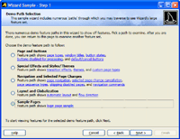

# Transition Effects

Wizard supports numerous types of animated transition effects to add some extra dazzle to your wizard dialogs during selected page changes.

Different transitions may be applied to forward progress page changes and backward progress page changes.  This allows you to maybe perform a certain transition effect in one direction for forward movement through pages, and apply it in the opposite direction for backward movement through pages.

## Transition Types (Built-In and Custom)

There are numerous built-in transitions that are available for use.

See the [Shared Library Animation](../../shared/windows-media-animation.md) topic for a detailed list of the transition classes that are available, their options, and even how to create your own custom transitions.

This table shows several of the most popular built-in transitions operating on a wizard page change.  Note that there are numerous other built-in transitions available than the ones displayed below.

<table>
<thead>

<tr>
<th>Transition</th>
<th>Description</th>
</tr>

</thead>
<tbody>

<tr>
<td>

[FadeTransition](xref:@ActiproUIRoot.Media.Animation.FadeTransition)

</td>
<td>

Fades in the new selected page.



</td>
</tr>

<tr>
<td>

[SlideTransition](xref:@ActiproUIRoot.Media.Animation.SlideTransition)

</td>
<td>

Slides in the new selected page to hide the old one behind it.  Slide transitions use a direction parameter.


</td>
</tr>

<tr>
<td>

[BarWipeTransition](xref:@ActiproUIRoot.Media.Animation.BarWipeTransition)

</td>
<td>

Wipes from the old selected page to the new.  Wipe transitions use a direction parameter.


</td>
</tr>

</tbody>
</table>

## Wizard Transition Settings

These [Wizard](xref:@ActiproUIRoot.Controls.Wizard.Wizard) properties are used to configure the transition effects:

| Member | Description |
|-----|-----|
| [BackwardProgressTransitionDuration](xref:@ActiproUIRoot.Controls.Wizard.Wizard.BackwardProgressTransitionDuration) Property | Gets or sets a `Duration` indicating the duration of backward progress page transitions. |
| [ForwardProgressTransitionDuration](xref:@ActiproUIRoot.Controls.Wizard.Wizard.ForwardProgressTransitionDuration) Property | Gets or sets a `Duration` indicating the duration of forward progress page transitions. |
| [TransitionDefaultDirection](xref:@ActiproUIRoot.Controls.Wizard.Wizard.TransitionDefaultDirection) Property | Gets or sets a [TransitionDirection](xref:@ActiproUIRoot.Media.Animation.TransitionDirection) that specifies the default direction for a transition between two pages.  Most transitions do make use of a [TransitionDirection](xref:@ActiproUIRoot.Media.Animation.TransitionDirection), however not all do. |
| [TransitionSelector](xref:@ActiproUIRoot.Controls.Wizard.Wizard.TransitionSelector) Property | Gets or sets a [TransitionSelector](xref:@ActiproUIRoot.Media.Animation.TransitionSelector) that is used to select the [Transition](xref:@ActiproUIRoot.Media.Animation.Transition) to use between two pages.  By default, no transition is performed.  Add a [MultiTransitionSelector](xref:@ActiproUIRoot.Media.Animation.MultiTransitionSelector) with one child [Transition](xref:@ActiproUIRoot.Media.Animation.Transition) to only use one transition.  Add a [MultiTransitionSelector](xref:@ActiproUIRoot.Media.Animation.MultiTransitionSelector) with more than one child [Transition](xref:@ActiproUIRoot.Media.Animation.Transition) to randomly choose a transition to use. |

Each transition uses a `Duration` to determine how long the effect animates.  Many transitions also support the concept of effect directions and other options that can be configured.

## Using a Single Transition Effect

This XAML code shows how to use a single diagonal [BarWipeTransition](xref:@ActiproUIRoot.Media.Animation.BarWipeTransition) for page transitions:

```xaml
<Window x:Class="Sample.Application.Window"
    xmlns="http://schemas.microsoft.com/winfx/2006/xaml/presentation"
    xmlns:x="http://schemas.microsoft.com/winfx/2006/xaml"
    xmlns:shared="http://schemas.actiprosoftware.com/winfx/xaml/shared"	
    xmlns:wizard="http://schemas.actiprosoftware.com/winfx/xaml/wizard"
    >
	<wizard:Wizard TransitionDefaultDirection="ForwardDown">
		<wizard:Wizard.TransitionSelector>
			<shared:MultiTransitionSelector>
				<shared:BarWipeTransition />
			</shared:MultiTransitionSelector>
		</wizard:Wizard.TransitionSelector>
	</wizard:Wizard>
</Window>
```

## Using a Random Transition Effect

This XAML code shows how to have a [Transition](xref:@ActiproUIRoot.Media.Animation.Transition) randomly selected at run-time for each page change from a supplied list of transitions:

```xaml
<Window x:Class="Sample.Application.Window"
    xmlns="http://schemas.microsoft.com/winfx/2006/xaml/presentation"
    xmlns:x="http://schemas.microsoft.com/winfx/2006/xaml"
    xmlns:shared="http://schemas.actiprosoftware.com/winfx/xaml/shared"	
    xmlns:wizard="http://schemas.actiprosoftware.com/winfx/xaml/wizard"
    >
	<wizard:Wizard TransitionDefaultDirection="ForwardDown">
		<wizard:Wizard.TransitionSelector>
			<shared:MultiTransitionSelector>
				<shared:FadeTransition TextSearch.Text="Fade" />
				<shared:BarWipeTransition TextSearch.Text="Bar wipe" />
				<shared:BarWipeTransition TextSearch.Text="Bar wipe w/no spread" Spread="0" />
				<shared:BarWipeTransition TextSearch.Text="Bar wipe w/full spread" Spread="1" />
				<shared:BarnDoorWipeTransition TextSearch.Text="Barn door wipe" />
				<shared:BarnDoorWipeTransition TextSearch.Text="Barn door wipe w/no spread" Spread="0" />
				<shared:BarnDoorWipeTransition TextSearch.Text="Barn door wipe w/full spread" Spread="1" />
				<shared:BoxWipeTransition TextSearch.Text="Box wipe" />
				<shared:FourBoxWipeTransition TextSearch.Text="Four box wipe" />
				<shared:WedgeWipeTransition TextSearch.Text="Wedge wipe" />
				<shared:SlideTransition TextSearch.Text="Slide" />
				<shared:SlideTransition TextSearch.Text="Push" IsFromContentPushed="True" />
				<shared:FadedZoomTransition TextSearch.Text="Faded zoom" />
				<shared:FadedZoomTransition TextSearch.Text="Faded zoom w/clip" ClipToBounds="True" />
			</shared:MultiTransitionSelector>
		</wizard:Wizard.TransitionSelector>
	</wizard:Wizard>
</Window>
```

## Adding Custom Logic for Transition Selection

Although the [MultiTransitionSelector](xref:@ActiproUIRoot.Media.Animation.MultiTransitionSelector) generally provides the transition selection functionality you need, sometimes there may be cases where you would like to write more robust code to select transitions.  To do this, create a class that inherits [TransitionSelector](xref:@ActiproUIRoot.Media.Animation.TransitionSelector) and implement its [SelectTransition](xref:@ActiproUIRoot.Media.Animation.TransitionSelector.SelectTransition*) method.  Then assign your custom selector to the [Wizard](xref:@ActiproUIRoot.Controls.Wizard.Wizard).[TransitionSelector](xref:@ActiproUIRoot.Controls.Wizard.Wizard.TransitionSelector) property.

## Transition Performance When In Debug Mode

When running an application in debug mode from Visual Studio, sometimes animation performance is affected and the transitions will not appear to render smoothly.  However when running the application outside of the Visual Studio debug process, this should not be an issue.
