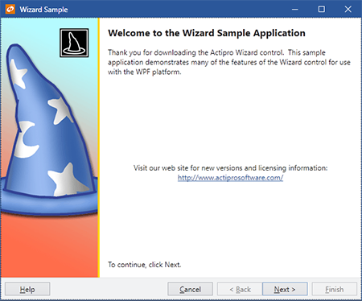

# Overview

Actipro Wizard is the premiere control for building wizard dialogs in WPF (Windows Presentation Foundation) that conforms to the Aero Wizard and Wizard97 specifications.

Wizard has been designed from the ground up to follow WPF best practices, be extremely configurable, and dramatically cut down on the time needed to implement a robust wizard dialog.  From simple linear sequences of pages to more advanced decision-based page execution paths, Wizard can handle it all.  It provides an amazing number of features that make the design and run-time experience for the developer and end user a positive one.

To get started using the control, read through this documentation and study the many QuickStarts in the sample project.  The sample includes live demos of many of Wizard's features.

## What is a Wizard Dialog?

Wizards are one of the best ways to simplify the user experience of applications.  They allow developers to take complex tasks and break them up into a series of simple steps.  Each step in a wizard is represented by a page that provides specialized explanations and controls related to that step.

*A sample Wizard97-style welcome page and a sample Aero-style page*

Wizard dialogs are used in many scenarios, such as for collecting data from the end user or guiding the end user through the configuration of some feature of an application.

In a wizard dialog, pages are visited in a developer-specified order to ensure that steps are completed in a certain sequence.  The end user clicks Back and Next buttons to navigate through the wizard pages.  Upon reaching the finish page for a set of steps, a Finish button can be clicked to complete the wizard.

## Features

### Page and Button Features

- Multiple built-in [page types](page-button-features/page-types.md):
  
  - Exterior - Welcome/finish with left watermark area.
  - Interior - Step with top header area.
  - Blank - Customizable for a unique user interface.

- [Page captions and descriptions](page-button-features/page-titles.md) that display in the header area of the page.

- [Page titles](page-button-features/page-titles.md) that can be used to update the title bar of the containing Window.

- Multiple options for automated updating of the containing [Window title bar text](page-button-features/page-titles.md).

- Global default settings for all [button visibility and enabled states](page-button-features/button-states.md) that can be overridden by page-specific settings.

- Toggle [button visibility and enabled states](page-button-features/button-states.md) at run-time via code.

- Uses WPF [command model](navigation-features/command-model.md) for handling all button clicks.

- Multiple options for setting the [default and cancel buttons](page-button-features/window-default-cancel-buttons.md) on the containing Window to wizard buttons.

- The Cancel and Finish buttons can set the appropriate Window.DialogResult and [close the containing Window](page-button-features/window-close.md).  This behavior can be changed.

- Lazily initialize pages if needed.

### Appearance Features

- Numerous built-in [animated page transition effect](appearance-features/transition-effects.md) options including:
  
  - None - Instant page change.
  - Barn door wipe - A wipe transition between two pages that uses two straight bars with a configurable gradient spread.
  - Bar wipe - A wipe transition between two pages that uses a straight bar with a configurable gradient spread.
  - Box wipe - A wipe transition between two pages that uses a box.
  - Fade - The old selected page fades into the new one with optional blur effect.
  - Faded zoom - A crossfade transition between two elements that zooms the new content in as well.
  - Four box wipe - A wipe transition between two pages that uses four boxes.
  - Slide - A slide transition between two pages that moves one page over the other.
  - Push - A slide transition between two pages that pushes one page out of the way for the other.
  - Wedge wipe - A wipe transition between two pages that uses a wedge shape.

- Ability to create [custom page transition effects](appearance-features/transition-effects.md).

- Randomly choose between multiple transitions or [write custom logic](appearance-features/transition-effects.md) to choose transitions for each page change.

- Page [transition duration and effect direction](appearance-features/transition-effects.md) options.

- Page transitions capable of [reversing](appearance-features/transition-effects.md) for backwards progress through pages.

- An [Aero Wizard](appearance-features/aero-wizard.md) style that mimics the wizards found in Windows Vista.

- Vista-like [command buttons](appearance-features/aero-wizard.md) that can be used in Aero wizards or anywhere else.

- Built-in [default styles and templates](appearance-features/styles-templates.md) for exterior and interior pages.

- Ability to create [custom styles and templates](appearance-features/styles-templates.md) for any page as well as override defaults.

- Ability to create custom styles and templates for the button container area to [completely change its look and/or contents](appearance-features/styles-templates.md).

- Ability to use custom button container templates to do things like [align the Help button on the right side](appearance-features/styles-templates.md), or show the [Finish button in the same space as the Next button](appearance-features/styles-templates.md).

- Create completely [custom page designs](appearance-features/custom-pages.md).

- Create WPF-based [slide show presentations](appearance-features/slide-shows.md) using Wizard.

### Navigation Features

- [WPF commands](navigation-features/command-model.md) defined for going to the next or previous pages.

- [WPF commands](navigation-features/command-model.md) for jumping forward to or backwards to a specific page, as indicated by its direct reference, name, or index.

- Any [wizard command](navigation-features/command-model.md) can be assigned to custom controls such as Buttons, Hyperlinks, or MenuItems.

- Default [page sequencing](navigation-features/page-sequencing.md) which visits pages in their order by index can be overridden to support decision-based branching of page execution paths.

- The [next and previous pages for each page](navigation-features/page-sequencing.md) can be explcitly set by a direct reference, name, or index.

- Two types of [backwards progress page sequencing](navigation-features/page-sequencing.md), normal and stack-based.

- [Disable pages](navigation-features/page-sequencing.md) to have Wizard skip over them when using default page sequencing.

- Ability to programmatically get/set the [selected page](navigation-features/selection-changes.md) by reference or index.

- Process [selection changing/changed events](navigation-features/selection-changes.md) at the general Wizard or WizardPage-specific levels.

- Selection change events specify what caused the change, which pages are changing, and allow you to [cancel the change](navigation-features/selection-changes.md) or [choose a new destination page](navigation-features/selection-changes.md).

- [Validate data](navigation-features/selection-changes.md) on a page in the selection changing event.

- Differentiation between [forward and backward progress](navigation-features/selection-changes.md) through wizard pages.

- Easily navigate through pages using the [mouse and/or keyboard forward/back buttons](navigation-features/navigation-commands.md).

### Layout, Globalization, and Accessibility Features

- Adheres to the Wizard97 and Aero Wizard specifications.
- Easily create wizard user interfaces in XAML markup.
- All parts of the wizard use [automatic layout](layout-features/automatic-layout.md) so that they are capable of growing as needed.
- [Right-to-left support](layout-features/flow-direction.md) is fully integrated for languages such as Hebrew or Arabic.
- All text properties use [localization attributes](layout-features/localization.md).
- Follows the WPF accessibility model for [UI automation](layout-features/ui-automation.md).

*This product is written in 100% pure C#, and includes detailed documentation and samples.*
