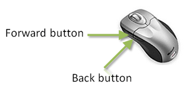

# Navigation Commands

Many of today's computer mice have two extended buttons on them, one for a "forward" action and one for a "backward" action.  These are extremely useful for web browsing.

*One of the great Microsoft mice with forward/back thumb buttons*

Many modern keyboards also have forward and back keyboard buttons that are used for the same purpose.

Windows is set up by default to fire the WPF `NavigationCommands.BrowseForward` and `NavigationCommands.BrowseBack` commands when either of those buttons are pressed.

## Enabling Mouse/Keyboard Forward/Back Button Navigation

Wizard has a property that controls whether the navigation commands are intercepted and processed.  When this property is `true` and if Wizard intercepts these unhandled commands, it will raise the [WizardCommands](xref:@ActiproUIRoot.Controls.Wizard.WizardCommands).[NextPage](xref:@ActiproUIRoot.Controls.Wizard.WizardCommands.NextPage) command and [WizardCommands](xref:@ActiproUIRoot.Controls.Wizard.WizardCommands).[PreviousPage](xref:@ActiproUIRoot.Controls.Wizard.WizardCommands.PreviousPage) command as appropriate.

By default, Wizard will process the navigation commands.  To disable this functionality, set the [Wizard](xref:@ActiproUIRoot.Controls.Wizard.Wizard).[NavigationCommandsEnabled](xref:@ActiproUIRoot.Controls.Wizard.Wizard.NavigationCommandsEnabled) property to `false`.
