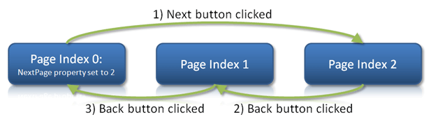
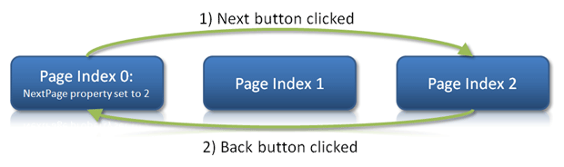
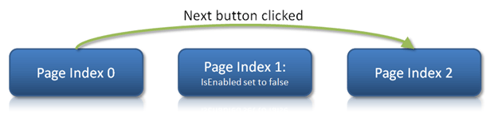

# Page Sequencing

Wizard has many helpful features for setting up the sequence in which pages will be visited.

The simplest way to set up page sequencing is declaratively in XAML.  In addition, default page sequencing may be overridden, and page changes can be initiated programmatically.

This topic describes declarative page sequencing.  See the [Selection Changes](selection-changes.md) topic for more help on cancelling page changes and programmatically overriding page sequence.

## Page Sequence Types

At the root level, Wizard has two modes of default page sequencing, which are specified by the [WizardPageSequenceType](xref:@ActiproUIRoot.Controls.Wizard.WizardPageSequenceType) enumeration and can be set to the [Wizard](xref:@ActiproUIRoot.Controls.Wizard.Wizard).[PageSequenceType](xref:@ActiproUIRoot.Controls.Wizard.Wizard.PageSequenceType) property:

<table>
<thead>

<tr>
<th>Value</th>
<th>Description</th>
</tr>

</thead>
<tbody>

<tr>
<td>

`Normal`

</td>
<td>

Normal page sequencing, in which pages are visited in the order in which they appear in the pages collection.



*Diagram showing how normal page sequencing functions*

</td>
</tr>

<tr>
<td>

`Stack`

</td>
<td>

Normal page sequencing occurs when the **Next** button is pressed.  Each page visited is stored in an internal stack.  **Back** button presses move backwards through the stack.

This feature requires each [WizardPage](xref:@ActiproUIRoot.Controls.Wizard.WizardPage)'s `Name` property to be set.

The [WizardPage](xref:@ActiproUIRoot.Controls.Wizard.WizardPage).[PreviousPage](xref:@ActiproUIRoot.Controls.Wizard.WizardPage.PreviousPage) property is ignored when using stack sequencing.



*Diagram showing how stack page sequencing functions*

</td>
</tr>

</tbody>
</table>

This XAML code shows how to turn on stack page sequencing for a [Wizard](xref:@ActiproUIRoot.Controls.Wizard.Wizard):

```xaml
<wizard:Wizard PageSequenceType="Stack"></wizard:Wizard>
```

## Setting a Page's Next or Previous Page

The [WizardPage](xref:@ActiproUIRoot.Controls.Wizard.WizardPage) class has [NextPage](xref:@ActiproUIRoot.Controls.Wizard.WizardPage.NextPage) and [PreviousPage](xref:@ActiproUIRoot.Controls.Wizard.WizardPage.PreviousPage) properties.  These allow you to declaratively override the default page sequencing.

Both properties are of type `Object` and can accept four types of values:

<table>
<thead>

<tr>
<th>Value</th>
<th>Description</th>
</tr>

</thead>
<tbody>

<tr>
<td>

`null`

</td>
<td>

By setting a `null` value (the default) to those properties, you indicate that the default page sequence type (see above) should be used.

</td>
</tr>

<tr>
<td>

`Page Index`

</td>
<td>

By setting an integer number value to those properties, you indicate that the next or previous page for the page should be the page at the specified numeric index within the parent Wizard's page collection.

This XAML code shows how to set the explicit next page for a [WizardPage](xref:@ActiproUIRoot.Controls.Wizard.WizardPage) to the fifth page in the parent Wizard's pages collection:

```xaml
<wizard:WizardPage NextPage="4"> ... </wizard:WizardPage>
```

</td>
</tr>

<tr>
<td>

`Page Name`

</td>
<td>

By setting a `String` value to those properties, you indicate that the next or previous page for the page should be the page with the specified name within the parent Wizard's pages collection.

This XAML code shows how to set the explicit previous page for a [WizardPage](xref:@ActiproUIRoot.Controls.Wizard.WizardPage) to the page with `Name` `"welcomePage"` in the parent Wizard's pages collection:

```
<wizard:WizardPage PreviousPage="welcomePage"> ... </wizard:WizardPage>
```

</td>
</tr>

<tr>
<td>

`Page Reference`

</td>
<td>

By setting an explicit [WizardPage](xref:@ActiproUIRoot.Controls.Wizard.WizardPage) reference to those properties, you indicate that the next or previous page for the page should be the specified page.

This XAML code shows how to set the explicit next page for a [WizardPage](xref:@ActiproUIRoot.Controls.Wizard.WizardPage) to the page with `Name` `"finishPage"` in the parent Wizard's pages collection:

```xaml
<wizard:WizardPage NextPage="{Binding ElementName=finishPage}"> ... </wizard:WizardPage>
```

</td>
</tr>

</tbody>
</table>

Note that in the default page sequence diagrams above, the first page in the diagram, index 0, has a [WizardPage](xref:@ActiproUIRoot.Controls.Wizard.WizardPage).[NextPage](xref:@ActiproUIRoot.Controls.Wizard.WizardPage.NextPage) value of `2`, meaning when the **Next** button is clicked, jump to the third page (since page indices are zero-based) in the Wizard.

It is important to note that when stack-based page sequencing is used, the [WizardPage](xref:@ActiproUIRoot.Controls.Wizard.WizardPage).[PreviousPage](xref:@ActiproUIRoot.Controls.Wizard.WizardPage.PreviousPage) property will be ignored since the stack will be used in determining which pages to visit on backwards progress.

## Disable Pages to Skip Over Them

Default page sequencing will skip over any [WizardPage](xref:@ActiproUIRoot.Controls.Wizard.WizardPage) whose `IsEnabled` property is set to `false`.

This makes it easy to "turn off" pages temporarily.



*Diagram showing how a disabled page is skipped in default page sequencing*
