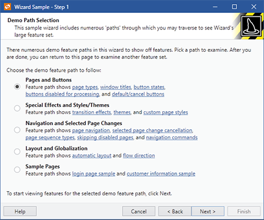

# Page Types

Wizard defines three distinct page types: `Exterior`, `Interior`, and `Blank`.

Page types are only used in determining which default style will be applied the page and do not affect the wizard behavior in any other way.

## Setting the Page Type

The [WizardPage](xref:@ActiproUIRoot.Controls.Wizard.WizardPage).[PageType](xref:@ActiproUIRoot.Controls.Wizard.WizardPage.PageType) property designates the type of page.  It can be set to a value of the [WizardPageType](xref:@ActiproUIRoot.Controls.Wizard.WizardPageType) enumeration.

The default page type is `Interior`.  Therefore interior pages do not need the page type to be set.

This XAML code shows how the page type can be set declaratively:

```xaml
<wizard:WizardPage x:Name="welcomePage" PageType="Exterior"></wizard:WizardPage>
```

## Exterior Pages

Exterior pages typically come at the beginning and end of the wizard.  In those scenarios, they are termed Welcome pages and Completion/Finish pages, respectively.


*An exterior page*

Exterior pages have a watermark area that appears on the left side of the page.  By default this area is filled with the system highlight color but it is encouraged that some sort of fancy graphic or gradient background be placed there.  The [WizardPage](xref:@ActiproUIRoot.Controls.Wizard.WizardPage).[HeaderBackground](xref:@ActiproUIRoot.Controls.Wizard.WizardPage.HeaderBackground) property designates the `Brush` that is used to fill the background of the watermark area.  The watermark area also typically includes a small page image near the upper right of the watermark area.  This image can be set via the [WizardPage](xref:@ActiproUIRoot.Controls.Wizard.WizardPage).[HeaderImage](xref:@ActiproUIRoot.Controls.Wizard.WizardPage.HeaderImage) property.  The margin around the image is set via the [WizardPage](xref:@ActiproUIRoot.Controls.Wizard.WizardPage).[HeaderImageMargin](xref:@ActiproUIRoot.Controls.Wizard.WizardPage.HeaderImageMargin) property.

The right side of an exterior page is filled with the system window color by default.  A large header label near the top of this content area displays the value of the [WizardPage](xref:@ActiproUIRoot.Controls.Wizard.WizardPage).[Caption](xref:@ActiproUIRoot.Controls.Wizard.WizardPage.Caption) property.  Another label is placed under the header and is used to provide an extended description, which is pulled from the [WizardPage](xref:@ActiproUIRoot.Controls.Wizard.WizardPage).[Description](xref:@ActiproUIRoot.Controls.Wizard.WizardPage.Description) property.  Set either of the two properties to `null` to prevent them from displaying.

## Interior Pages

Interior pages typically appear as the "inner" pages of the wizard.



*An interior page*

Interior pages have a header area that stretches across the top of the page that displays the page's caption in bold, and its description underneath it.  These are controlled by the values of the [WizardPage](xref:@ActiproUIRoot.Controls.Wizard.WizardPage).[Caption](xref:@ActiproUIRoot.Controls.Wizard.WizardPage.Caption) and [WizardPage](xref:@ActiproUIRoot.Controls.Wizard.WizardPage).[Description](xref:@ActiproUIRoot.Controls.Wizard.WizardPage.Description) properties respectively.  By default the header background is filled with the system window color.  The [WizardPage](xref:@ActiproUIRoot.Controls.Wizard.WizardPage).[HeaderBackground](xref:@ActiproUIRoot.Controls.Wizard.WizardPage.HeaderBackground) property designates the `Brush` that is used to fill the background of the header.  Additionally, an image appears at the right side of the header.  This image can be set via the [WizardPage](xref:@ActiproUIRoot.Controls.Wizard.WizardPage).[HeaderImage](xref:@ActiproUIRoot.Controls.Wizard.WizardPage.HeaderImage) property.  The margin around the image is set via the [WizardPage](xref:@ActiproUIRoot.Controls.Wizard.WizardPage).[HeaderImageMargin](xref:@ActiproUIRoot.Controls.Wizard.WizardPage.HeaderImageMargin) property.

The content area of the page, filled with the system control color by default, appears underneath the header.

## Blank Pages

Blank pages have no real template applied to them other than their content filling the page.  Therefore it is up to the developer to design the contents of a blank page.
