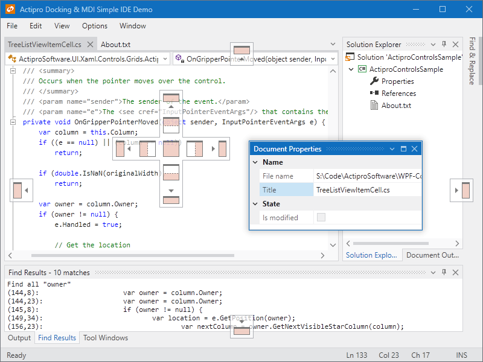
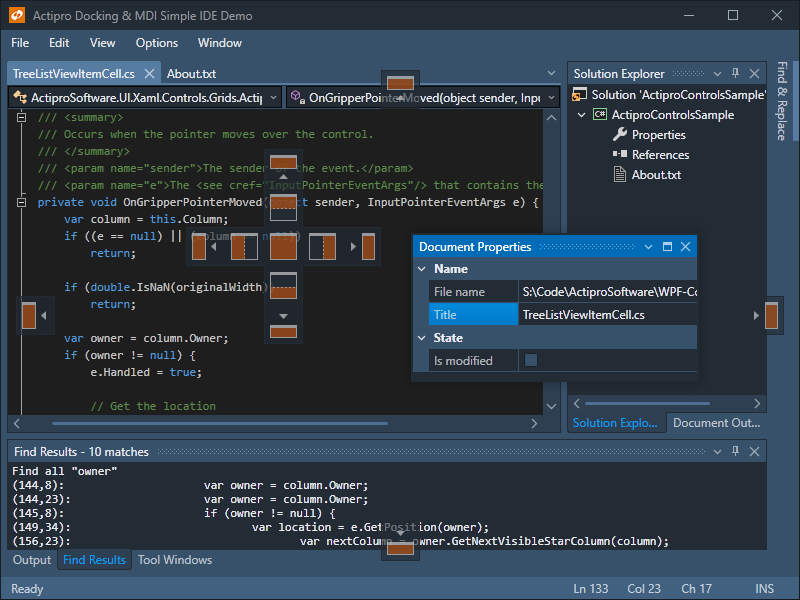
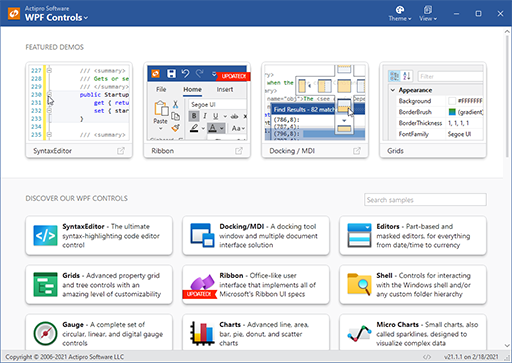
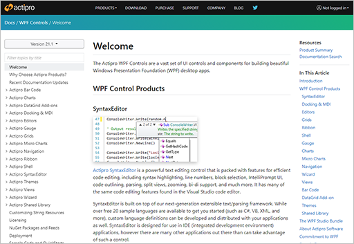

# Actipro WPF Controls

 
 

Samples, documentation, and other related open-source projects for [Actipro WPF Controls](https://www.actiprosoftware.com/products/controls/wpf), a vast set of modern-themed UI controls for building beautiful WPF desktop applications.

The controls ship with over 25 professionally-designed themes, and custom themes can be easily created using configurable theme definitions.

| An Office Colorful Theme | A Custom Dark Slate Theme |
| ------------- | ------------- |
|  |  |

## Table of Contents

- [About WPF Controls](#about-wpf-controls)
- [Getting Started](#getting-started)
  - [Running the Sample Browser Application](#running-the-sample-browser-application)
  - [Browsing Documentation](#browsing-documentation)
  - [Running Other Sample Applications](#running-other-sample-applications)
  - [Viewing Related Open-Source Projects](#viewing-related-open-source-projects)
- [NuGet Packages](#nuget-packages)
- [Contributing](#contributing)
- [Support](#support)
- [Licensing](#licensing)

## About WPF Controls

The [Actipro WPF Controls](https://www.actiprosoftware.com/products/controls/wpf) include:

- [SyntaxEditor](https://www.actiprosoftware.com/products/controls/wpf/syntaxeditor) - A syntax-highlighting code editor control and parsing suite.
- [Docking/MDI](https://www.actiprosoftware.com/products/controls/wpf/docking) - A complete docking tool window and multiple document interface solution.
- [Editors](https://www.actiprosoftware.com/products/controls/wpf/editors) - Part-based and masked edit controls, with advanced date/time picker.
- [Grids](https://www.actiprosoftware.com/products/controls/wpf/grids) - Advanced PropertyGrid and custom tree (TreeListBox/TreeListView) controls.
- [Shell](https://www.actiprosoftware.com/products/controls/wpf/shell) - Windows shell folder and file browsing controls.
- [Gauge](https://www.actiprosoftware.com/products/controls/wpf/gauge) - A complete set of circular, linear, and digital gauge controls.
- [Charts](https://www.actiprosoftware.com/products/controls/wpf/charts) - Visualize complex data sets with stunning charts.
- [Micro Charts](https://www.actiprosoftware.com/products/controls/wpf/microcharts) - Small charts, also called sparklines, designed to visualize complex data.
- [Ribbon](https://www.actiprosoftware.com/products/controls/wpf/ribbon) - Easily add an Office-like user interface that meets all Microsoft specifications.
- [Navigation](https://www.actiprosoftware.com/products/controls/wpf/navigation) - Navigation bar, explorer bar, breadcrumb, and zoom controls.
- [Wizard](https://www.actiprosoftware.com/products/controls/wpf/wizard) - Everything you need to quickly create wizard dialogs.
- [Views](https://www.actiprosoftware.com/products/controls/wpf/views) - Unique controls and panels that support fluid animated item layout.
- [Bar Code](https://www.actiprosoftware.com/products/controls/wpf/barcode) - Vector-based 2D and linear bar code generation.
- [Themes](https://www.actiprosoftware.com/products/controls/wpf/themes) - Professionally-designed themes for your whole application.
- [Shared Library](https://www.actiprosoftware.com/products/controls/wpf/shared) - A set of common controls and useful components for WPF applications.

*The control products themselves are closed-source commercial products, whose source is not included in this repo.*

## Getting Started

### Running the Sample Browser Application

The Sample Browser application allows you to examine all of the Actipro WPF controls and their feature sets via hundreds of included demos and QuickStarts.

Follow these steps to run the application:

- Check out the repo.
- Open the `Samples\SampleBrowser\SampleBrowser.sln` solution in Visual Studio.
- Build and run the solution's application project, which currently targets .NET Framework 4.6.2.

### Browsing Documentation

Complete [product documentation](https://www.actiprosoftware.com/docs/controls/wpf/index) is available on our web site.

The Markdown source code for the product documentation is contained within this repo's `Documentation\topics` folder.  The documentation is built with [DocFx](https://github.com/dotnet/docfx). 

### Running Other Sample Applications

This repo contains two other sample application solutions that demonstrate specialized integrations:

- `Samples\PrismIntegration.sln` - Shows using Docking/MDI with the [Prism library](https://github.com/PrismLibrary/Prism).
- `Samples\WindowsWorkflowIntegration.sln` - Shows using SyntaxEditor and its .NET Languages Add-on as a [rehosted Windows Workflow Designer](https://docs.microsoft.com/en-us/dotnet/framework/windows-workflow-foundation/rehosting-the-workflow-designer) expression editor, along with Docking/MDI and Themes.

### Viewing Related Open-Source Projects

This repo also contains the following open-source projects, which can be opened in the `Source\WPF-Libraries.sln` solution:

- `DataGrid.Contrib` - Several enhancements for the native Microsoft WPF DataGrid control.
- `Editors.Interop.DataGrid` - Integration of Actipro Editors with the Microsoft WPF DataGrid control, with dedicated DataGrid column types for each of the editors.

## NuGet Packages

[Packages for the Actipro WPF Controls](https://www.nuget.org/packages?q=ActiproSoftware.Controls.WPF) are published on nuget.org, all beginning with the `ActiproSoftware.Controls.WPF` name prefix.

### All WPF Controls Metapackage

This metapackage contains all of the control products, and is easiest to reference when getting started:

- [ActiproSoftware.Controls.WPF](https://www.nuget.org/packages/ActiproSoftware.Controls.WPF)

### Individual WPF Control Packages

Use these individual control packages if you want to use a specific subset of the metapackage:

- [ActiproSoftware.Controls.WPF.BarCode](https://www.nuget.org/packages/ActiproSoftware.Controls.WPF.BarCode)
- [ActiproSoftware.Controls.WPF.Charts](https://www.nuget.org/packages/ActiproSoftware.Controls.WPF.Charts)
- [ActiproSoftware.Controls.WPF.Docking](https://www.nuget.org/packages/ActiproSoftware.Controls.WPF.Docking)
- [ActiproSoftware.Controls.WPF.Editors](https://www.nuget.org/packages/ActiproSoftware.Controls.WPF.Editors)
- [ActiproSoftware.Controls.WPF.Editors.Interop.DataGrid](https://www.nuget.org/packages/ActiproSoftware.Controls.WPF.Editors.Interop.DataGrid)
- [ActiproSoftware.Controls.WPF.Editors.Interop.Grids](https://www.nuget.org/packages/ActiproSoftware.Controls.WPF.Editors.Interop.Grids)
- [ActiproSoftware.Controls.WPF.Gauge](https://www.nuget.org/packages/ActiproSoftware.Controls.WPF.Gauge)
- [ActiproSoftware.Controls.WPF.Grids](https://www.nuget.org/packages/ActiproSoftware.Controls.WPF.Grids)
- [ActiproSoftware.Controls.WPF.MicroCharts](https://www.nuget.org/packages/ActiproSoftware.Controls.WPF.MicroCharts)
- [ActiproSoftware.Controls.WPF.Navigation](https://www.nuget.org/packages/ActiproSoftware.Controls.WPF.Navigation)
- [ActiproSoftware.Controls.WPF.Ribbon](https://www.nuget.org/packages/ActiproSoftware.Controls.WPF.Ribbon)
- [ActiproSoftware.Controls.WPF.Shared](https://www.nuget.org/packages/ActiproSoftware.Controls.WPF.Shared)
- [ActiproSoftware.Controls.WPF.Shell](https://www.nuget.org/packages/ActiproSoftware.Controls.WPF.Shell)
- [ActiproSoftware.Controls.WPF.SyntaxEditor](https://www.nuget.org/packages/ActiproSoftware.Controls.WPF.SyntaxEditor)
- [ActiproSoftware.Controls.WPF.Views](https://www.nuget.org/packages/ActiproSoftware.Controls.WPF.Views)
- [ActiproSoftware.Controls.WPF.Wizard](https://www.nuget.org/packages/ActiproSoftware.Controls.WPF.Wizard)

### SyntaxEditor Language Add-on Packages

Use these packages for SyntaxEditor's premium language add-ons as needed, which are shipped separately from the metapackage:

- [ActiproSoftware.Controls.WPF.SyntaxEditor.Addons.DotNet](https://www.nuget.org/packages/ActiproSoftware.Controls.WPF.SyntaxEditor.Addons.DotNet) - Advanced C#/VB languages in the .NET Languages Add-on.
- [ActiproSoftware.Controls.WPF.SyntaxEditor.Addons.JavaScript](https://www.nuget.org/packages/ActiproSoftware.Controls.WPF.SyntaxEditor.Addons.JavaScript) - Advanced JavaScript/JSON languages in the Web Languages Add-on.
- [ActiproSoftware.Controls.WPF.SyntaxEditor.Addons.Python](https://www.nuget.org/packages/ActiproSoftware.Controls.WPF.SyntaxEditor.Addons.Python) - Advanced Python language in the Python Language Add-on.
- [ActiproSoftware.Controls.WPF.SyntaxEditor.Addons.XML](https://www.nuget.org/packages/ActiproSoftware.Controls.WPF.SyntaxEditor.Addons.XML) - Advanced XML language in the Web Languages Add-on.

### Other Packages

These packages are optional and shipped separately from the metapackage:

- [ActiproSoftware.Controls.WPF.DataGrid.Contrib](https://www.nuget.org/packages/ActiproSoftware.Controls.WPF.DataGrid.Contrib) - For the `DataGrid.Contrib` project in this repo.
- [ActiproSoftware.Controls.WPF.Themes.Aero](https://www.nuget.org/packages/ActiproSoftware.Controls.WPF.Themes.Aero) - For legacy Aero themes.

## Contributing

We welcome contributions to our open-source repository.  If you want to submit a pull request, please first open a [GitHub issue](https://github.com/Actipro/WPF-Controls/issues) or [contact us](https://www.actiprosoftware.com/company/contact) to discuss.

Read through our [How to Contribute](https://github.com/Actipro/.github/blob/main/Contributing.md) document, as it covers everything you need to know about contributing.

## Support

Our [Support](https://github.com/Actipro/.github/blob/main/Support.md) document provides details about how to properly obtain support for both our closed-source UI control products and for code in this open-source repo (documentation, samples, and related libraries).  This chart shows a quick summary:

| | UI Control Products | Open-Source Repos |
| --- | :-: | :-: |
| [Contact us via support options](https://www.actiprosoftware.com/company/contact) | ✔ | ✔ |
| [Create a GitHub issue](https://github.com/Actipro/WPF-Controls/issues) | ❌ | ✔ |

## Licensing

While the source code in this repo falls under the terms of the [included license document](https://github.com/Actipro/WPF-Controls/blob/develop/License.md), the Actipro End-User License Agreement (EULA) applies to usage of our commercial WPF control products.  

Visit the [Actipro purchasing page](https://www.actiprosoftware.com/purchase) to learn more about product licensing or to order developer licenses.  [Contact our sales team](https://www.actiprosoftware.com/company/contact) if you have any questions.
